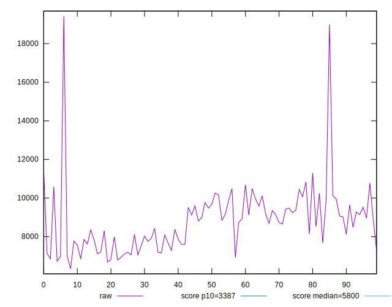
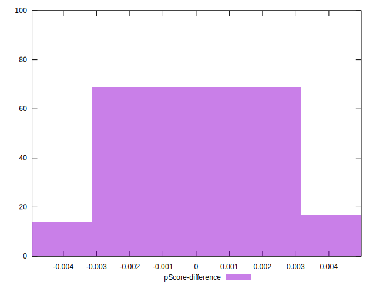

# //speed-index/samples/pages

[→ Parent](../..)


## Raw


```yaml
p90min: 6779.955660102734
p90max: 11299.61704276812
p90range: 4519.661382665387
p90mean: 8654.709730104401
median: 8731.982233690513
p90stdev: 1177.010037195947
mad: 1048.4403867577585
stdevBySn: 1399.364779257841
p90skewness: 0.11428517044966159
p90eccentricity: 0.9999999999999992
p90discretization: 1
outlandishness: 1.0413962926748703
confidence: 755.2539726916187
p90confidence: 475.8765739897095

```


## Score


```yaml
p90min: 0.06
p90max: 0.35
p90range: 0.29
p90mean: 0.1879787234042553
median: 0.165
p90stdev: 0.08513543387155527
mad: 0.065
stdevBySn: 0.10137100000000002
p90skewness: 0.4361613631677016
p90eccentricity: 1
p90discretization: 3.2413793103448274
outlandishness: 1.0076887464293023
confidence: 0.036929195976026764
p90confidence: 0.0344210816523211

```


## Raw Estimate


## Score Estimate


## P Score


```yaml
p90min: 0.056043541621106474
p90max: 0.35497233999095273
p90range: 0.29892879836984626
p90mean: 0.18817152384137836
median: 0.1648444996185856
p90stdev: 0.08549532185606275
mad: 0.06932130370053666
stdevBySn: 0.10244474525800253
p90skewness: 0.42070373334154476
p90eccentricity: 0.9999999999999992
p90discretization: 1
outlandishness: 1.0078798565659934
confidence: 0.03697505798890304
p90confidence: 0.03456658785505111

```


## Score Difference


```yaml
p90min: 0
p90max: 5.551115123125783e-17
p90range: 5.551115123125783e-17
p90mean: 5.905441620346577e-19
median: 0
p90stdev: 5.695001657605474e-18
mad: 0
stdevBySn: 0
p90skewness: 9.539955591519895
p90eccentricity: 1.0000000000000036
p90discretization: 47
outlandishness: 14.137600000000003
confidence: 4.264066145825139e-18
p90confidence: 2.3025444066249988e-18

```


## P Score Difference


```yaml
p90min: -0.004656563539851388
p90max: 0.004737095672472658
p90range: 0.009393659212324046
p90mean: 0.00022081935939141946
median: 0.0003856638657002698
p90stdev: 0.00255780714762685
mad: 0.0023415778878161514
stdevBySn: 0.0029508482865077054
p90skewness: -0.10615402969918265
p90eccentricity: 1.0000000000000002
p90discretization: 1
outlandishness: 0.9169523233633449
confidence: 0.0010792484454420616
p90confidence: 0.0010341462382418226

```

