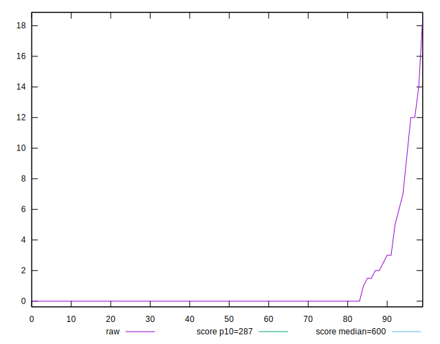
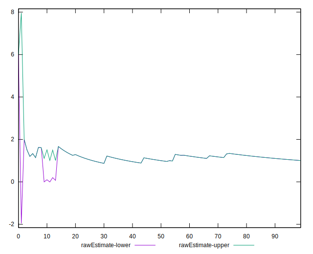
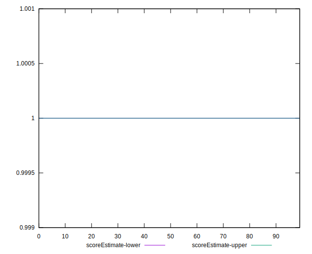
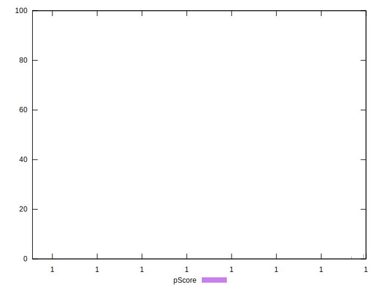
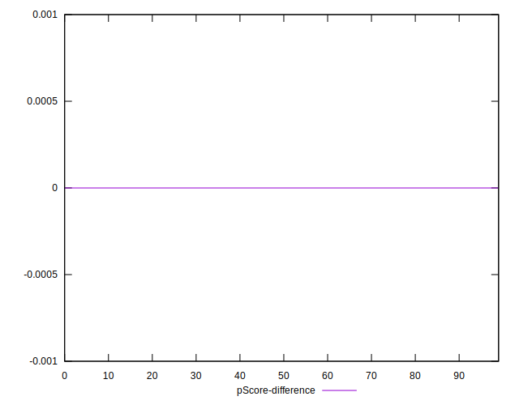
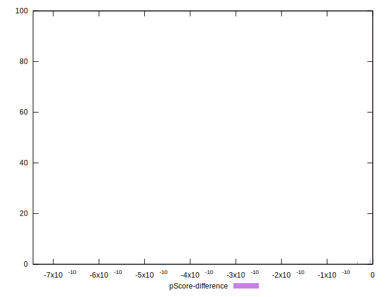

# //total-blocking-time/samples/pages+cached+noadtech+nomedia+nocss

[→ Parent](../..)


## Raw


```yaml
p90min: 0
p90max: 12
p90range: 12
p90mean: 0.5957446808510638
median: 0
p90stdev: 1.9258551509580633
mad: 0
stdevBySn: 0
p90skewness: 4.050741582952184
p90eccentricity: 1.000000000000002
p90discretization: 7.833333333333333
outlandishness: 2.8458485012755177
confidence: 1.2165978144623775
p90confidence: 0.7786419166158609

```


## Score


```yaml
p90min: 1
p90max: 1
p90range: 0
p90mean: 1
median: 1
p90stdev: 0
mad: 0
stdevBySn: 0
p90skewness: .nan
p90eccentricity: .nan
p90discretization: 94
outlandishness: 1
confidence: 0
p90confidence: 0

```


## Raw Estimate


## Score Estimate


## P Score


```yaml
p90min: 0.9999999999946796
p90max: 1
p90range: 5.320410778608675e-12
p90mean: 0.9999999999999402
median: 1
p90stdev: 5.463323879318926e-13
mad: 0
stdevBySn: 0
p90skewness: -9.497450258629963
p90eccentricity: 0.9999999991213666
p90discretization: 18.8
outlandishness: 0.9999999999843527
confidence: 2.9048379793092956e-11
p90confidence: 2.2088748337951832e-13

```


## Score Difference


```yaml
p90min: 0
p90max: 0
p90range: 0
p90mean: 0
median: 0
p90stdev: 0
mad: 0
stdevBySn: 0
p90skewness: .nan
p90eccentricity: .nan
p90discretization: 94
outlandishness: .nan
confidence: 0
p90confidence: 0

```


## P Score Difference


```yaml
p90min: -5.320410778608675e-12
p90max: 0
p90range: 5.320410778608675e-12
p90mean: -5.978669096438875e-14
median: 0
p90stdev: 5.463323849904509e-13
mad: 0
stdevBySn: 0
p90skewness: -9.497139105721306
p90eccentricity: 0.9999999999999996
p90discretization: 18.8
outlandishness: 17386.59791072198
confidence: 2.904837979309279e-11
p90confidence: 2.2088748219026489e-13

```

