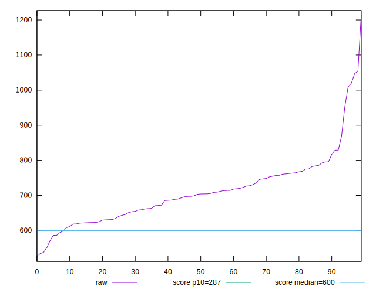
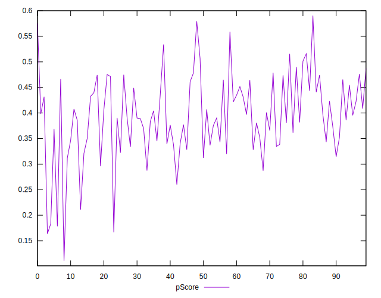
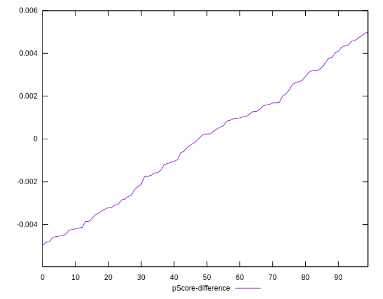

# //total-blocking-time/samples/pages+cached

[→ Parent](../..)


## Raw


```yaml
p90min: 551
p90max: 1019.8379999999988
p90range: 468.83799999999883
p90mean: 706.4868670212767
median: 703.8185000000008
p90stdev: 83.43702306142035
mad: 58.24549999999954
stdevBySn: 84.64284702500059
p90skewness: 1.1943893037575888
p90eccentricity: 0.9999999999999999
p90discretization: 1
outlandishness: 1.0191584604363584
confidence: 43.5387197665853
p90confidence: 33.73439768870802

```


## Score


```yaml
p90min: 0.18
p90max: 0.56
p90range: 0.38000000000000006
p90mean: 0.3948936170212765
median: 0.39
p90stdev: 0.07260714285316654
mad: 0.04999999999999999
stdevBySn: 0.07751899999999998
p90skewness: -0.41650729666144237
p90eccentricity: 1.0000000000000002
p90discretization: 3.2413793103448274
outlandishness: 0.9909365782747938
confidence: 0.03481326407434652
p90confidence: 0.02935577208029717

```


## Raw Estimate


## Score Estimate


## P Score


```yaml
p90min: 0.1783005653783778
p90max: 0.5588496996057853
p90range: 0.38054913422740755
p90mean: 0.3948293243948313
median: 0.39075965325535844
p90stdev: 0.07244031744932147
mad: 0.052851658912590804
stdevBySn: 0.07876506719564484
p90skewness: -0.41788396988061166
p90eccentricity: 0.9999999999999996
p90discretization: 1
outlandishness: 0.9907660402059137
confidence: 0.03471115362345053
p90confidence: 0.029288322951464447

```


## Score Difference


```yaml
p90min: 0
p90max: 5.551115123125783e-17
p90range: 5.551115123125783e-17
p90mean: 7.677074106450551e-18
median: 0
p90stdev: 1.9163135309776857e-17
mad: 0
stdevBySn: 0
p90skewness: 2.0955340746286444
p90eccentricity: 0.9999999999999996
p90discretization: 47
outlandishness: 1.3384710059171598
confidence: 7.977337296109665e-18
p90confidence: 7.747841471125599e-18

```


## P Score Difference


```yaml
p90min: -0.004606744739911461
p90max: 0.004713810416490605
p90range: 0.009320555156402066
p90mean: -0.00010553708476240982
median: 0.0002267763132105527
p90stdev: 0.002757814571339173
mad: 0.0024864637176749416
stdevBySn: 0.0031540844200095143
p90skewness: -0.022202090733292133
p90eccentricity: 1.0000000000000002
p90discretization: 1
outlandishness: 0.8591447886086615
confidence: 0.0011485474490718712
p90confidence: 0.0011150111795429846

```

