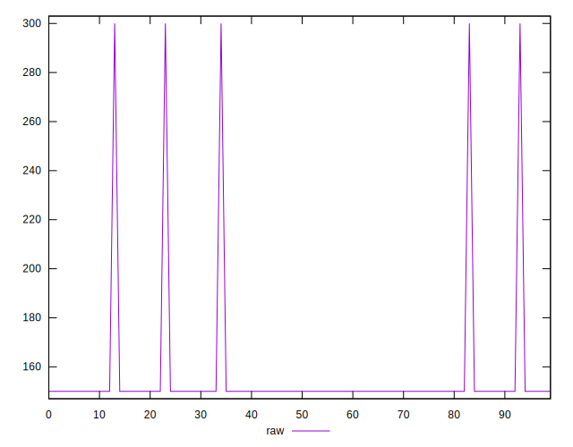
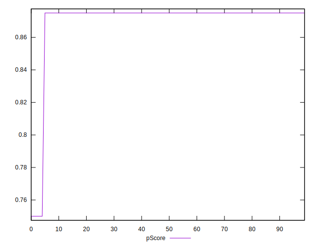

# //unused-css-rules/samples/pages+cached+noadtech+nomedia

[→ Parent](../..)


## Raw


```yaml
p90min: 150
p90max: 300
p90range: 150
p90mean: 153.19148936170214
median: 150
p90stdev: 21.645733988697724
mad: 0
stdevBySn: 0
p90skewness: 6.634888026970315
p90eccentricity: 0.9999999999999942
p90discretization: 47
outlandishness: 1.0570410156249999
confidence: 12.81492741238412
p90confidence: 8.751580196014283

```


## Score


```yaml
p90min: 0.75
p90max: 0.88
p90range: 0.13
p90mean: 0.8772340425531914
median: 0.88
p90stdev: 0.018759636123537975
mad: 0
stdevBySn: 0
p90skewness: -6.634888026970363
p90eccentricity: 0.9999999999999972
p90discretization: 47
outlandishness: 0.9915049001922391
confidence: 0.01110627042406625
p90confidence: 0.007584702836545689

```


## Raw Estimate


## Score Estimate


## P Score


```yaml
p90min: 0.75
p90max: 0.875
p90range: 0.125
p90mean: 0.8723404255319149
median: 0.875
p90stdev: 0.018038111657248057
mad: 0
stdevBySn: 0
p90skewness: -6.634888026970383
p90eccentricity: 0.9999999999999991
p90discretization: 47
outlandishness: 0.9917852329342652
confidence: 0.01067910617698677
p90confidence: 0.007292983496678548

```


## Score Difference


```yaml
p90min: 0
p90max: 0
p90range: 0
p90mean: 0
median: 0
p90stdev: 0
mad: 0
stdevBySn: 0
p90skewness: .nan
p90eccentricity: .nan
p90discretization: 94
outlandishness: .nan
confidence: 0
p90confidence: 0

```


## P Score Difference


```yaml
p90min: -0.0050000000000000044
p90max: 0
p90range: 0.0050000000000000044
p90mean: -0.0048936170212766
median: -0.0050000000000000044
p90stdev: 0.0007215244662899235
mad: 0
stdevBySn: 0
p90skewness: 6.634888026970349
p90eccentricity: 0.9999999999999976
p90discretization: 47
outlandishness: 0.9421656427221174
confidence: 0.0004271642470794709
p90confidence: 0.0002917193398671425

```

