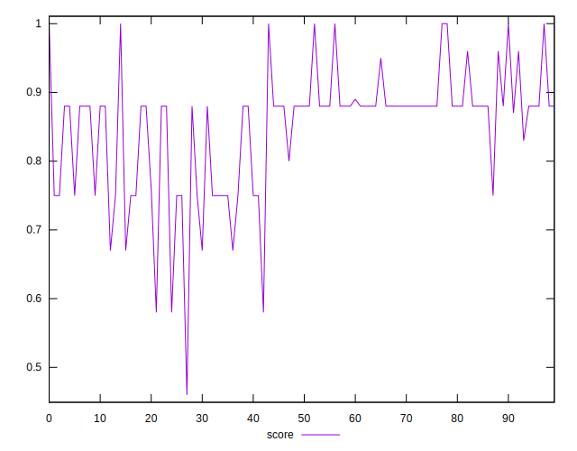
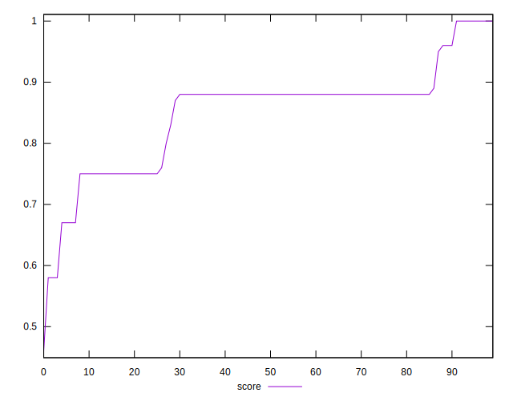

# //unused-css-rules/samples/pages

[→ Parent](../..)


## Raw


```yaml
p90min: 0
p90max: 600
p90range: 600
p90mean: 185.31914893617022
median: 150
p90stdev: 105.8974024520158
mad: 0
stdevBySn: 0
p90skewness: 1.1076740281479966
p90eccentricity: 1.0000000000000002
p90discretization: 7.230769230769231
outlandishness: 1.1265957944535026
confidence: 58.61322679175737
p90confidence: 42.815346922046004

```


## Score


```yaml
p90min: 0.58
p90max: 1
p90range: 0.42000000000000004
p90mean: 0.851276595744681
median: 0.88
p90stdev: 0.08167441906029439
mad: 0
stdevBySn: 0
p90skewness: -0.7312040189464029
p90eccentricity: 0.9999999999999966
p90discretization: 7.833333333333333
outlandishness: 0.9885756807736326
confidence: 0.03902846906958749
p90confidence: 0.03302175979536036

```


## Raw Estimate


## Score Estimate


## P Score


```yaml
p90min: 0.5833333333333334
p90max: 1
p90range: 0.41666666666666663
p90mean: 0.8482269503546098
median: 0.875
p90stdev: 0.08083006446217715
mad: 0
stdevBySn: 0
p90skewness: -0.6689155949380882
p90eccentricity: 1.0000000000000004
p90discretization: 7.230769230769231
outlandishness: 0.9892304123002189
confidence: 0.03857858877771304
p90confidence: 0.032680379041852316

```


## Score Difference


```yaml
p90min: 0
p90max: 0
p90range: 0
p90mean: 0
median: 0
p90stdev: 0
mad: 0
stdevBySn: 0
p90skewness: .nan
p90eccentricity: .nan
p90discretization: 94
outlandishness: .inf
confidence: 6.092792000602806e-18
p90confidence: 0

```


## P Score Difference


```yaml
p90min: -0.0050000000000000044
p90max: 0.0033333333333334103
p90range: 0.008333333333333415
p90mean: -0.00289007092198582
median: -0.0050000000000000044
p90stdev: 0.0025633294588468004
mad: 0
stdevBySn: 0
p90skewness: 0.6545028958348958
p90eccentricity: 0.9999999999999997
p90discretization: 10.444444444444445
outlandishness: 0.9073542181804863
confidence: 0.001083685917342228
p90confidence: 0.00103637896222956

```

