# //unused-javascript/samples/pages

[→ Parent](../..)


## Raw


```yaml
p90min: 1050
p90max: 6340
p90range: 5290
p90mean: 3643.8297872340427
median: 4955
p90stdev: 1959.0385757407587
mad: 485
stdevBySn: 846.7460000000001
p90skewness: -0.3920815032898301
p90eccentricity: 1
p90discretization: 1.8431372549019607
outlandishness: 1.0075172860369705
confidence: 797.9119779773591
p90confidence: 792.058297105236

```

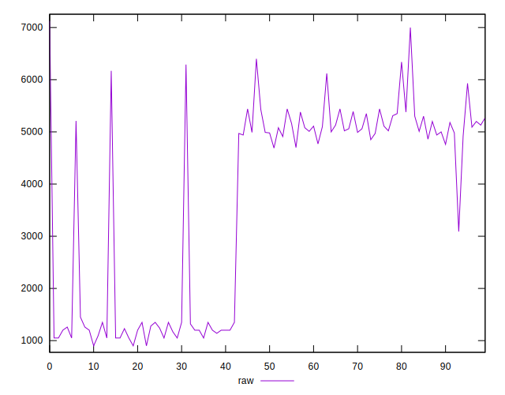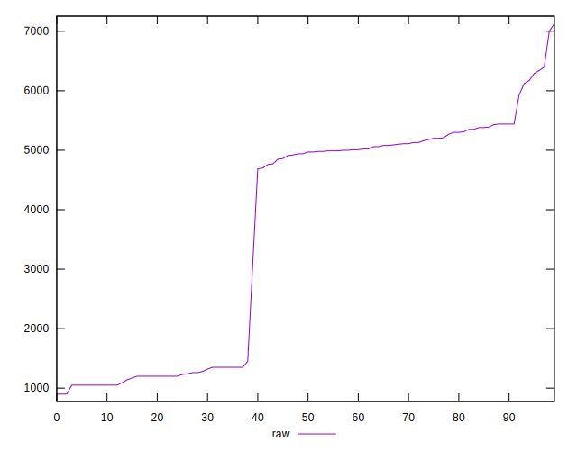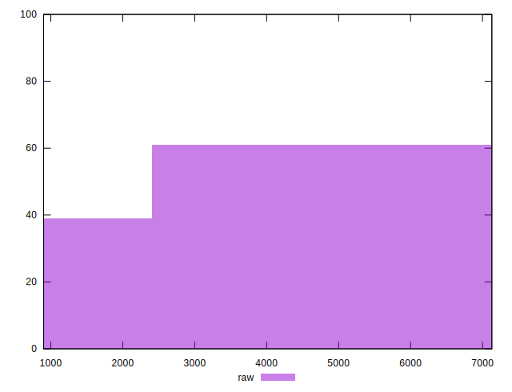
## Score


```yaml
p90min: 0
p90max: 0.46
p90range: 0.46
p90mean: 0.17563829787234045
median: 0.005
p90stdev: 0.21471187279819204
mad: 0.005
stdevBySn: 0.008944500000000001
p90skewness: 0.4592146988545186
p90eccentricity: 0.9999999999999978
p90discretization: 8.545454545454545
outlandishness: 1.0444567633513961
confidence: 0.08500438592882982
p90confidence: 0.08681009268666734

```

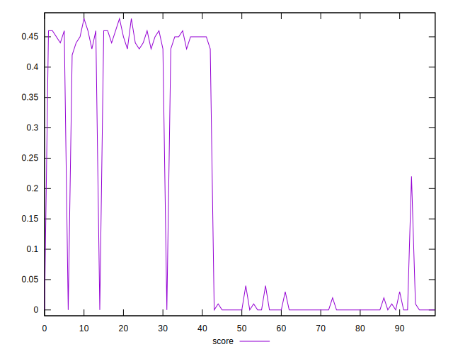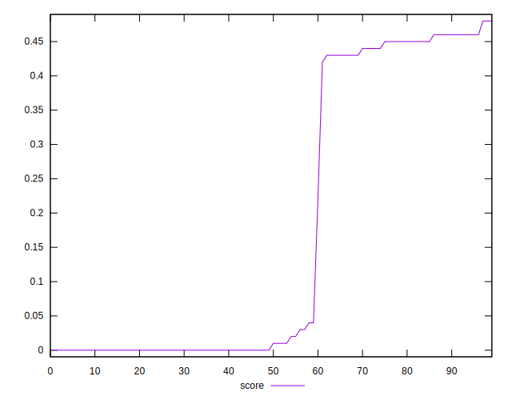
## Raw Estimate

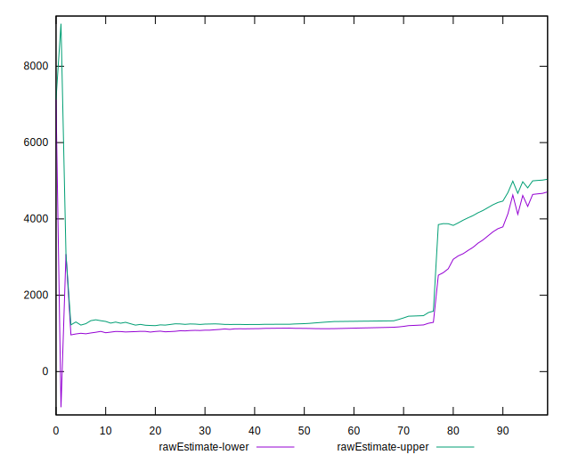
## Score Estimate

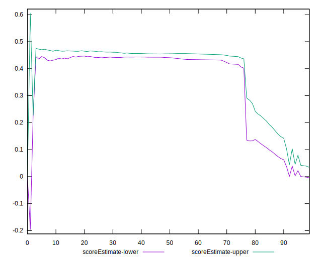
## P Score


```yaml
p90min: 0
p90max: 0.4647058823529412
p90range: 0.4647058823529412
p90mean: 0.17585732165206513
median: 0.00529411764705881
p90stdev: 0.21515398769775473
mad: 0.00529411764705881
stdevBySn: 0.007366058823529383
p90skewness: 0.4603992204398758
p90eccentricity: 1.0000000000000002
p90discretization: 3.6153846153846154
outlandishness: 1.0450685805266828
confidence: 0.08520264870396023
p90confidence: 0.08698884402868216

```

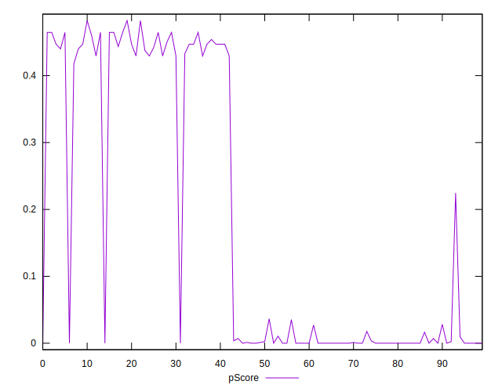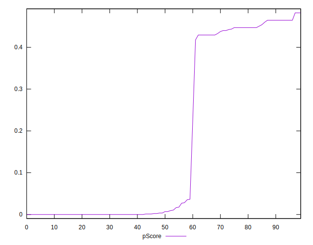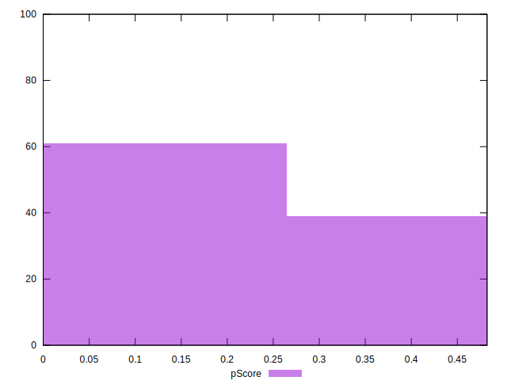
## Score Difference


```yaml
p90min: 0
p90max: 0
p90range: 0
p90mean: 0
median: 0
p90stdev: 0
mad: 0
stdevBySn: 0
p90skewness: .nan
p90eccentricity: .nan
p90discretization: 94
outlandishness: .nan
confidence: 0
p90confidence: 0

```


## P Score Difference


```yaml
p90min: -0.0029411764705882717
p90max: 0.004705882352941171
p90range: 0.0076470588235294425
p90mean: 0.00026908635794743485
median: 0
p90stdev: 0.0020568824993102155
mad: 0.0005882352941176117
stdevBySn: 0.0007015294117646637
p90skewness: 0.5744736536237749
p90eccentricity: 0.9999999999999979
p90discretization: 4.7
outlandishness: 1.0556367766360146
confidence: 0.0008855476306341716
p90confidence: 0.0008316175444034752

```

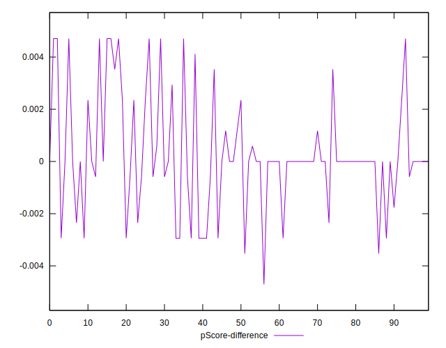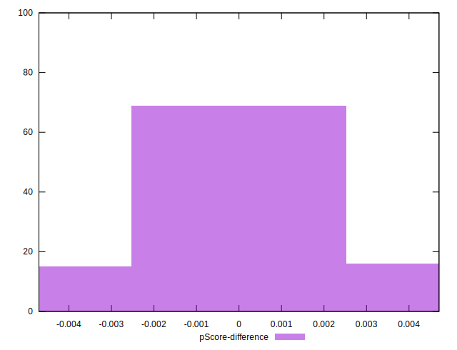