# //uses-http2/samples/pages+cached+noadtech+nomedia+nocss

[→ Parent](../..)


## Raw


```yaml
p90min: 610
p90max: 1260
p90range: 650
p90mean: 1011.063829787234
median: 930
p90stdev: 196.2167065409015
mad: 160
stdevBySn: 238.52
p90skewness: -0.11705012657850976
p90eccentricity: 0.9999999999999999
p90discretization: 4.086956521739131
outlandishness: 0.9913864736423228
confidence: 81.76232139894003
p90confidence: 79.33231758216816

```

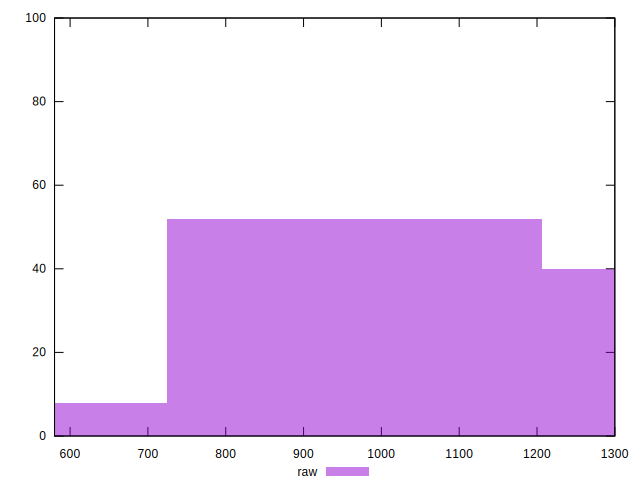
## Score


```yaml
p90min: 0.44
p90max: 0.58
p90range: 0.13999999999999996
p90mean: 0.4715957446808509
median: 0.48
p90stdev: 0.032821347214215445
mad: 0.020000000000000018
stdevBySn: 0.04174100000000001
p90skewness: 1.3316821395660607
p90eccentricity: 0.9999999999999997
p90discretization: 11.75
outlandishness: 1.010222246263375
confidence: 0.01472975200717256
p90confidence: 0.01326998901660796

```

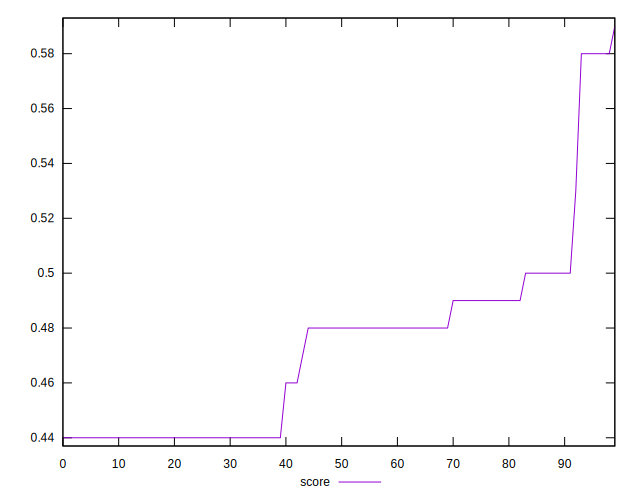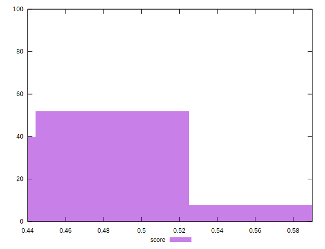
## Raw Estimate

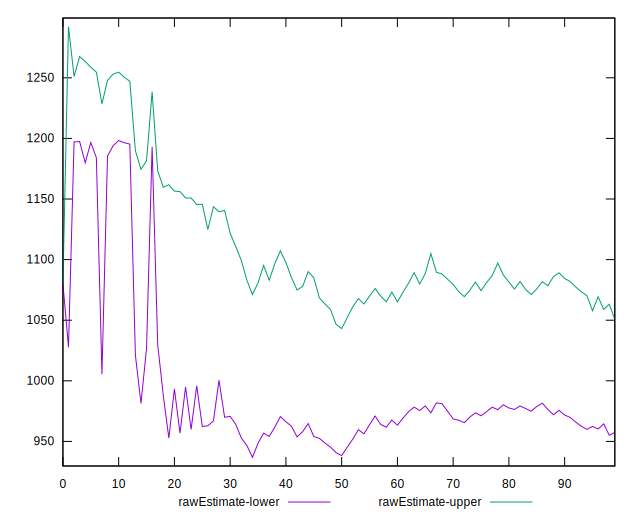
## Score Estimate

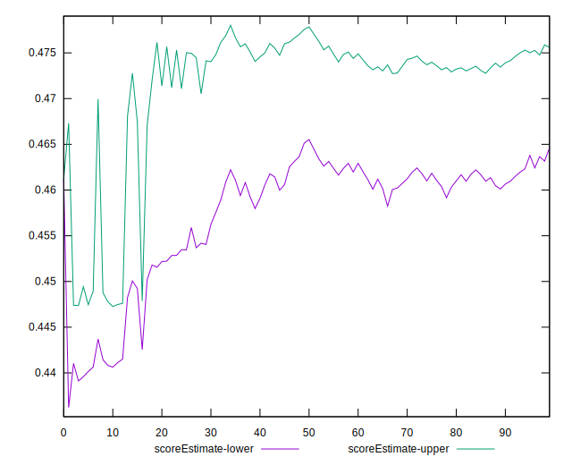
## P Score


```yaml
p90min: 0.44
p90max: 0.5777777777777777
p90range: 0.13777777777777772
p90mean: 0.47217494089834544
median: 0.4788235294117647
p90stdev: 0.030969843897821963
mad: 0.018823529411764683
stdevBySn: 0.040688705882352946
p90skewness: 1.5215333025307567
p90eccentricity: 0.9999999999999992
p90discretization: 4.086956521739131
outlandishness: 1.0099977397058229
confidence: 0.014222887966806841
p90confidence: 0.012521408267853279

```

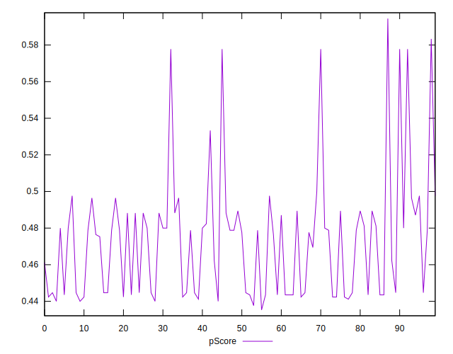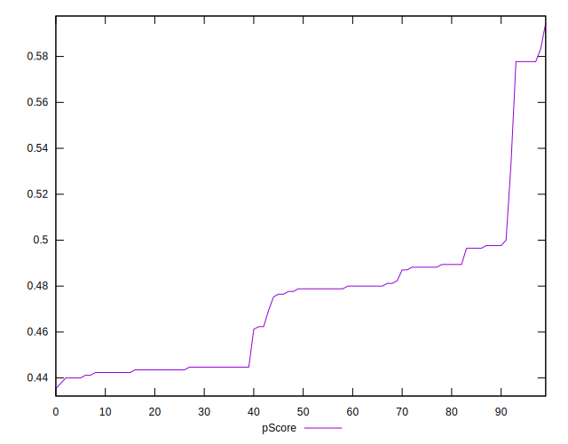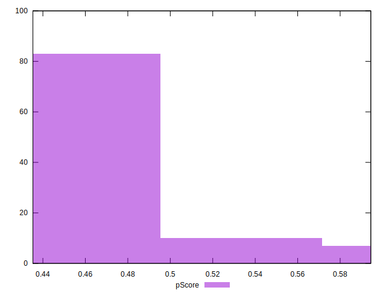
## Score Difference


```yaml
p90min: 0
p90max: 0
p90range: 0
p90mean: 0
median: 0
p90stdev: 0
mad: 0
stdevBySn: 0
p90skewness: .nan
p90eccentricity: .nan
p90discretization: 94
outlandishness: .inf
confidence: 2.1650898205369663e-18
p90confidence: 0

```


## P Score Difference


```yaml
p90min: -0.003529411764705892
p90max: 0.004705882352941171
p90range: 0.008235294117647063
p90mean: 0.0005506883604505685
median: 0
p90stdev: 0.002562825900356058
mad: 0.002352941176470613
stdevBySn: 0.0028061176470588534
p90skewness: 0.2124279011265672
p90eccentricity: 0.9999999999999999
p90discretization: 5.222222222222222
outlandishness: 0.9242200413223131
confidence: 0.0010670999607903615
p90confidence: 0.001036175368647683

```

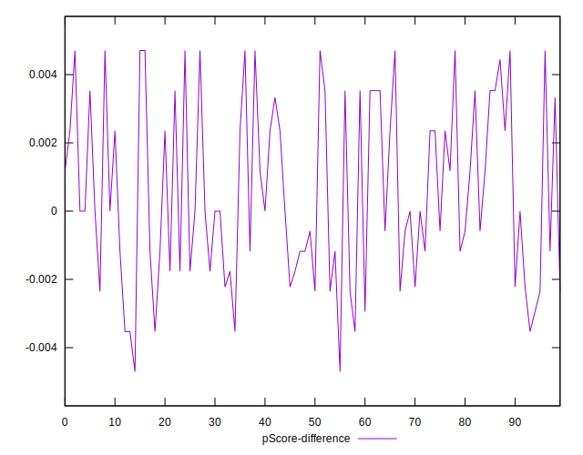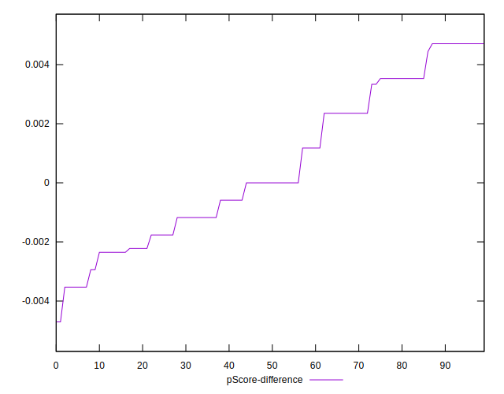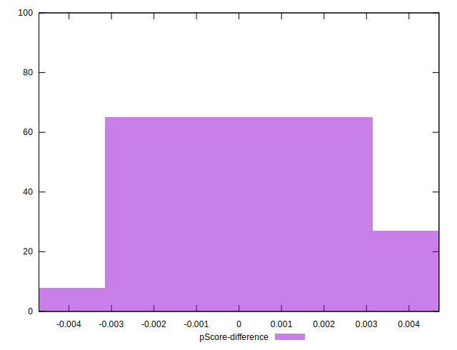