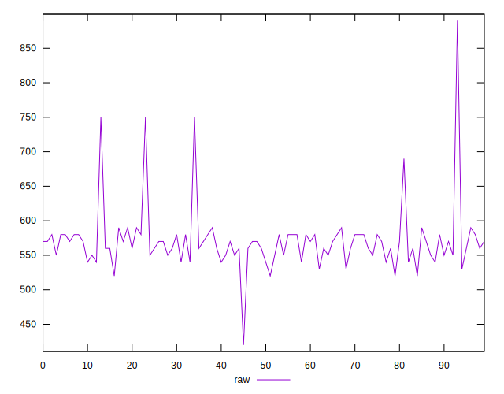
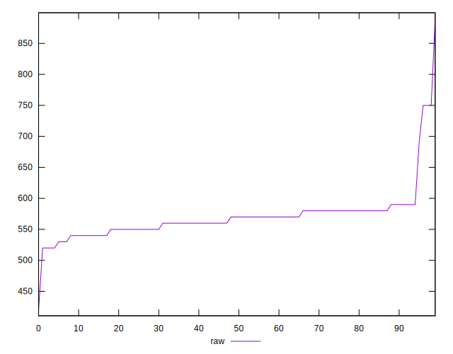
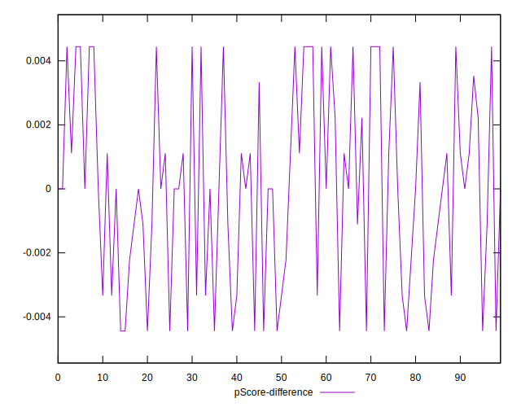
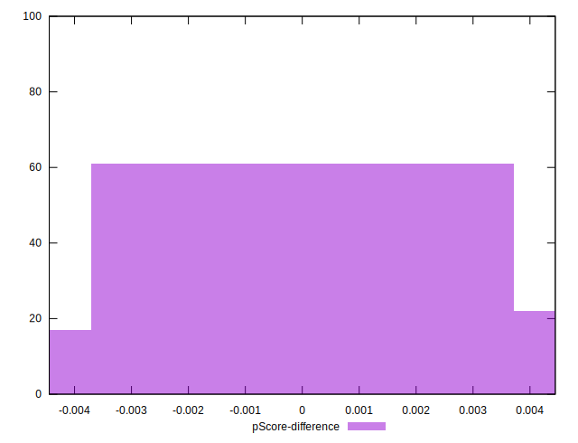

# //uses-http2/samples/pages+cached+noadtech+nomedia

[→ Parent](../..)


## Raw


```yaml
p90min: 520
p90max: 750
p90range: 230
p90mean: 566.9148936170212
median: 570
p90stdev: 28.547332689974493
mad: 10
stdevBySn: 23.852000000000004
p90skewness: 3.43721436355422
p90eccentricity: 1
p90discretization: 9.4
outlandishness: 1.015885446764115
confidence: 20.443993397221448
p90confidence: 11.541963490314641

```


## Score


```yaml
p90min: 0.5
p90max: 0.63
p90range: 0.13
p90mean: 0.6017021276595748
median: 0.6
p90stdev: 0.01711278592987055
mad: 0.010000000000000009
stdevBySn: 0.023852000000000022
p90skewness: -2.8127803086737115
p90eccentricity: 0.9999999999999996
p90discretization: 13.428571428571429
outlandishness: 0.9936875040762314
confidence: 0.010400448743041505
p90confidence: 0.006918865330262577

```


## Raw Estimate


## Score Estimate


## P Score


```yaml
p90min: 0.5
p90max: 0.6277777777777778
p90range: 0.12777777777777777
p90mean: 0.6017139479905436
median: 0.6
p90stdev: 0.01585962927220807
mad: 0.005555555555555647
stdevBySn: 0.013251111111111198
p90skewness: -3.4372143635541827
p90eccentricity: 0.9999999999999994
p90discretization: 9.4
outlandishness: 0.9937654058384819
confidence: 0.010068195346648188
p90confidence: 0.006412201939063697

```


## Score Difference


```yaml
p90min: 0
p90max: 0
p90range: 0
p90mean: 0
median: 0
p90stdev: 0
mad: 0
stdevBySn: 0
p90skewness: .nan
p90eccentricity: .nan
p90discretization: 94
outlandishness: .nan
confidence: 0
p90confidence: 0

```


## P Score Difference


```yaml
p90min: -0.004444444444444362
p90max: 0.004444444444444473
p90range: 0.008888888888888835
p90mean: 0.000037546933667117025
median: 0
p90stdev: 0.0030190330163528166
mad: 0.0033333333333332993
stdevBySn: 0.003975333333333293
p90skewness: 0.033777996164349705
p90eccentricity: 1.0000000000000002
p90discretization: 9.4
outlandishness: 0.8836000000001671
confidence: 0.0012241823605083249
p90confidence: 0.0012206243304487805

```

