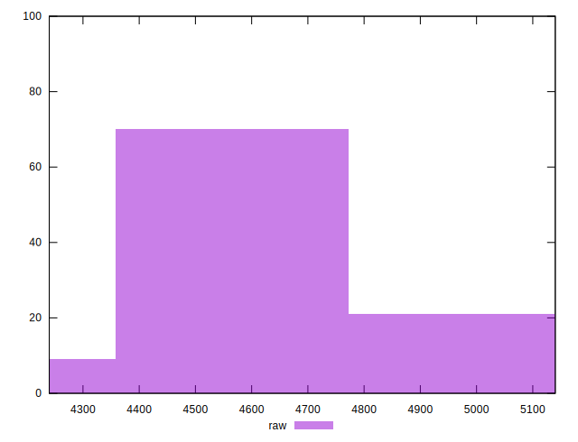
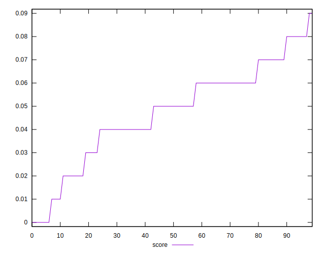
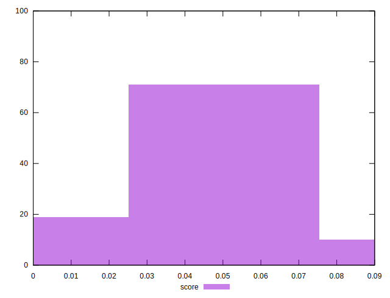
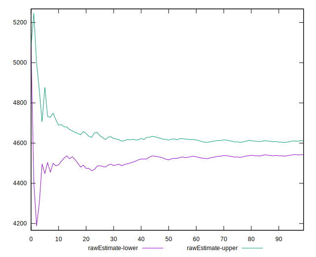
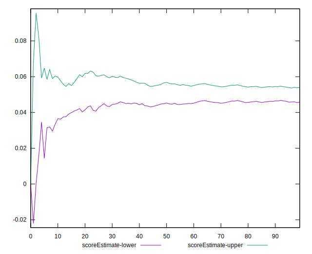
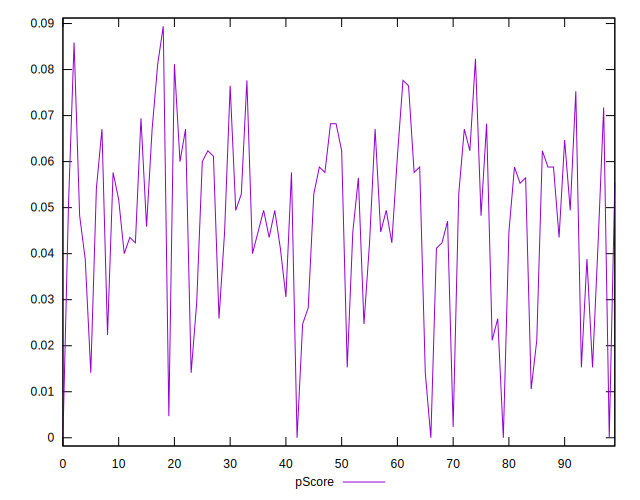
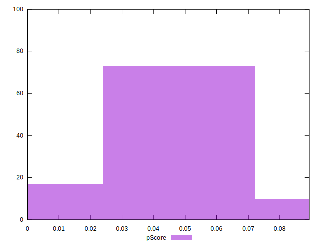
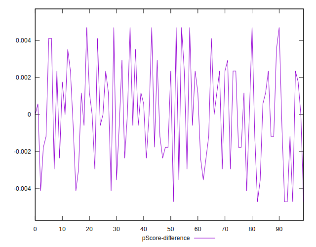
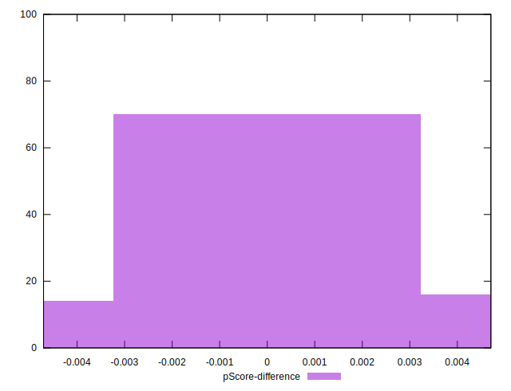

# //uses-http2/samples/pages+cached

[→ Parent](../..)


## Raw


```yaml
p90min: 4310
p90max: 5080
p90range: 770
p90mean: 4598.617021276596
median: 4580
p90stdev: 168.67822233175082
mad: 100
stdevBySn: 172.92700000000002
p90skewness: 0.6627346114702531
p90eccentricity: 0.9999999999999996
p90discretization: 2.1363636363636362
outlandishness: 1.0024731306018628
confidence: 76.4561928429201
p90confidence: 68.19824131758432

```


## Score


```yaml
p90min: 0
p90max: 0.08
p90range: 0.08
p90mean: 0.047234042553191476
median: 0.05
p90stdev: 0.02044214749717019
mad: 0.010000000000000002
stdevBySn: 0.023851999999999998
p90skewness: -0.5131645075620781
p90eccentricity: 0.9999999999999991
p90discretization: 10.444444444444445
outlandishness: 0.9901146416686949
confidence: 0.008826368725794145
p90confidence: 0.008264958503770323

```


## Raw Estimate


## Score Estimate


## P Score


```yaml
p90min: 0
p90max: 0.0811764705882353
p90range: 0.0811764705882353
p90mean: 0.04733416770963703
median: 0.04941176470588232
p90stdev: 0.019549837420717017
mad: 0.011764705882352955
stdevBySn: 0.020344352941176473
p90skewness: -0.5902572034784773
p90eccentricity: 0.9999999999999997
p90discretization: 2.186046511627907
outlandishness: 0.9888940434259428
confidence: 0.008509391841408831
p90confidence: 0.007904188885245533

```


## Score Difference


```yaml
p90min: 0
p90max: 0
p90range: 0
p90mean: 0
median: 0
p90stdev: 0
mad: 0
stdevBySn: 0
p90skewness: .nan
p90eccentricity: .nan
p90discretization: 94
outlandishness: .nan
confidence: 0
p90confidence: 0

```


## P Score Difference


```yaml
p90min: -0.004705882352941209
p90max: 0.004705882352941171
p90range: 0.00941176470588238
p90mean: 0.00007509386733415448
median: 0
p90stdev: 0.0026267949764474763
mad: 0.0023529411764705837
stdevBySn: 0.0028061176470588534
p90skewness: 0.060440954016741724
p90eccentricity: 1.0000000000000007
p90discretization: 2.41025641025641
outlandishness: 0.8835999999999791
confidence: 0.0010958345311195663
p90confidence: 0.001062038686554634

```

