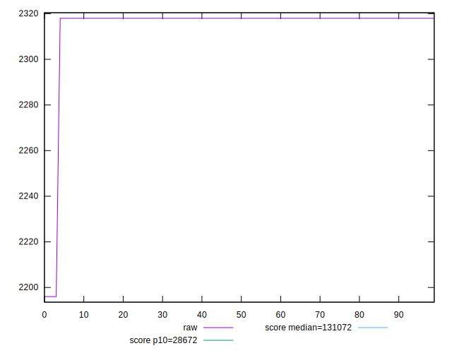

# //uses-long-cache-ttl/samples/pages+cached+noadtech+nomedia

[→ Parent](../..)


## Raw


```yaml
p90min: 2196
p90max: 2318
p90range: 122
p90mean: 2316.7021276595747
median: 2318
p90stdev: 12.5162275834164
mad: 0
stdevBySn: 0
p90skewness: -9.539955591519922
p90eccentricity: 0.9999999999999951
p90discretization: 47
outlandishness: 0.9969099538168206
confidence: 9.371379592245576
p90confidence: 5.060432208260023

```


## Score


```yaml
p90min: 1
p90max: 1
p90range: 0
p90mean: 1
median: 1
p90stdev: 0
mad: 0
stdevBySn: 0
p90skewness: .nan
p90eccentricity: .nan
p90discretization: 94
outlandishness: 1
confidence: 0
p90confidence: 0

```


## Raw Estimate


## Score Estimate


## P Score


```yaml
p90min: 0.9996660123158774
p90max: 0.9997176059617163
p90range: 0.000051593645838954316
p90mean: 0.9996665611844482
median: 0.9996660123158774
p90stdev: 0.000005293096829332259
mad: 0
stdevBySn: 0
p90skewness: 9.539955592682038
p90eccentricity: 1.000000000000002
p90discretization: 47
outlandishness: 1.0000030307673922
confidence: 0.000003963144587743616
p90confidence: 0.0000021400503864344642

```


## Score Difference


```yaml
p90min: 0
p90max: 0
p90range: 0
p90mean: 0
median: 0
p90stdev: 0
mad: 0
stdevBySn: 0
p90skewness: .nan
p90eccentricity: .nan
p90discretization: 94
outlandishness: .nan
confidence: 0
p90confidence: 0

```


## P Score Difference


```yaml
p90min: -0.00033398768412262747
p90max: -0.00028239403828367315
p90range: 0.000051593645838954316
p90mean: -0.0003334388155498726
median: -0.00033398768412262747
p90stdev: 0.000005293096829332256
mad: 0
stdevBySn: 0
p90skewness: 9.539955591519943
p90eccentricity: 1.000000000000003
p90discretization: 47
outlandishness: 0.9909342524049508
confidence: 0.000003963144587743618
p90confidence: 0.000002140050386434463

```

