# //uses-text-compression/samples/pages+cached+noadtech+nomedia

[→ Parent](../..)


## Raw


```yaml
p90min: 300
p90max: 450
p90range: 150
p90mean: 304.6808510638298
median: 300
p90stdev: 25.793868958949002
mad: 0
stdevBySn: 0
p90skewness: 5.334954149794637
p90eccentricity: 1.000000000000004
p90discretization: 31.333333333333332
outlandishness: 1.027887291331809
confidence: 13.813450182991604
p90confidence: 10.428711397709765

```

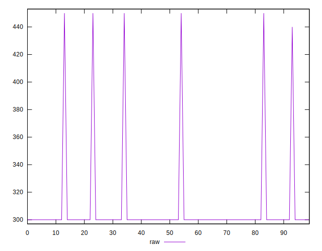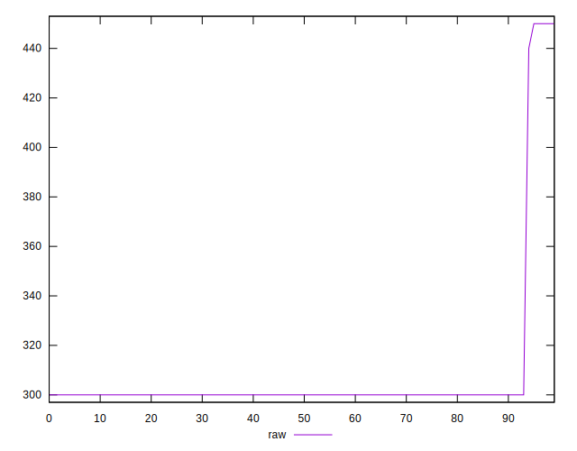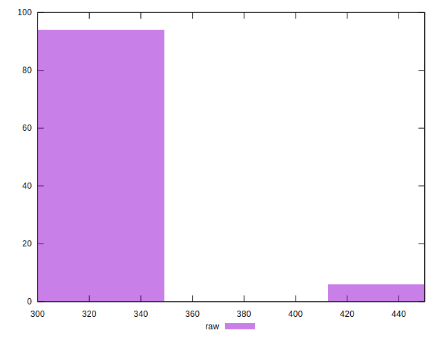
## Score


```yaml
p90min: 0.67
p90max: 0.75
p90range: 0.07999999999999996
p90mean: 0.7474468085106384
median: 0.75
p90stdev: 0.014061882248390044
mad: 0
stdevBySn: 0
p90skewness: -5.326002287485494
p90eccentricity: 1.0000000000000029
p90discretization: 47
outlandishness: 0.9939970803090047
confidence: 0.007447450505824797
p90confidence: 0.0056853553807855416

```

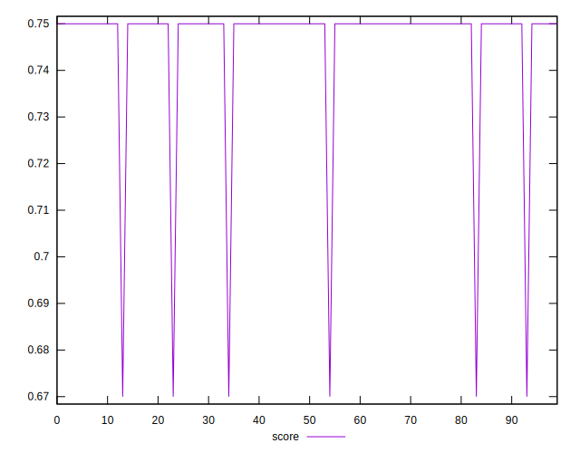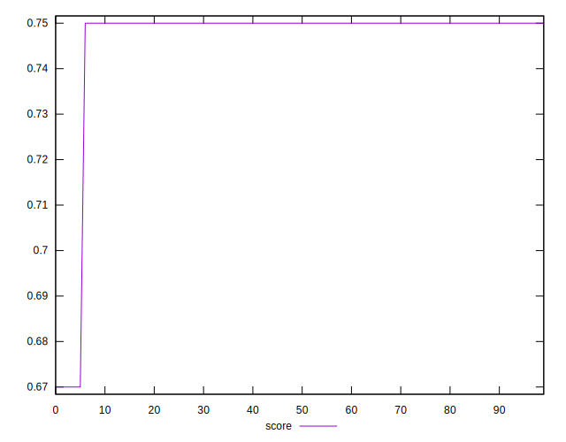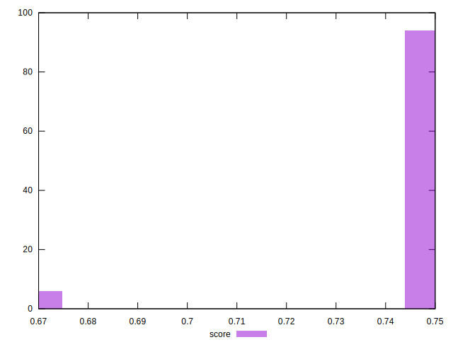
## Raw Estimate

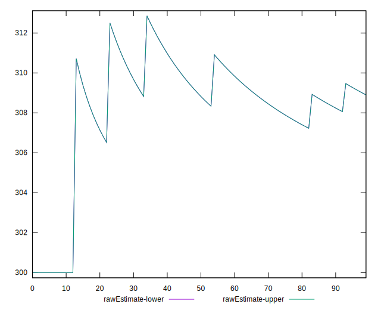
## Score Estimate

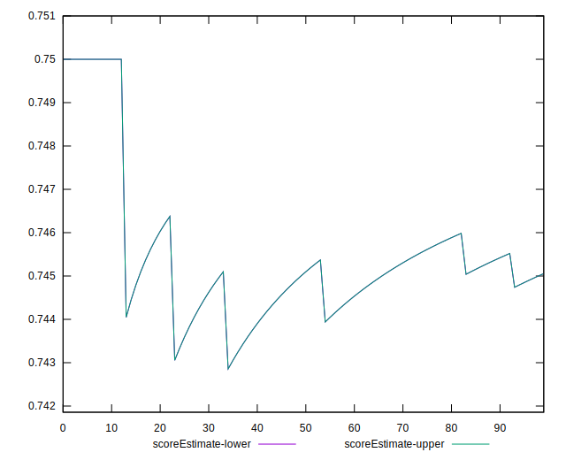
## P Score


```yaml
p90min: 0.6666666666666666
p90max: 0.75
p90range: 0.08333333333333337
p90mean: 0.7473995271867612
median: 0.75
p90stdev: 0.014329927199416148
mad: 0
stdevBySn: 0
p90skewness: -5.334954149794608
p90eccentricity: 1.0000000000000027
p90discretization: 31.333333333333332
outlandishness: 0.9937374964798312
confidence: 0.007674138990550879
p90confidence: 0.005793728554283217

```

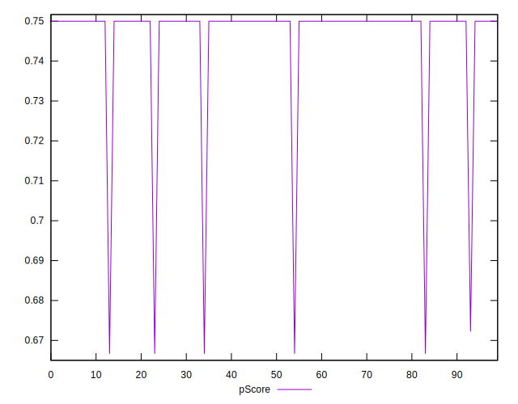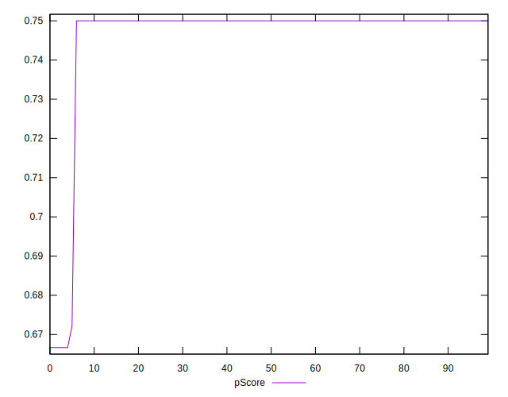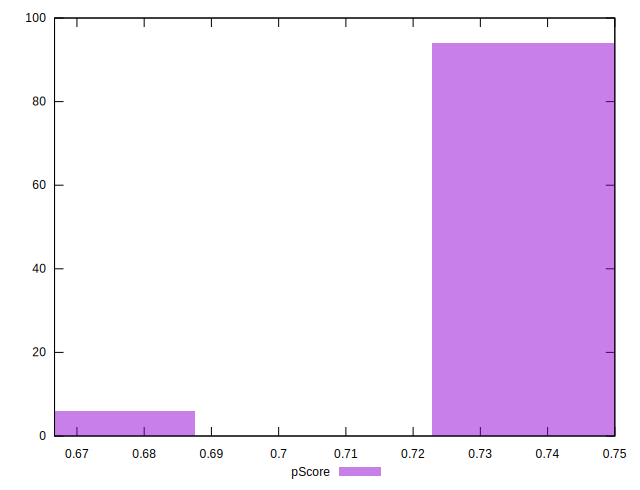
## Score Difference


```yaml
p90min: 0
p90max: 0
p90range: 0
p90mean: 0
median: 0
p90stdev: 0
mad: 0
stdevBySn: 0
p90skewness: .nan
p90eccentricity: .nan
p90discretization: 94
outlandishness: .nan
confidence: 0
p90confidence: 0

```


## P Score Difference


```yaml
p90min: -0.0033333333333334103
p90max: 0
p90range: 0.0033333333333334103
p90mean: -0.00007092198581560448
median: 0
p90stdev: 0.00048101631085995916
mad: 0
stdevBySn: 0
p90skewness: -6.634888026970383
p90eccentricity: 0.9999999999999992
p90discretization: 47
outlandishness: 4.148011111111133
confidence: 0.0002995794721799681
p90confidence: 0.0001944795599114324

```

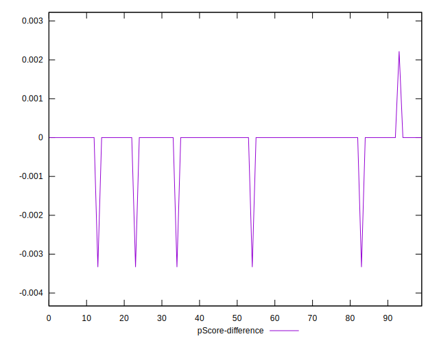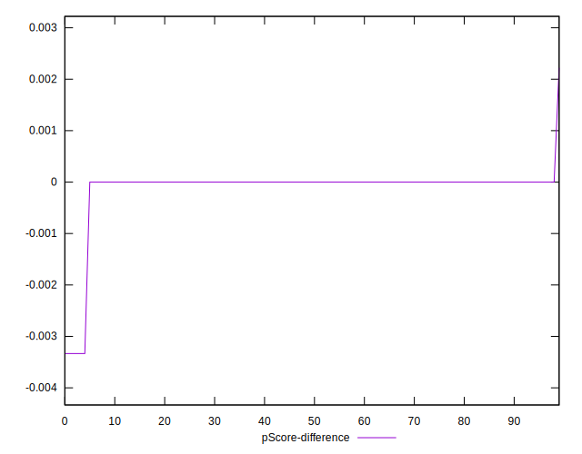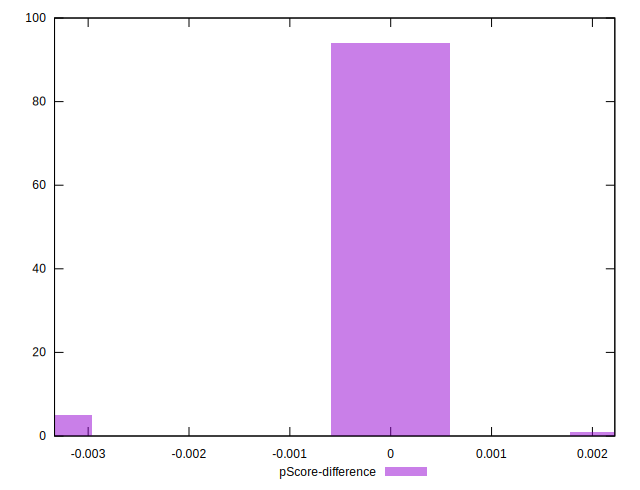