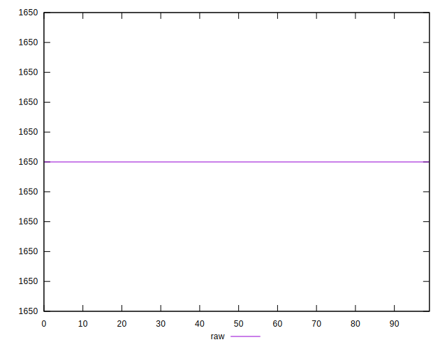
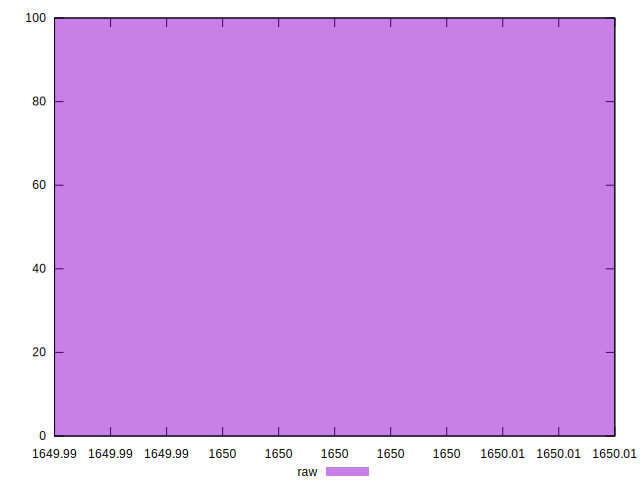
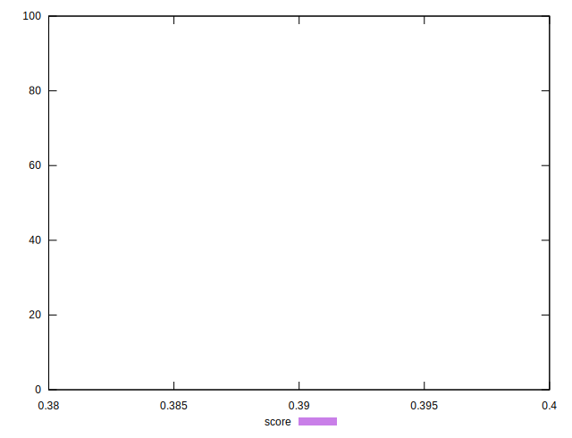
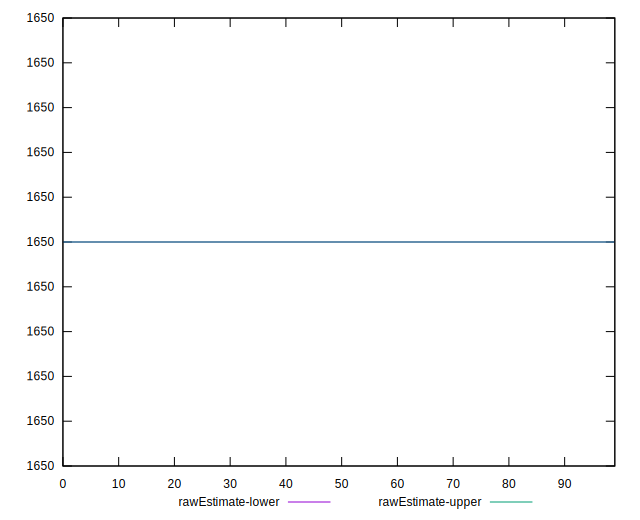
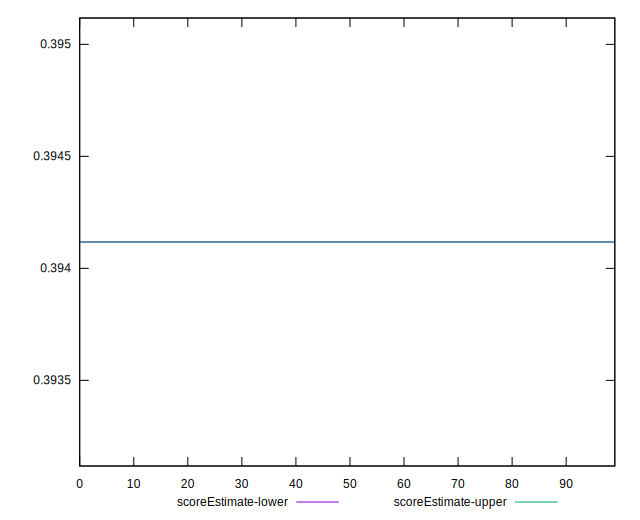
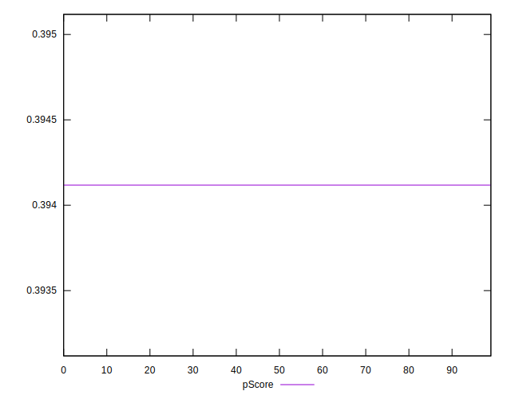
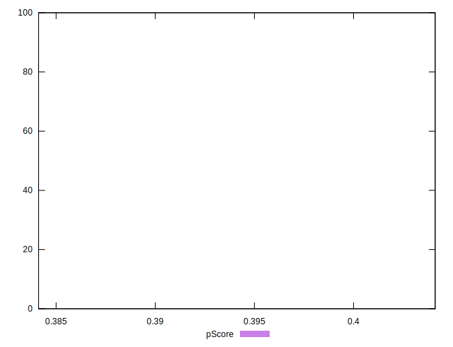
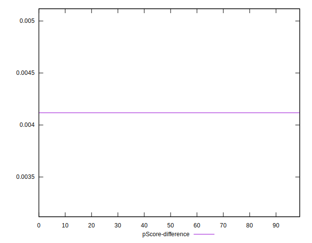
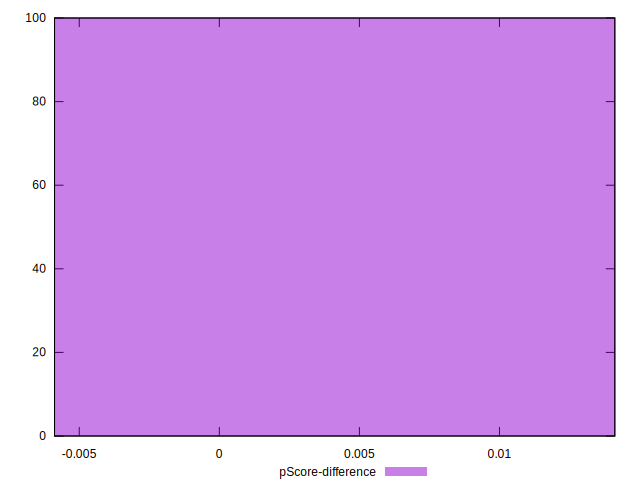

# //uses-webp-images/samples/pages+cached+noadtech

[→ Parent](../..)


## Raw


```yaml
p90min: 1650
p90max: 1650
p90range: 0
p90mean: 1650
median: 1650
p90stdev: 0
mad: 0
stdevBySn: 0
p90skewness: .nan
p90eccentricity: .nan
p90discretization: 94
outlandishness: 1
confidence: 0
p90confidence: 0

```


## Score


```yaml
p90min: 0.39
p90max: 0.39
p90range: 0
p90mean: 0.3900000000000004
median: 0.39
p90stdev: 3.885780586188048e-16
mad: 0
stdevBySn: 0
p90skewness: -1
p90eccentricity: 1
p90discretization: 94
outlandishness: 1
confidence: 1.5231980001507031e-16
p90confidence: 1.5710587796143399e-16

```


## Raw Estimate


## Score Estimate


## P Score


```yaml
p90min: 0.3941176470588235
p90max: 0.3941176470588235
p90range: 0
p90mean: 0.39411764705882335
median: 0.3941176470588235
p90stdev: 1.6653345369377348e-16
mad: 0
stdevBySn: 0
p90skewness: 1
p90eccentricity: 1
p90discretization: 94
outlandishness: 0.9999999999999991
confidence: 1.30559828584346e-16
p90confidence: 6.733109055490028e-17

```


## Score Difference


```yaml
p90min: 0
p90max: 0
p90range: 0
p90mean: 0
median: 0
p90stdev: 0
mad: 0
stdevBySn: 0
p90skewness: .nan
p90eccentricity: .nan
p90discretization: 94
outlandishness: .nan
confidence: 0
p90confidence: 0

```


## P Score Difference


```yaml
p90min: 0.004117647058823504
p90max: 0.004117647058823504
p90range: 0
p90mean: 0.004117647058823504
median: 0.004117647058823504
p90stdev: 0
mad: 0
stdevBySn: 0
p90skewness: .nan
p90eccentricity: .nan
p90discretization: 94
outlandishness: 1
confidence: 0
p90confidence: 0

```

