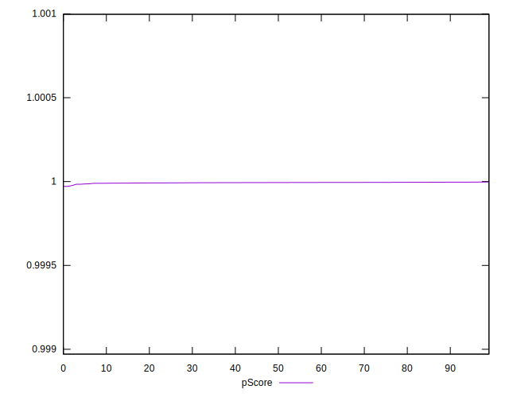

# //bootup-time/samples/pages+cached+noadtech+nomedia

[→ Parent](../..)


## Raw


```yaml
p90min: 102.612
p90max: 134.504
p90range: 31.891999999999996
p90mean: 113.86936170212768
median: 112.91199999999998
p90stdev: 6.8406132499308185
mad: 4.644000000000013
stdevBySn: 7.225963399999998
lfitCenter: 113.80918199100013
lfitStdev: 5.735752501466651
mfitCenter: 112.74274419791584
mfitConfidence: 0.5735752501466651
p90skewness: 0.7925746225575818
p90eccentricity: 0.9999999999999994
p90discretization: 1
outlandishness: 1.010766008492254

```


## Score


```yaml
p90min: 1
p90max: 1
p90range: 0
p90mean: 1
median: 1
p90stdev: 0
mad: 0
stdevBySn: 0
lfitCenter: 1
lfitStdev: 0
mfitCenter: 1
mfitConfidence: 0
p90skewness: .nan
p90eccentricity: .nan
p90discretization: 94
outlandishness: 1

```


## Raw Estimate


## Score Estimate


## P Score


```yaml
p90min: 0.9999839680935656
p90max: 0.999996658891719
p90range: 0.000012690798153358607
p90mean: 0.9999934936686966
median: 0.9999941076743781
p90stdev: 0.0000025264143503845045
mad: 0.0000013551014507728887
stdevBySn: 0.0000020712443982750465
lfitCenter: 0.9999934779807489
lfitStdev: 0.000002172421162943267
mfitCenter: 0.9999941268658457
mfitConfidence: 2.172421162943267e-7
p90skewness: -1.6351502399288864
p90eccentricity: 1.0000000000000004
p90discretization: 1.010752688172043
outlandishness: 0.9999989774405321

```


## Score Difference


```yaml
p90min: 0
p90max: 0
p90range: 0
p90mean: 0
median: 0
p90stdev: 0
mad: 0
stdevBySn: 0
lfitCenter: 0
lfitStdev: 0
mfitCenter: 0
mfitConfidence: 0
p90skewness: .nan
p90eccentricity: .nan
p90discretization: 94
outlandishness: .nan

```


## P Score Difference


```yaml
p90min: -0.000016031906434399446
p90max: -0.000003341108281040839
p90range: 0.000012690798153358607
p90mean: -0.0000065063313028286465
median: -0.0000058923256218701425
p90stdev: 0.0000025264143503845045
mad: 0.0000013551014507728887
stdevBySn: 0.0000020712443982750465
lfitCenter: -0.0000065220192508273984
lfitStdev: 0.0000021724211628097907
mfitCenter: -0.000005873134155075014
mfitConfidence: 2.1724211628097907e-7
p90skewness: -1.635150239805467
p90eccentricity: 1.0000000000000002
p90discretization: 1.010752688172043
outlandishness: 1.163337808574735

```

