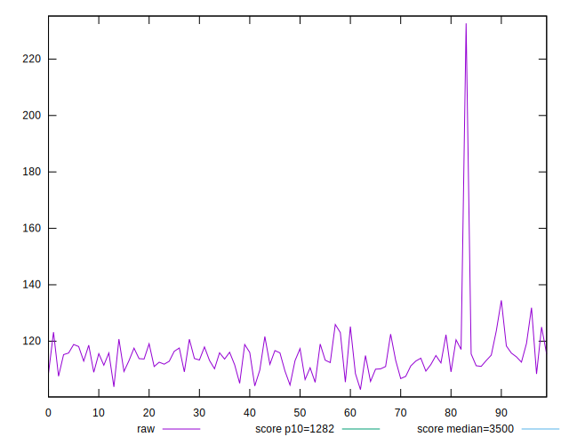
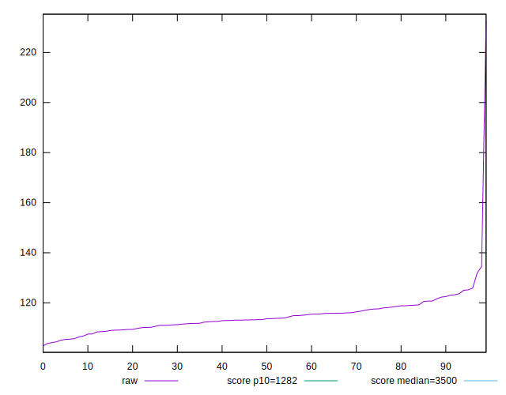
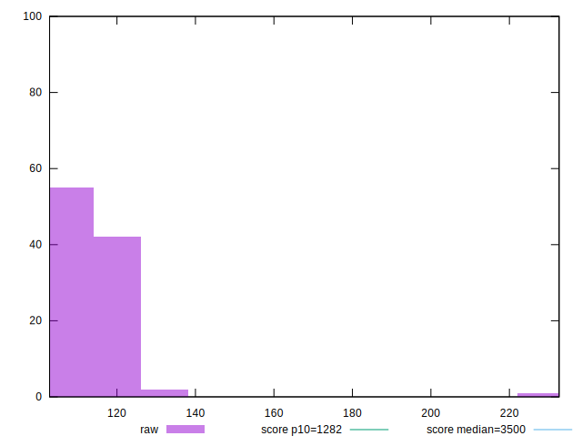
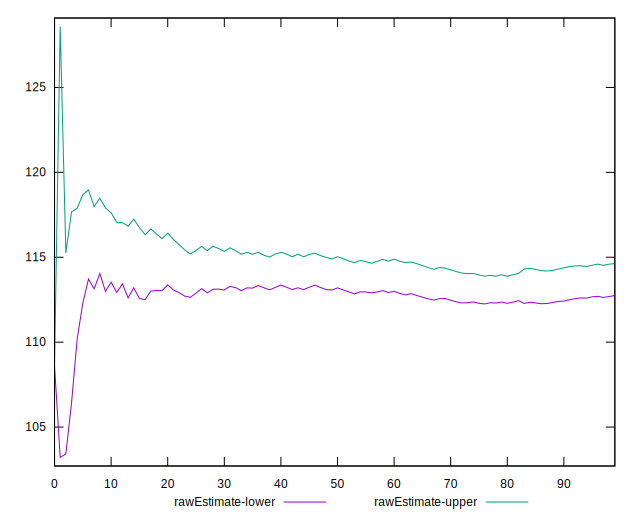
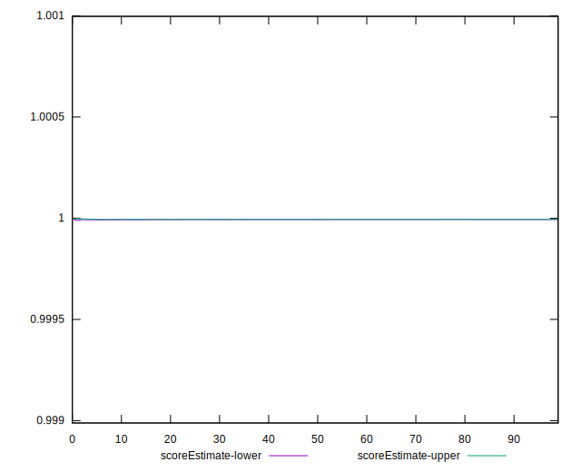
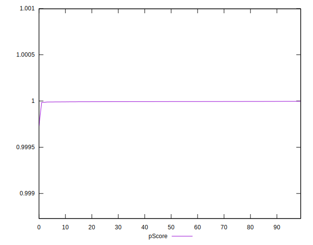
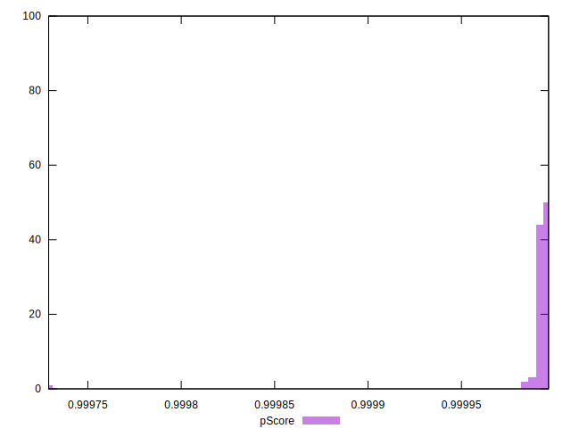
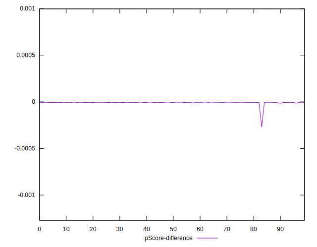
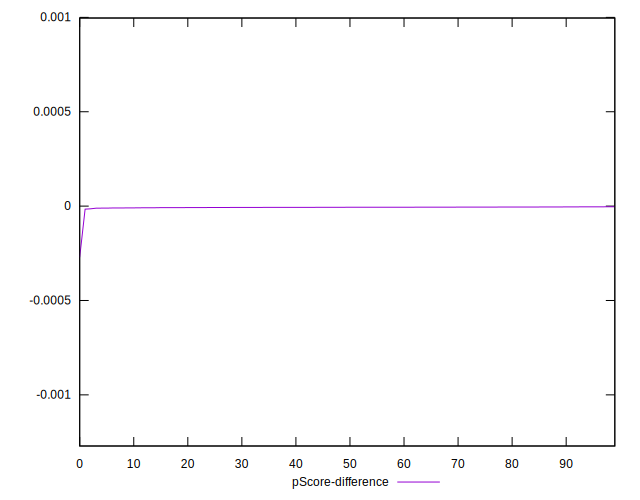
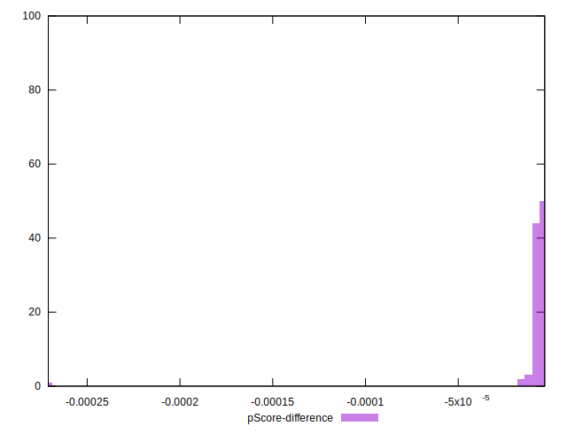

# //bootup-time/samples/pages+cached+noadtech

[→ Parent](../..)


## Raw


```yaml
p90min: 104.45999999999998
p90max: 125.92399999999996
p90range: 21.463999999999984
p90mean: 114.12361702127654
median: 113.49199999999998
p90stdev: 4.880205230046155
mad: 3.5
stdevBySn: 5.4132114000000024
lfitCenter: 114.58338582235734
lfitStdev: 4.791955930064803
mfitCenter: 113.68409388781087
mfitConfidence: 0.4791955930064803
p90skewness: 0.30448959458637387
p90eccentricity: 1.0000000000000007
p90discretization: 1
outlandishness: 1.0220356593513251

```


## Score


```yaml
p90min: 1
p90max: 1
p90range: 0
p90mean: 1
median: 1
p90stdev: 0
mad: 0
stdevBySn: 0
lfitCenter: 1
lfitStdev: 0
mfitCenter: 1
mfitConfidence: 0
p90skewness: .nan
p90eccentricity: .nan
p90discretization: 94
outlandishness: 1

```


## Raw Estimate


## Score Estimate


## P Score


```yaml
p90min: 0.9999889421738348
p90max: 0.9999962817391371
p90range: 0.000007339565302300066
p90mean: 0.9999935725727788
median: 0.9999939281647694
p90stdev: 0.0000016439462284931335
mad: 0.000001072683360303639
stdevBySn: 0.0000015507235666741006
lfitCenter: 0.9999923942232912
lfitStdev: 0.0000036466702153590774
mfitCenter: 0.9999937274492829
mfitConfidence: 3.6466702153590773e-7
p90skewness: -0.7639436675937206
p90eccentricity: 1
p90discretization: 1
outlandishness: 0.9999945321394136

```


## Score Difference


```yaml
p90min: 0
p90max: 0
p90range: 0
p90mean: 0
median: 0
p90stdev: 0
mad: 0
stdevBySn: 0
lfitCenter: 0
lfitStdev: 0
mfitCenter: 0
mfitConfidence: 0
p90skewness: .nan
p90eccentricity: .nan
p90discretization: 94
outlandishness: .nan

```


## P Score Difference


```yaml
p90min: -0.000011057826165172813
p90max: -0.0000037182608628727465
p90range: 0.000007339565302300066
p90mean: -0.000006427427221232725
median: -0.000006071835230547773
p90stdev: 0.0000016439462284931335
mad: 0.000001072683360303639
stdevBySn: 0.0000015507235666741006
lfitCenter: -0.0000076057767094921424
lfitStdev: 0.0000036466702159935614
mfitCenter: -0.000006272550716805869
mfitConfidence: 3.6466702159935616e-7
p90skewness: -0.7639436682036818
p90eccentricity: 1.0000000000000002
p90discretization: 1
outlandishness: 2.0316271860646538

```

