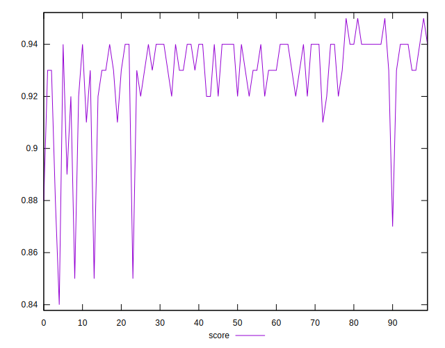
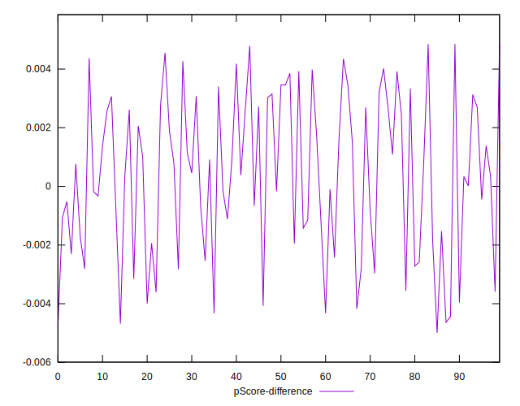

# //bootup-time/samples/pages+cached

[→ Parent](../..)


## Raw


```yaml
p90min: 996.3120000000004
p90max: 1539.135999999999
p90range: 542.8239999999987
p90mean: 1097.3024680851063
median: 1072.96
p90stdev: 97.50589787744761
mad: 43.91999999999996
stdevBySn: 67.3675887999996
lfitCenter: 1092.6718533865364
lfitStdev: 68.13898537337371
mfitCenter: 1071.4409638749482
mfitConfidence: 6.813898537337371
p90skewness: 2.4230724676148587
p90eccentricity: 1.0000000000000002
p90discretization: 1
outlandishness: 1.020026710870457

```


## Score


```yaml
p90min: 0.85
p90max: 0.95
p90range: 0.09999999999999998
p90mean: 0.9295744680851064
median: 0.93
p90stdev: 0.015973042024785895
mad: 0.009999999999999898
stdevBySn: 0.01192599999999988
lfitCenter: 0.930482279318916
lfitStdev: 0.011160515651244648
mfitCenter: 0.9339436378675386
mfitConfidence: 0.0011160515651244649
p90skewness: -2.60878471375655
p90eccentricity: 1.0000000000000016
p90discretization: 10.444444444444445
outlandishness: 0.9959711067032598

```


## Raw Estimate


## Score Estimate


## P Score


```yaml
p90min: 0.852749034606789
p90max: 0.9455607886824695
p90range: 0.09281175407568054
p90mean: 0.9300523574208593
median: 0.9343099157679108
p90stdev: 0.016276252314644822
mad: 0.00654754832333776
stdevBySn: 0.009984429531901156
lfitCenter: 0.9308247523131759
lfitStdev: 0.011063371192122168
mfitCenter: 0.9344440459190628
mfitConfidence: 0.0011063371192122167
p90skewness: -2.677696484573162
p90eccentricity: 1
p90discretization: 1
outlandishness: 0.9956979204869636

```


## Score Difference


```yaml
p90min: 0
p90max: 1.1102230246251565e-16
p90range: 1.1102230246251565e-16
p90mean: 5.196788625904988e-17
median: 0
p90stdev: 5.539795288958158e-17
mad: 0
stdevBySn: 0
lfitCenter: 4.9676344103855176e-17
lfitStdev: 6.880425346057829e-17
mfitCenter: 4.9676344103855176e-17
mfitConfidence: 0
p90skewness: 0.12792042981336654
p90eccentricity: 1.0000000000000016
p90discretization: 47
outlandishness: 1.008198553719008

```


## P Score Difference


```yaml
p90min: -0.004636952627112612
p90max: 0.00479109832429836
p90range: 0.009428050951410971
p90mean: 0.0003709327477505293
median: 0.00041749813404090563
p90stdev: 0.0026742603271739662
mad: 0.002359299896364131
stdevBySn: 0.003196820571682807
lfitCenter: 0.0004165300631275098
lfitStdev: 0.00235356567018638
mfitCenter: 0.0005507708195087745
mfitConfidence: 0.000235356567018638
p90skewness: -0.1870256015763788
p90eccentricity: 1.0000000000000002
p90discretization: 1
outlandishness: 0.8883947043529417

```

