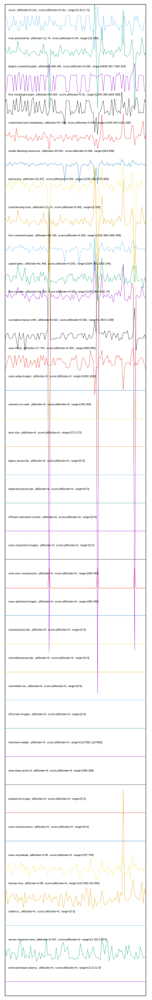

# //correlation/pages+cached+noadtech

[→ Parent](../..)

[0. score, p90stdev=0.011, score:p90stdev=0.011, range=[0.62:0.71]](../../meta/score/samples/pages+cached+noadtech)  
[1. max-potential-fid, p90stdev=11.74, score:p90stdev=0.04, range=[32:386]](../../max-potential-fid/samples/pages+cached+noadtech/)  
[2. largest-contentful-paint, p90stdev=393.495, score:p90stdev=0.036, range=[5630.381:7180.423]](../../largest-contentful-paint/samples/pages+cached+noadtech/)  
[3. first-meaningful-paint, p90stdev=50.004, score:p90stdev=0.01, range=[2245.366:2605.958]](../../first-meaningful-paint/samples/pages+cached+noadtech/)  
[4. mainthread-work-breakdown, p90stdev=57.288, score:p90stdev=0.008, range=[1454.644:2103.168]](../../mainthread-work-breakdown/samples/pages+cached+noadtech/)  
[5. render-blocking-resources, p90stdev=20.501, score:p90stdev=0.006, range=[623:859]](../../render-blocking-resources/samples/pages+cached+noadtech/)  
[6. interactive, p90stdev=32.647, score:p90stdev=0.005, range=[2245.366:5070.883]](../../interactive/samples/pages+cached+noadtech/)  
[7. total-blocking-time, p90stdev=11.74, score:p90stdev=0.005, range=[0:336]](../../total-blocking-time/samples/pages+cached+noadtech/)  
[8. first-contentful-paint, p90stdev=18.793, score:p90stdev=0.005, range=[2229.366:2490.458]](../../first-contentful-paint/samples/pages+cached+noadtech/)  
[9. speed-index, p90stdev=61.456, score:p90stdev=0.003, range=[2294.471:3263.244]](../../speed-index/samples/pages+cached+noadtech/)  
[10. first-cpu-idle, p90stdev=16.914, score:p90stdev=0.003, range=[2245.366:4342.74]](../../first-cpu-idle/samples/pages+cached+noadtech/)  
[11. cumulative-layout-shift, p90stdev=0.022, score:p90stdev=0.002, range=[1.053:2.028]](../../cumulative-layout-shift/samples/pages+cached+noadtech/)  
[12. uses-http2, p90stdev=17.752, score:p90stdev=0.002, range=[690:880]](../../uses-http2/samples/pages+cached+noadtech/)  
[13. uses-webp-images, p90stdev=0, score:p90stdev=0, range=[1650:1650]](../../uses-webp-images/samples/pages+cached+noadtech/)  
[14. unused-css-rules, p90stdev=0, score:p90stdev=0, range=[150:300]](../../unused-css-rules/samples/pages+cached+noadtech/)  
[15. uses-passive-event-listeners, p90stdev=NaN, score:p90stdev=0, range=[NaN:NaN]](../../uses-passive-event-listeners/samples/pages+cached+noadtech/)  
[16. no-document-write, p90stdev=NaN, score:p90stdev=0, range=[NaN:NaN]](../../no-document-write/samples/pages+cached+noadtech/)  
[17. dom-size, p90stdev=0, score:p90stdev=0, range=[172:172]](../../dom-size/samples/pages+cached+noadtech/)  
[18. legacy-javascript, p90stdev=0, score:p90stdev=0, range=[0:0]](../../legacy-javascript/samples/pages+cached+noadtech/)  
[19. duplicated-javascript, p90stdev=0, score:p90stdev=0, range=[0:0]](../../duplicated-javascript/samples/pages+cached+noadtech/)  
[20. efficient-animated-content, p90stdev=0, score:p90stdev=0, range=[0:0]](../../efficient-animated-content/samples/pages+cached+noadtech/)  
[21. uses-responsive-images, p90stdev=0, score:p90stdev=0, range=[0:0]](../../uses-responsive-images/samples/pages+cached+noadtech/)  
[22. uses-text-compression, p90stdev=0, score:p90stdev=0, range=[300:450]](../../uses-text-compression/samples/pages+cached+noadtech/)  
[23. uses-optimized-images, p90stdev=0, score:p90stdev=0, range=[300:300]](../../uses-optimized-images/samples/pages+cached+noadtech/)  
[24. unused-javascript, p90stdev=0, score:p90stdev=0, range=[0:0]](../../unused-javascript/samples/pages+cached+noadtech/)  
[25. unminified-javascript, p90stdev=0, score:p90stdev=0, range=[0:0]](../../unminified-javascript/samples/pages+cached+noadtech/)  
[26. unminified-css, p90stdev=0, score:p90stdev=0, range=[0:0]](../../unminified-css/samples/pages+cached+noadtech/)  
[27. offscreen-images, p90stdev=0, score:p90stdev=0, range=[0:0]](../../offscreen-images/samples/pages+cached+noadtech/)  
[28. total-byte-weight, p90stdev=0, score:p90stdev=0, range=[1227082:1227082]](../../total-byte-weight/samples/pages+cached+noadtech/)  
[29. uses-long-cache-ttl, p90stdev=0, score:p90stdev=0, range=[366:366]](../../uses-long-cache-ttl/samples/pages+cached+noadtech/)  
[30. preload-lcp-image, p90stdev=0, score:p90stdev=0, range=[0:0]](../../preload-lcp-image/samples/pages+cached+noadtech/)  
[31. unsized-images, p90stdev=NaN, score:p90stdev=0, range=[NaN:NaN]](../../unsized-images/samples/pages+cached+noadtech/)  
[32. third-party-summary, p90stdev=NaN, score:p90stdev=0, range=[NaN:NaN]](../../third-party-summary/samples/pages+cached+noadtech/)  
[33. font-display, p90stdev=NaN, score:p90stdev=0, range=[NaN:NaN]](../../font-display/samples/pages+cached+noadtech/)  
[34. uses-rel-preconnect, p90stdev=0, score:p90stdev=0, range=[0:0]](../../uses-rel-preconnect/samples/pages+cached+noadtech/)  
[35. uses-rel-preload, p90stdev=3.95, score:p90stdev=0, range=[767:794]](../../uses-rel-preload/samples/pages+cached+noadtech/)  
[36. bootup-time, p90stdev=4.88, score:p90stdev=0, range=[102.836:232.664]](../../bootup-time/samples/pages+cached+noadtech/)  
[37. redirects, p90stdev=0, score:p90stdev=0, range=[0:0]](../../redirects/samples/pages+cached+noadtech/)  
[38. server-response-time, p90stdev=0.537, score:p90stdev=0, range=[2.431:5.074]](../../server-response-time/samples/pages+cached+noadtech/)  
[39. estimated-input-latency, p90stdev=0, score:p90stdev=0, range=[12.8:12.8]](../../estimated-input-latency/samples/pages+cached+noadtech/)  
