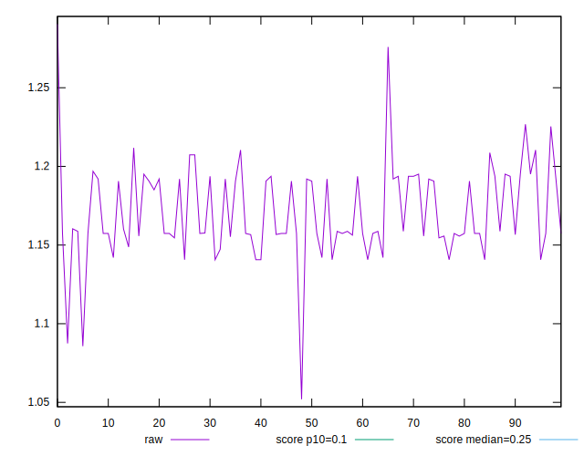
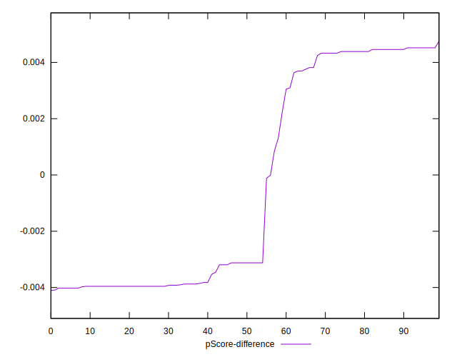

# //cumulative-layout-shift/samples/pages+cached

[→ Parent](../..)


## Raw


```yaml
p90min: 1.1406689402262369
p90max: 1.2254139862060547
p90range: 0.0847450459798178
p90mean: 1.1710476635691693
median: 1.158188471476237
p90stdev: 0.022210650480292245
mad: 0.017519531250000053
stdevBySn: 0.021534349609375013
lfitCenter: 1.1695043851662068
lfitStdev: 0.025184450861003866
mfitCenter: 1.1668231375226417
mfitConfidence: 0.0025184450861003866
p90skewness: 0.3546615873272871
p90eccentricity: 1
p90discretization: 3.2413793103448274
outlandishness: 0.9998657844645125

```


## Score


```yaml
p90min: 0.01
p90max: 0.02
p90range: 0.01
p90mean: 0.015851063829787244
median: 0.02
p90stdev: 0.004927036671025281
mad: 0
stdevBySn: 0
lfitCenter: 0.016321063590624237
lfitStdev: 0.005829111667363761
mfitCenter: 0.017053355482450145
mfitConfidence: 0.0005829111667363761
p90skewness: -0.34546681367003046
p90eccentricity: 0.9999999999999987
p90discretization: 47
outlandishness: 0.993567424890771

```


## Raw Estimate


## Score Estimate


## P Score


```yaml
p90min: 0.013100293117394857
p90max: 0.016877152400296802
p90range: 0.0037768592829019454
p90mean: 0.015434600534718955
median: 0.01600393824851018
p90stdev: 0.0010158691561539391
mad: 0.0008732141517866221
stdevBySn: 0.0010723644960367207
lfitCenter: 0.015518203573779962
lfitStdev: 0.0011494140161866066
mfitCenter: 0.0156040612520514
mfitConfidence: 0.00011494140161866066
p90skewness: -0.28087249342670423
p90eccentricity: 0.9999999999999999
p90discretization: 3.357142857142857
outlandishness: 1.0060989443934216

```


## Score Difference


```yaml
p90min: 0
p90max: 0
p90range: 0
p90mean: 0
median: 0
p90stdev: 0
mad: 0
stdevBySn: 0
lfitCenter: 0
lfitStdev: 0
mfitCenter: 0
mfitConfidence: 0
p90skewness: .nan
p90eccentricity: .nan
p90discretization: 94
outlandishness: .nan

```


## P Score Difference


```yaml
p90min: -0.004022029635621965
p90max: 0.004519133420604513
p90range: 0.008541163056226478
p90mean: -0.0003556066888310763
median: -0.0031228475997031983
p90stdev: 0.0038581130680810246
mad: 0.0008991820359187663
stdevBySn: 0.0010723644960367207
lfitCenter: -0.0006587794974879309
lfitStdev: 0.0043715760341416785
mfitCenter: -0.001188717213197973
mfitConfidence: 0.00043715760341416784
p90skewness: 0.2973243804746411
p90eccentricity: 0.9999999999999991
p90discretization: 3.032258064516129
outlandishness: 0.8017079144822448

```

