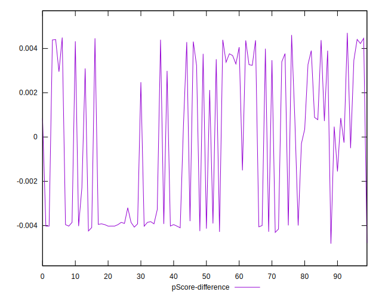

# //cumulative-layout-shift/samples/pages

[→ Parent](../..)


## Raw


```yaml
p90min: 1.093710659450955
p90max: 1.3067596842447917
p90range: 0.2130490247938368
p90mean: 1.189920860056054
median: 1.1810043784247504
p90stdev: 0.043547583026929654
mad: 0.024048758612738586
stdevBySn: 0.04282927348217449
lfitCenter: 1.1884374399640816
lfitStdev: 0.039853206650922
mfitCenter: 1.1794305972524652
mfitConfidence: 0.0039853206650922
p90skewness: 1.1247230770293373
p90eccentricity: 0.9999999999999999
p90discretization: 1.146341463414634
outlandishness: 1.0099760177441013

```


## Score


```yaml
p90min: 0.01
p90max: 0.02
p90range: 0.01
p90mean: 0.015000000000000012
median: 0.015
p90stdev: 0.004999999999999998
mad: 0.005000000000000001
stdevBySn: 0.008944500000000001
lfitCenter: 0.014953463986474513
lfitStdev: 0.006324894936587679
mfitCenter: 0.015007492681274732
mfitConfidence: 0.0006324894936587679
p90skewness: -6.7711793618893856e-15
p90eccentricity: 1.0000000000000002
p90discretization: 47
outlandishness: 0.9867111111111108

```


## Raw Estimate


## Score Estimate


## P Score


```yaml
p90min: 0.01035808192855403
p90max: 0.01949947396285412
p90range: 0.009141392034300089
p90mean: 0.014683000742785553
median: 0.01494520726794879
p90stdev: 0.0017674304642020596
mad: 0.0010998437353084423
stdevBySn: 0.0019543341389787945
lfitCenter: 0.014797232473385546
lfitStdev: 0.0016351521490258088
mfitCenter: 0.015024583027719828
mfitConfidence: 0.00016351521490258087
p90skewness: -0.7344429089968582
p90eccentricity: 1
p90discretization: 1.175
outlandishness: 0.9919248543176248

```


## Score Difference


```yaml
p90min: 0
p90max: 0
p90range: 0
p90mean: 0
median: 0
p90stdev: 0
mad: 0
stdevBySn: 0
lfitCenter: 0
lfitStdev: 0
mfitCenter: 0
mfitConfidence: 0
p90skewness: .nan
p90eccentricity: .nan
p90discretization: 94
outlandishness: .nan

```


## P Score Difference


```yaml
p90min: -0.0042827726166462625
p90max: 0.004461182548883011
p90range: 0.008743955165529274
p90mean: -0.00029304898555014336
median: -0.00027159977170169644
p90stdev: 0.003582415772322338
mad: 0.0037446167490026074
stdevBySn: 0.004470514365716512
lfitCenter: -0.0004112778200313058
lfitStdev: 0.0038359298905171054
mfitCenter: -0.0005221489216948671
mfitConfidence: 0.0003835929890517105
p90skewness: 0.12054581333300671
p90eccentricity: 0.9999999999999991
p90discretization: 1.175
outlandishness: 0.8896217716063196

```

