# //dom-size/samples/pages

[→ Parent](../..)


## Raw


```yaml
p90min: 419
p90max: 422
p90range: 3
p90mean: 421.968085106383
median: 422
p90stdev: 0.3077760881167963
mad: 0
stdevBySn: 0
lfitCenter: 421.899993306802
lfitStdev: 0.24582274780406108
mfitCenter: 421.99908668623135
mfitConfidence: 0.02458227478040611
p90skewness: -9.539955591520126
p90eccentricity: 1.0000000000000027
p90discretization: 47
outlandishness: 0.9991561090346196

```

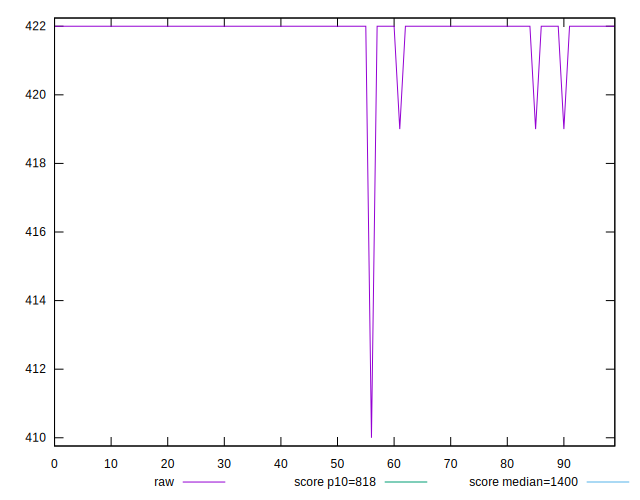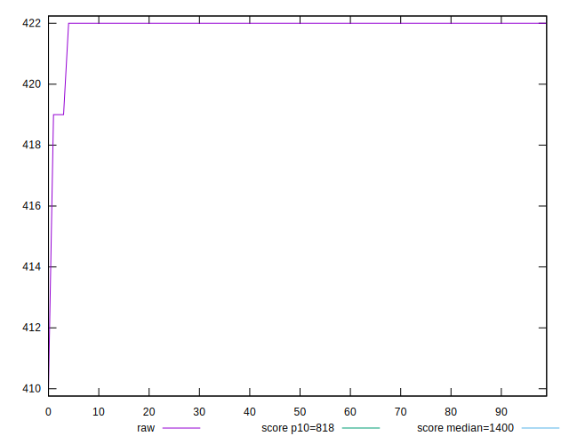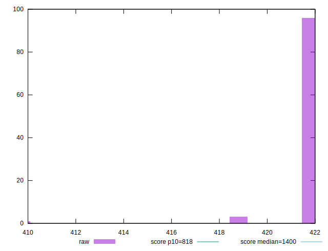
## Score


```yaml
p90min: 1
p90max: 1
p90range: 0
p90mean: 1
median: 1
p90stdev: 0
mad: 0
stdevBySn: 0
lfitCenter: 1
lfitStdev: 0
mfitCenter: 1
mfitConfidence: 0
p90skewness: .nan
p90eccentricity: .nan
p90discretization: 94
outlandishness: 1

```


## Raw Estimate

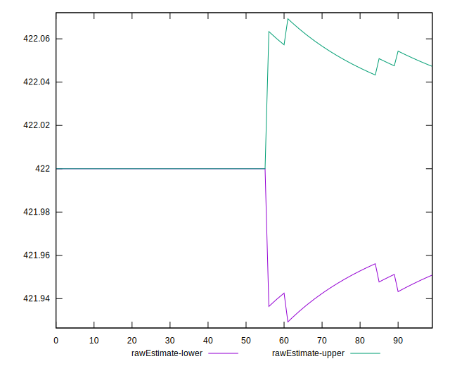
## Score Estimate

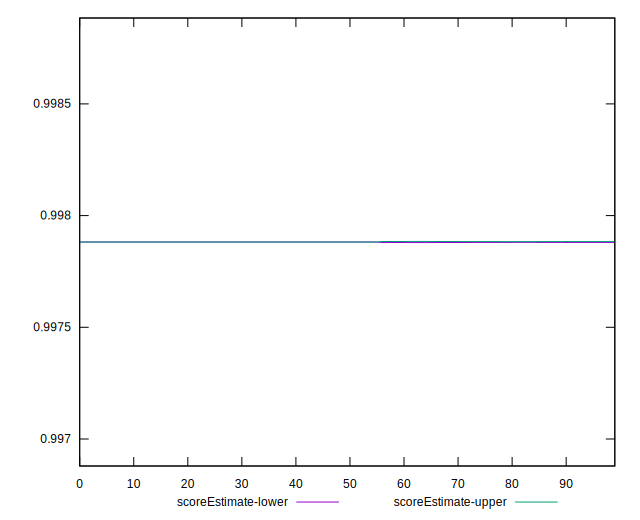
## P Score


```yaml
p90min: 0.9978817385378554
p90max: 0.997992657587729
p90range: 0.00011091904987359236
p90mean: 0.9978829185277484
median: 0.9978817385378554
p90stdev: 0.000011379410422575358
mad: 0
stdevBySn: 0
lfitCenter: 0.997885311158228
lfitStdev: 0.000008781725790396128
mfitCenter: 0.9978817702437613
mfitConfidence: 8.781725790396127e-7
p90skewness: 9.539955591352411
p90eccentricity: 1.000000000000002
p90discretization: 47
outlandishness: 1.0000126586143323

```

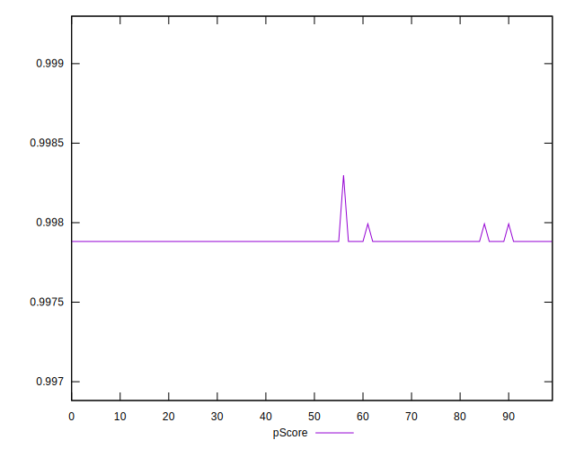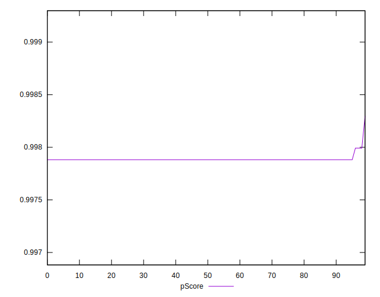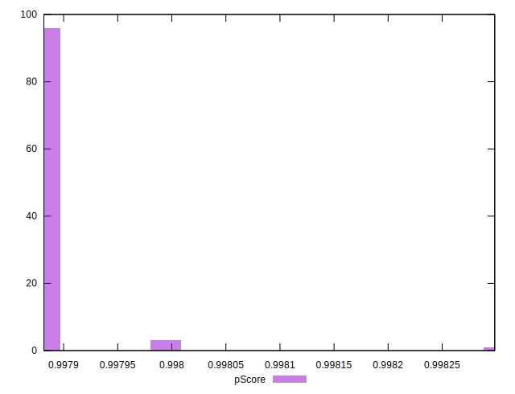
## Score Difference


```yaml
p90min: 0
p90max: 0
p90range: 0
p90mean: 0
median: 0
p90stdev: 0
mad: 0
stdevBySn: 0
lfitCenter: 0
lfitStdev: 0
mfitCenter: 0
mfitConfidence: 0
p90skewness: .nan
p90eccentricity: .nan
p90discretization: 94
outlandishness: .nan

```


## P Score Difference


```yaml
p90min: -0.002118261462144555
p90max: -0.0020073424122709627
p90range: 0.00011091904987359236
p90mean: -0.0021170814722522827
median: -0.002118261462144555
p90stdev: 0.000011379410422575382
mad: 0
stdevBySn: 0
lfitCenter: -0.002114688841771763
lfitStdev: 0.000008781725790701773
mfitCenter: -0.00211822975623934
mfitConfidence: 8.781725790701773e-7
p90skewness: 9.539955591519853
p90eccentricity: 0.9999999999999976
p90discretization: 47
outlandishness: 0.994042301620392

```

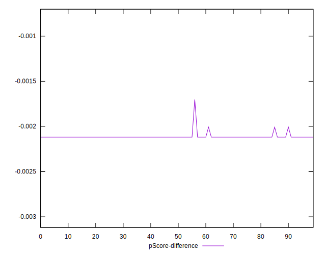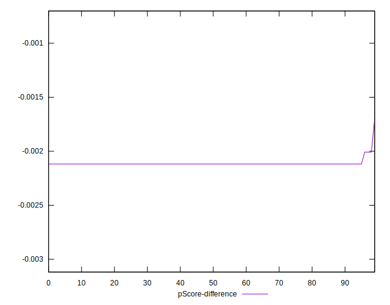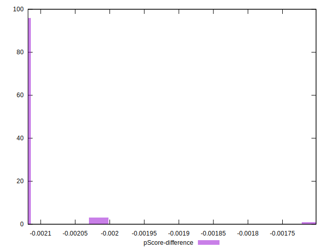