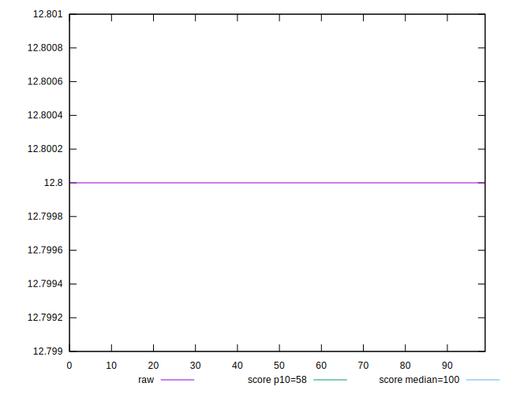
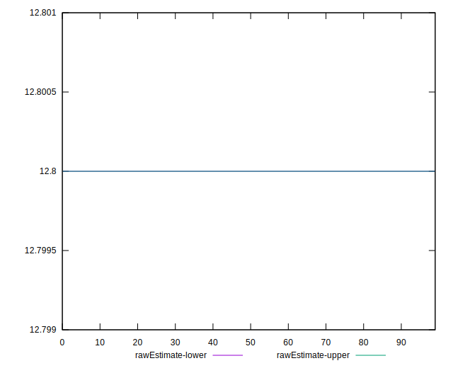
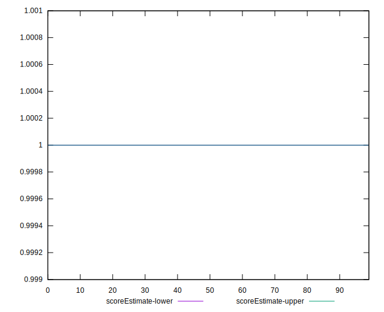
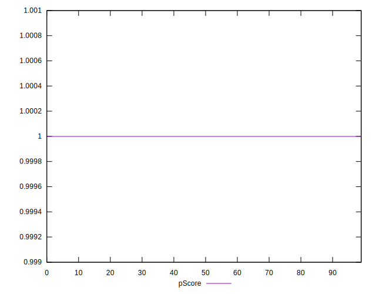
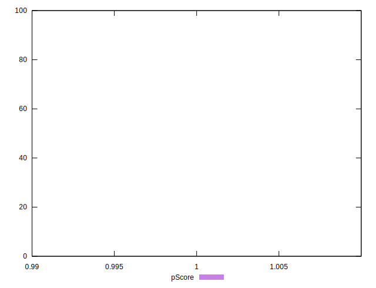
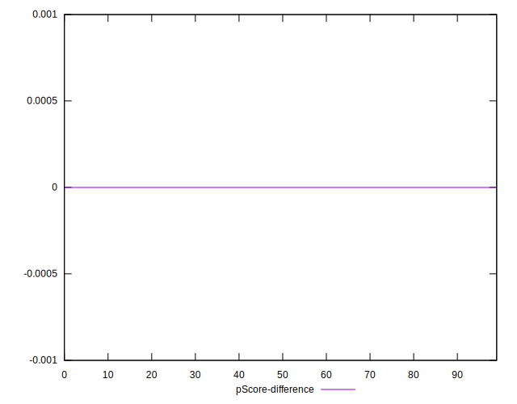
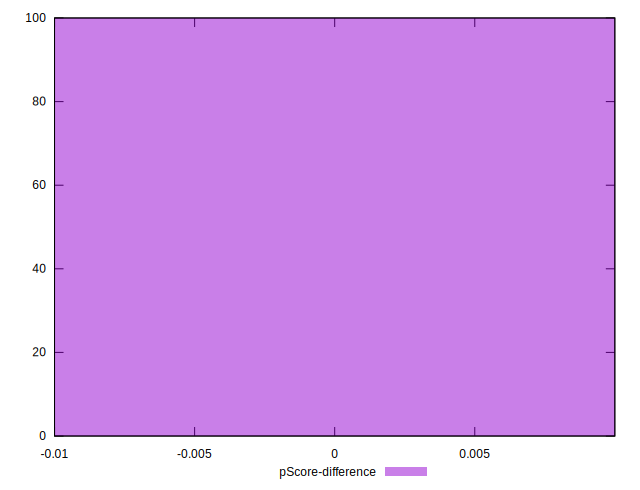

# //estimated-input-latency/samples/pages+cached+noadtech+nomedia

[→ Parent](../..)


## Raw


```yaml
p90min: 12.8
p90max: 12.8
p90range: 0
p90mean: 12.799999999999976
median: 12.8
p90stdev: 2.4868995751603507e-14
mad: 0
stdevBySn: 0
lfitCenter: 12.799999999999976
lfitStdev: 0
mfitCenter: 12.799999999999976
mfitConfidence: 0
p90skewness: 1
p90eccentricity: 1
p90discretization: 94
outlandishness: 1

```


## Score


```yaml
p90min: 1
p90max: 1
p90range: 0
p90mean: 1
median: 1
p90stdev: 0
mad: 0
stdevBySn: 0
lfitCenter: 1
lfitStdev: 0
mfitCenter: 1
mfitConfidence: 0
p90skewness: .nan
p90eccentricity: .nan
p90discretization: 94
outlandishness: 1

```


## Raw Estimate


## Score Estimate


## P Score


```yaml
p90min: 0.9999993380488856
p90max: 0.9999993380488856
p90range: 0
p90mean: 0.9999993380488849
median: 0.9999993380488856
p90stdev: 7.771561172376096e-16
mad: 0
stdevBySn: 0
lfitCenter: 0.9999993380488845
lfitStdev: 0
mfitCenter: 0.9999993380488845
mfitConfidence: 0
p90skewness: 1
p90eccentricity: 1
p90discretization: 94
outlandishness: 0.9999999999999993

```


## Score Difference


```yaml
p90min: 0
p90max: 0
p90range: 0
p90mean: 0
median: 0
p90stdev: 0
mad: 0
stdevBySn: 0
lfitCenter: 0
lfitStdev: 0
mfitCenter: 0
mfitConfidence: 0
p90skewness: .nan
p90eccentricity: .nan
p90discretization: 94
outlandishness: .nan

```


## P Score Difference


```yaml
p90min: -6.619511143668433e-7
p90max: -6.619511143668433e-7
p90range: 0
p90mean: -6.619511143668433e-7
median: -6.619511143668433e-7
p90stdev: 0
mad: 0
stdevBySn: 0
lfitCenter: -6.619511143668433e-7
lfitStdev: 0
mfitCenter: -6.619511143668433e-7
mfitConfidence: 0
p90skewness: .nan
p90eccentricity: .nan
p90discretization: 94
outlandishness: 1

```

