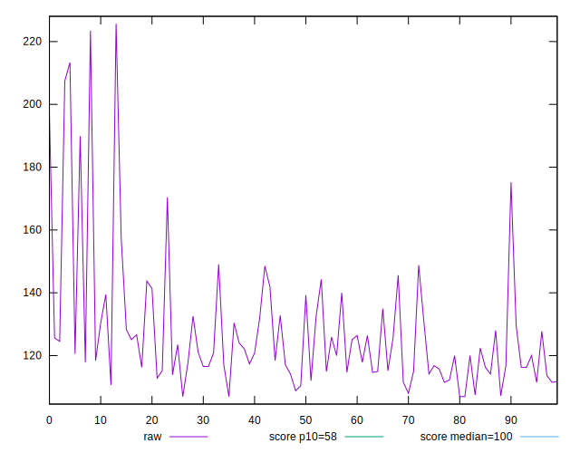
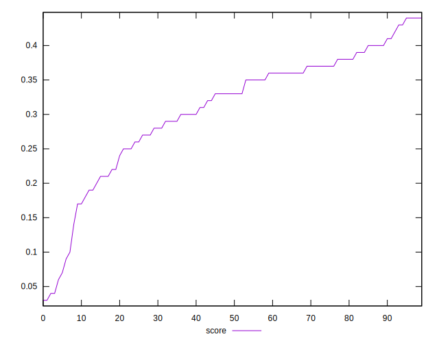

# //estimated-input-latency/samples/pages+cached

[→ Parent](../..)


## Raw


```yaml
p90min: 106.93333333333335
p90max: 207.4666666666667
p90range: 100.53333333333335
p90mean: 126.09929078014186
median: 120
p90stdev: 18.48913487008121
mad: 6.933333333333337
stdevBySn: 11.130933333333337
lfitCenter: 125.01616365298176
lfitStdev: 13.386452200743026
mfitCenter: 120.59114670781256
mfitConfidence: 1.3386452200743026
p90skewness: 2.299931253549161
p90eccentricity: 1.0000000000000004
p90discretization: 1.3823529411764706
outlandishness: 1.0362743029580255

```


## Score


```yaml
p90min: 0.04
p90max: 0.44
p90range: 0.4
p90mean: 0.3095744680851063
median: 0.33
p90stdev: 0.08834067150377757
mad: 0.04999999999999999
stdevBySn: 0.08348200000000001
lfitCenter: 0.31518169563923304
lfitStdev: 0.07141961742965709
mfitCenter: 0.3323048086661444
mfitConfidence: 0.007141961742965709
p90skewness: -1.080059777107716
p90eccentricity: 1.0000000000000007
p90discretization: 2.9375
outlandishness: 0.9719385050247402

```


## Raw Estimate


## Score Estimate


## P Score


```yaml
p90min: 0.04299283757011996
p90max: 0.43734235988761117
p90range: 0.3943495223174912
p90mean: 0.3094064167039071
median: 0.3339840140442445
p90stdev: 0.08800524883905476
mad: 0.049869469806957056
stdevBySn: 0.07955901383746454
lfitCenter: 0.31492083450035413
lfitStdev: 0.07131250424313215
mfitCenter: 0.33216313989047297
mfitConfidence: 0.007131250424313215
p90skewness: -1.0866722160091715
p90eccentricity: 1
p90discretization: 1.3823529411764706
outlandishness: 0.9711196547868826

```


## Score Difference


```yaml
p90min: 0
p90max: 5.551115123125783e-17
p90range: 5.551115123125783e-17
p90mean: 2.9527208101732887e-18
median: 0
p90stdev: 1.2457542745436651e-17
mad: 0
stdevBySn: 0
lfitCenter: 2.2729039546157425e-18
lfitStdev: 5.4640483521104424e-18
mfitCenter: 2.2729039546157425e-18
mfitConfidence: 0
p90skewness: 3.9819818903758075
p90eccentricity: 0.999999999999997
p90discretization: 47
outlandishness: 2.262016

```


## P Score Difference


```yaml
p90min: -0.004574953841826712
p90max: 0.004296649633854649
p90range: 0.008871603475681361
p90mean: -0.0003162757944206497
median: -0.0006367642993366229
p90stdev: 0.0026973688913871758
mad: 0.002229763260365253
stdevBySn: 0.0031059563408470147
lfitCenter: -0.00037667968029202816
lfitStdev: 0.002356504754585961
mfitCenter: -0.0005970248444290021
mfitConfidence: 0.00023565047545859611
p90skewness: 0.17207441512440302
p90eccentricity: 0.9999999999999989
p90discretization: 1.4242424242424243
outlandishness: 0.8652632701228239

```

