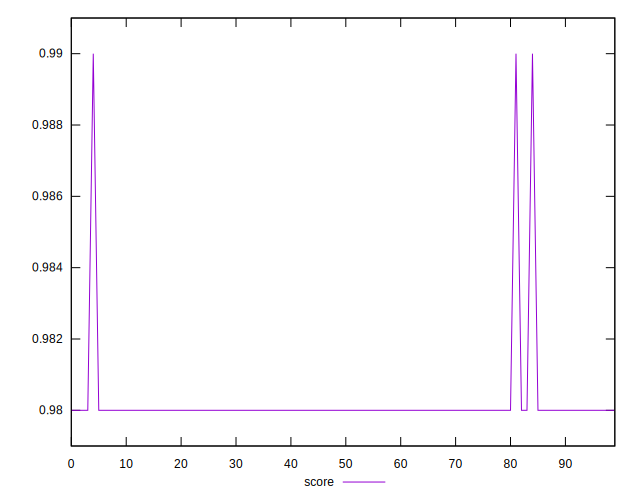

# //first-contentful-paint/samples/pages+cached+noadtech+nomedia+nocss

[→ Parent](../..)


## Raw


```yaml
p90min: 1609.9473
p90max: 1729.747
p90range: 119.79970000000003
p90mean: 1631.894794148937
median: 1621.610325
p90stdev: 28.711766792787195
mad: 7.04910000000018
stdevBySn: 11.187273745000434
lfitCenter: 1629.0594342313505
lfitStdev: 17.886552523425497
mfitCenter: 1622.397512866388
mfitConfidence: 1.7886552523425496
p90skewness: 2.3591127781201227
p90eccentricity: 1.0000000000000002
p90discretization: 1
outlandishness: 1.00294016274585

```


## Score


```yaml
p90min: 0.98
p90max: 0.98
p90range: 0
p90mean: 0.9800000000000002
median: 0.98
p90stdev: 2.220446049250313e-16
mad: 0
stdevBySn: 0
lfitCenter: 0.9801433667946134
lfitStdev: 0.0003542151281479214
mfitCenter: 0.9800005241043489
mfitConfidence: 0.000035421512814792135
p90skewness: -1
p90eccentricity: 1
p90discretization: 94
outlandishness: 1.0006123386089132

```


## Raw Estimate


## Score Estimate


## P Score


```yaml
p90min: 0.9771131422989212
p90max: 0.9849392941941479
p90range: 0.00782615189522673
p90mean: 0.983606749584116
median: 0.9842733888149724
p90stdev: 0.0018579606283229179
mad: 0.0004048530595744948
stdevBySn: 0.0006406103745674311
lfitCenter: 0.983788090391294
lfitStdev: 0.001134194278337149
mfitCenter: 0.9842187270188072
mfitConfidence: 0.0001134194278337149
p90skewness: -2.4510587195357214
p90eccentricity: 1.0000000000000002
p90discretization: 1
outlandishness: 0.9996599812572757

```


## Score Difference


```yaml
p90min: 0
p90max: 0
p90range: 0
p90mean: 0
median: 0
p90stdev: 0
mad: 0
stdevBySn: 0
lfitCenter: 0
lfitStdev: 0
mfitCenter: 0
mfitConfidence: 0
p90skewness: .nan
p90eccentricity: .nan
p90discretization: 94
outlandishness: .nan

```


## P Score Difference


```yaml
p90min: -0.00401284546750813
p90max: 0.004866918849843915
p90range: 0.008879764317352046
p90mean: 0.0033347080848041394
median: 0.004254180092744808
p90stdev: 0.002233727159127779
mad: 0.0004206628530440959
stdevBySn: 0.0006635186966960715
lfitCenter: 0.0035816572551477205
lfitStdev: 0.0014222795855325914
mfitCenter: 0.004132915982963652
mfitConfidence: 0.00014222795855325915
p90skewness: -2.1330943166075396
p90eccentricity: 0.9999999999999988
p90discretization: 1
outlandishness: 0.8863575064543677

```

