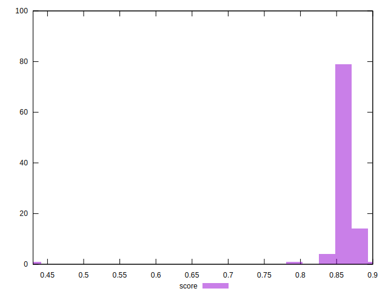

# //first-contentful-paint/samples/pages+cached

[→ Parent](../..)


## Raw


```yaml
p90min: 2441.7825
p90max: 2644.7474999999995
p90range: 202.9649999999997
p90mean: 2518.712409574468
median: 2518.37625
p90stdev: 43.58216929462474
mad: 32.08125000000018
stdevBySn: 44.3423587499993
lfitCenter: 2526.6971988233036
lfitStdev: 47.95578525796952
mfitCenter: 2515.2027005307327
mfitConfidence: 4.795578525796952
p90skewness: 0.5415099408742934
p90eccentricity: 1
p90discretization: 1
outlandishness: 1.0153877638935735

```


## Score


```yaml
p90min: 0.84
p90max: 0.88
p90range: 0.040000000000000036
p90mean: 0.8646808510638293
median: 0.86
p90stdev: 0.009190898326151149
mad: 0.010000000000000009
stdevBySn: 0.011926000000000011
lfitCenter: 0.8624278270131562
lfitStdev: 0.011180286263678615
mfitCenter: 0.8649577163914648
mfitConfidence: 0.0011180286263678615
p90skewness: -0.31713513593610976
p90eccentricity: 0.9999999999999999
p90discretization: 18.8
outlandishness: 0.9892025330925662

```


## Raw Estimate


## Score Estimate


## P Score


```yaml
p90min: 0.8378775934171095
p90max: 0.8802075894289103
p90range: 0.04232999601180076
p90mean: 0.8646692309511393
median: 0.8648632062280025
p90stdev: 0.009023973688497097
mad: 0.006662285083934183
stdevBySn: 0.009074493037397349
lfitCenter: 0.8627154819676237
lfitStdev: 0.010474366618019749
mfitCenter: 0.8654997336275968
mfitConfidence: 0.0010474366618019749
p90skewness: -0.6211975623671993
p90eccentricity: 1
p90discretization: 1
outlandishness: 0.9890794583359299

```


## Score Difference


```yaml
p90min: 0
p90max: 0
p90range: 0
p90mean: 0
median: 0
p90stdev: 0
mad: 0
stdevBySn: 0
lfitCenter: 0
lfitStdev: 0
mfitCenter: 0
mfitConfidence: 0
p90skewness: .nan
p90eccentricity: .nan
p90discretization: 94
outlandishness: .nan

```


## P Score Difference


```yaml
p90min: -0.004683076258720331
p90max: 0.004797657402368927
p90range: 0.009480733661089258
p90mean: -0.00007097742103580122
median: -0.00029224497111879355
p90stdev: 0.002830992189885487
mad: 0.002439633701750321
stdevBySn: 0.0032297802278605492
lfitCenter: -0.00008593835541445133
lfitStdev: 0.0025267852016300604
mfitCenter: -0.00013718671085544707
mfitConfidence: 0.00025267852016300603
p90skewness: 0.058079981932061826
p90eccentricity: 0.9999999999999996
p90discretization: 1
outlandishness: 0.8401570419525282

```

