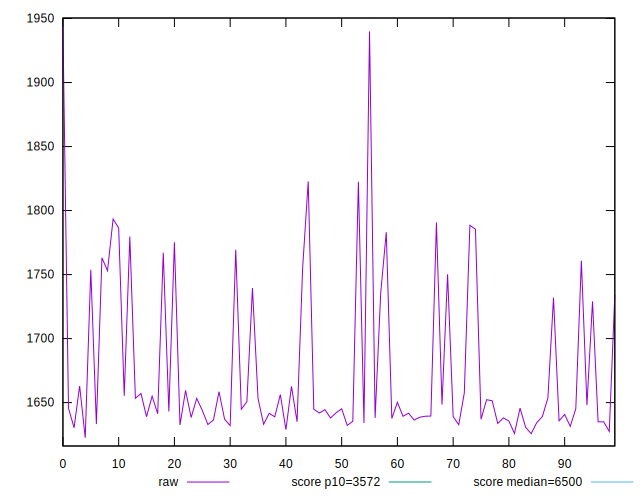
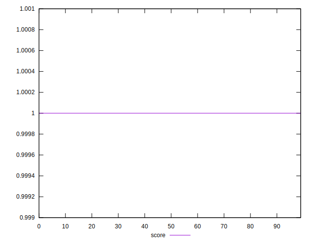

# //first-cpu-idle/samples/pages+cached+noadtech+nomedia+nocss

[→ Parent](../..)


## Raw


```yaml
p90min: 1627.4473
p90max: 1822.5099999999998
p90range: 195.06269999999972
p90mean: 1671.069889361703
median: 1644.6595
p90stdev: 54.142439165985515
mad: 10.49834999999996
stdevBySn: 15.514593030000206
lfitCenter: 1664.7820167229784
lfitStdev: 45.143642697608406
mfitCenter: 1648.6739986506855
mfitConfidence: 4.514364269760841
p90skewness: 1.3457741850911877
p90eccentricity: 1.0000000000000004
p90discretization: 1
outlandishness: 1.0066469151551583

```


## Score


```yaml
p90min: 1
p90max: 1
p90range: 0
p90mean: 1
median: 1
p90stdev: 0
mad: 0
stdevBySn: 0
lfitCenter: 1
lfitStdev: 0
mfitCenter: 1
mfitConfidence: 0
p90skewness: .nan
p90eccentricity: .nan
p90discretization: 94
outlandishness: 1

```


## Raw Estimate


## Score Estimate


## P Score


```yaml
p90min: 0.9967556634400742
p90max: 0.9984832530098751
p90range: 0.0017275895698009025
p90mean: 0.9981436809805134
median: 0.9983684644130402
p90stdev: 0.00045418097286357154
mad: 0.00007196709334134077
stdevBySn: 0.00010481139565119195
lfitCenter: 0.9981909236514074
lfitStdev: 0.000390708612832019
mfitCenter: 0.9983285014044232
mfitConfidence: 0.0000390708612832019
p90skewness: -1.4385997343493229
p90eccentricity: 0.9999999999999994
p90discretization: 1
outlandishness: 0.99987349179721

```


## Score Difference


```yaml
p90min: 0
p90max: 0
p90range: 0
p90mean: 0
median: 0
p90stdev: 0
mad: 0
stdevBySn: 0
lfitCenter: 0
lfitStdev: 0
mfitCenter: 0
mfitConfidence: 0
p90skewness: .nan
p90eccentricity: .nan
p90discretization: 94
outlandishness: .nan

```


## P Score Difference


```yaml
p90min: -0.0032443365599258422
p90max: -0.0015167469901249397
p90range: 0.0017275895698009025
p90mean: -0.001856319019487043
median: -0.0016315355869597759
p90stdev: 0.00045418097286357154
mad: 0.00007196709334134077
stdevBySn: 0.00010481139565119195
lfitCenter: -0.0018090763485929082
lfitStdev: 0.00039070861283226115
mfitCenter: -0.0016714985955779845
mfitConfidence: 0.00003907086128322611
p90skewness: -1.4385997343469605
p90eccentricity: 0.9999999999999992
p90discretization: 1
outlandishness: 1.0691825496733869

```

