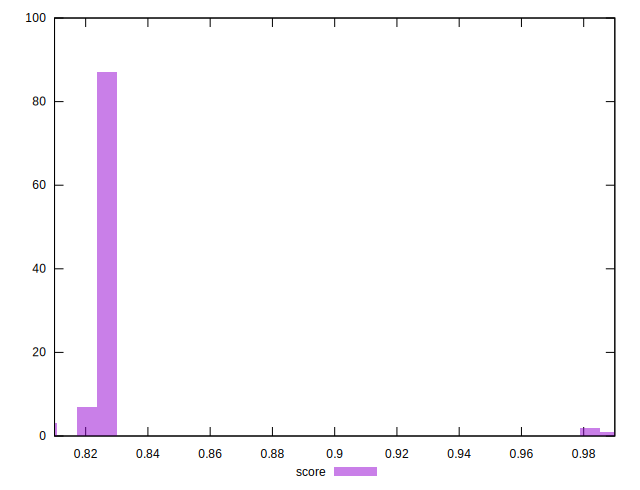
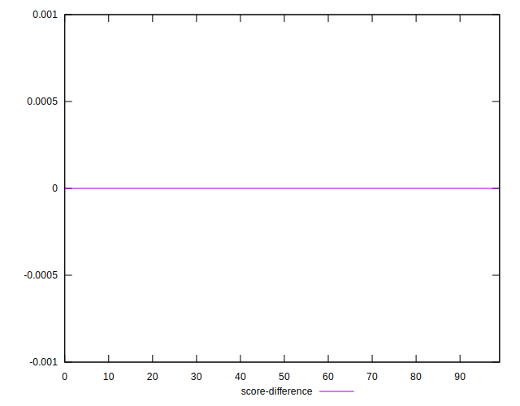

# //first-cpu-idle/samples/pages+cached+noadtech

[→ Parent](../..)


## Raw


```yaml
p90min: 4140.923999999999
p90max: 4236.432000000001
p90range: 95.50800000000163
p90mean: 4173.183646808509
median: 4171.3642
p90stdev: 16.913658483854096
mad: 9.63839999999982
stdevBySn: 15.52288159999955
lfitCenter: 4148.65039541356
lfitStdev: 63.74027645279834
mfitCenter: 4173.373821832973
mfitConfidence: 6.374027645279834
p90skewness: 1.048571456691786
p90eccentricity: 1.0000000000000007
p90discretization: 1
outlandishness: 0.9764415635259434

```


## Score


```yaml
p90min: 0.82
p90max: 0.83
p90range: 0.010000000000000009
p90mean: 0.8292553191489347
median: 0.83
p90stdev: 0.002625311208351721
mad: 0
stdevBySn: 0
lfitCenter: 0.8315271656337795
lfitStdev: 0.005452276075014936
mfitCenter: 0.8297328799699193
mfitConfidence: 0.0005452276075014936
p90skewness: -3.2417635938909024
p90eccentricity: 0.9999999999999989
p90discretization: 47
outlandishness: 1.0097787610008067

```


## Raw Estimate


## Score Estimate


## P Score


```yaml
p90min: 0.8202628837845917
p90max: 0.8327724658558139
p90range: 0.012509582071222214
p90mean: 0.828575052186951
median: 0.828817011589933
p90stdev: 0.002211896473085581
mad: 0.0012571838466579055
stdevBySn: 0.002022917616926298
lfitCenter: 0.8306522765332661
lfitStdev: 0.005667431291614882
mfitCenter: 0.8286524057585055
mfitConfidence: 0.0005667431291614882
p90skewness: -1.06576236323203
p90eccentricity: 0.9999999999999997
p90discretization: 1
outlandishness: 1.0098999006506233

```


## Score Difference


```yaml
p90min: 0
p90max: 1.1102230246251565e-16
p90range: 1.1102230246251565e-16
p90mean: 1.0747903749030771e-16
median: 1.1102230246251565e-16
p90stdev: 1.951478180216298e-17
mad: 0
stdevBySn: 0
lfitCenter: 1.077064358453097e-16
lfitStdev: 8.063403855810709e-18
mfitCenter: 1.077064358453097e-16
mfitConfidence: 0
p90skewness: -5.326002287485482
p90eccentricity: 1.000000000000003
p90discretization: 47
outlandishness: 0.9428196594614175

```


## P Score Difference


```yaml
p90min: -0.003982524236921692
p90max: 0.004022169863218239
p90range: 0.00800469410013993
p90mean: -0.0006736024547681936
median: -0.0007430466476717745
p90stdev: 0.0016840812868602487
mad: 0.00104993679749954
stdevBySn: 0.0018474964332260322
lfitCenter: -0.0007050775264556355
lfitStdev: 0.0013492333483854173
mfitCenter: -0.0008364857553801415
mfitConfidence: 0.00013492333483854172
p90skewness: 0.44734503546089255
p90eccentricity: 0.9999999999999999
p90discretization: 1
outlandishness: 0.8848761967072607

```

