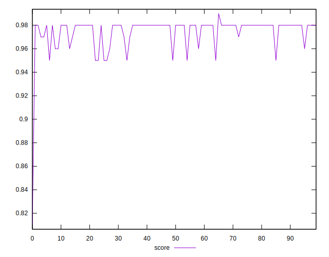

# //first-cpu-idle/samples/pages+cached

[→ Parent](../..)


## Raw


```yaml
p90min: 2441.7825
p90max: 3051.9340000000007
p90range: 610.1515000000009
p90mean: 2583.121260638298
median: 2524.388
p90stdev: 157.73059867674405
mad: 40.53049999999962
stdevBySn: 69.4030588500004
lfitCenter: 2571.447730972133
lfitStdev: 116.5169945345821
mfitCenter: 2527.45123534648
mfitConfidence: 11.65169945345821
p90skewness: 1.8214712641994
p90eccentricity: 1.0000000000000002
p90discretization: 1
outlandishness: 1.01713572427824

```


## Score


```yaml
p90min: 0.95
p90max: 0.98
p90range: 0.030000000000000027
p90mean: 0.9755319148936172
median: 0.98
p90stdev: 0.00940993378191319
mad: 0
stdevBySn: 0
lfitCenter: 0.9763424770660517
lfitStdev: 0.00793432937675366
mfitCenter: 0.9790732500205288
mfitConfidence: 0.000793432937675366
p90skewness: -1.91574355240762
p90eccentricity: 0.9999999999999989
p90discretization: 23.5
outlandishness: 0.9960431803198764

```


## Raw Estimate


## Score Estimate


## P Score


```yaml
p90min: 0.9472098373423965
p90max: 0.9819521265814605
p90range: 0.03474228923906397
p90mean: 0.9751434308773645
median: 0.9785471634632503
p90stdev: 0.008805708272833435
mad: 0.0017514659728612991
stdevBySn: 0.003034877035415069
lfitCenter: 0.9755020742884691
lfitStdev: 0.0070840246396541755
mfitCenter: 0.978201275205799
mfitConfidence: 0.0007084024639654175
p90skewness: -2.000971066187524
p90eccentricity: 0.9999999999999999
p90discretization: 1
outlandishness: 0.995850492522749

```


## Score Difference


```yaml
p90min: 0
p90max: 1.1102230246251565e-16
p90range: 1.1102230246251565e-16
p90mean: 8.267618268485208e-18
median: 0
p90stdev: 2.9146809503185686e-17
mad: 0
stdevBySn: 0
lfitCenter: 5.8453853350884466e-18
lfitStdev: 1.388076134647322e-17
mfitCenter: 5.8453853350884466e-18
mfitConfidence: 0
p90skewness: 3.2417635938924287
p90eccentricity: 0.9999999999999983
p90discretization: 47
outlandishness: 1.8032653061224493

```


## P Score Difference


```yaml
p90min: -0.004396108034068202
p90max: 0.004523772610207644
p90range: 0.008919880644275846
p90mean: -0.0005072830129326646
median: -0.0008720421556046576
p90stdev: 0.0020682431053858997
mad: 0.0014974586189187011
stdevBySn: 0.0022904588573793277
lfitCenter: -0.000570907641754577
lfitStdev: 0.0017441505386307005
mfitCenter: -0.0007556233123201581
mfitConfidence: 0.00017441505386307004
p90skewness: 0.3590254084457659
p90eccentricity: 1
p90discretization: 1
outlandishness: 0.9022599621930539

```

