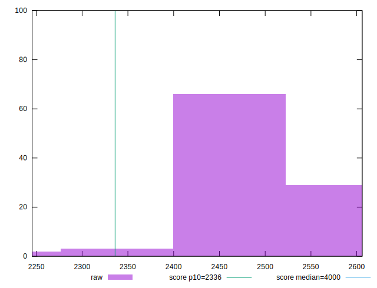
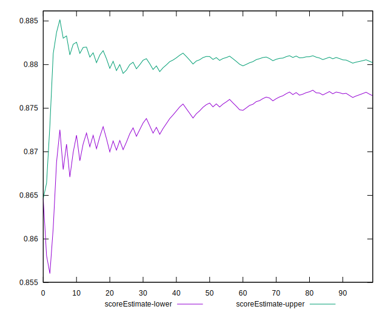
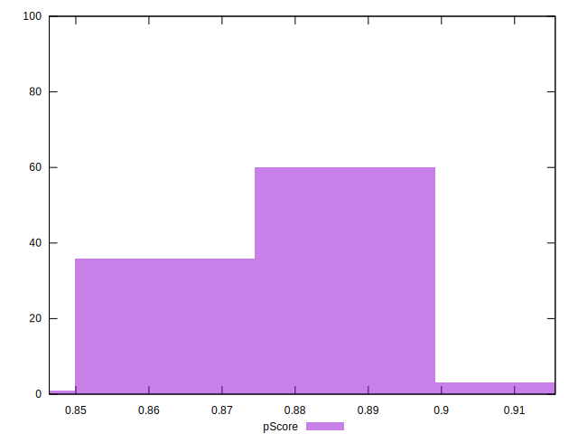
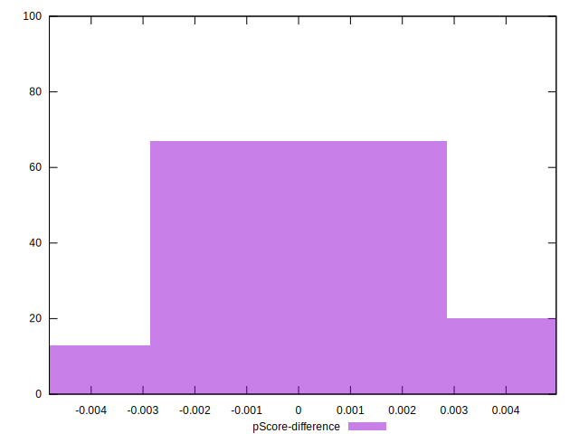

# //first-meaningful-paint/samples/pages+cached+noadtech

[→ Parent](../..)


## Raw


```yaml
p90min: 2391.3075
p90max: 2555.6224999999995
p90range: 164.3149999999996
p90mean: 2466.381063829788
median: 2444.37
p90stdev: 50.0035034018087
mad: 29.925000000000182
stdevBySn: 42.04764727499984
lfitCenter: 2460.6269689661135
lfitStdev: 49.23918787389377
mfitCenter: 2451.413371701114
mfitConfidence: 4.923918787389377
p90skewness: 0.5242397307692236
p90eccentricity: 1.0000000000000007
p90discretization: 1
outlandishness: 0.9982284891101464

```


## Score


```yaml
p90min: 0.86
p90max: 0.89
p90range: 0.030000000000000027
p90mean: 0.8744680851063832
median: 0.88
p90stdev: 0.01037765821128273
mad: 0.010000000000000009
stdevBySn: 0.011926000000000011
lfitCenter: 0.8755991084710308
lfitStdev: 0.010268488160108252
mfitCenter: 0.8771240727026095
mfitConfidence: 0.0010268488160108252
p90skewness: -0.34344599678127663
p90eccentricity: 1.0000000000000009
p90discretization: 23.5
outlandishness: 1.000988078504152

```


## Raw Estimate


## Score Estimate


## P Score


```yaml
p90min: 0.8571158963447953
p90max: 0.8898621288312336
p90range: 0.032746232486438265
p90mean: 0.8751946685378924
median: 0.8797025715741171
p90stdev: 0.01001130092595744
mad: 0.0058512703327713855
stdevBySn: 0.008120242901853003
lfitCenter: 0.8763331307126622
lfitStdev: 0.009847142294084182
mfitCenter: 0.8782859984798728
mfitConfidence: 0.0009847142294084183
p90skewness: -0.544656688053332
p90eccentricity: 0.9999999999999994
p90discretization: 1
outlandishness: 1.0007734549265286

```


## Score Difference


```yaml
p90min: 0
p90max: 0
p90range: 0
p90mean: 0
median: 0
p90stdev: 0
mad: 0
stdevBySn: 0
lfitCenter: 0
lfitStdev: 0
mfitCenter: 0
mfitConfidence: 0
p90skewness: .nan
p90eccentricity: .nan
p90discretization: 94
outlandishness: .nan

```


## P Score Difference


```yaml
p90min: -0.004435786119026508
p90max: 0.004259793192859518
p90range: 0.008695579311886026
p90mean: 0.0006716490869195766
median: 0.0007547680786112454
p90stdev: 0.0023252032579984044
mad: 0.0019793185959649517
stdevBySn: 0.002863130811834627
lfitCenter: 0.0007461321219848718
lfitStdev: 0.001995261161536096
mfitCenter: 0.0009832385276905015
mfitConfidence: 0.0001995261161536096
p90skewness: -0.38909312789703476
p90eccentricity: 1.0000000000000002
p90discretization: 1
outlandishness: 0.8884063519001362

```

