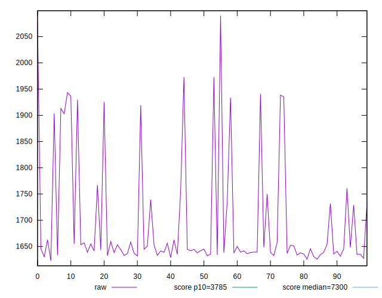
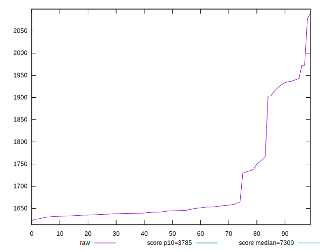
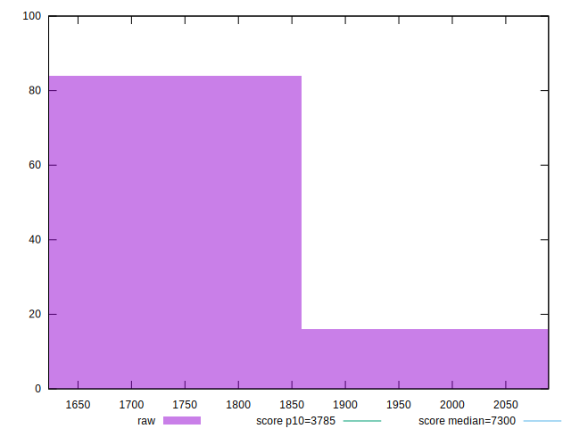
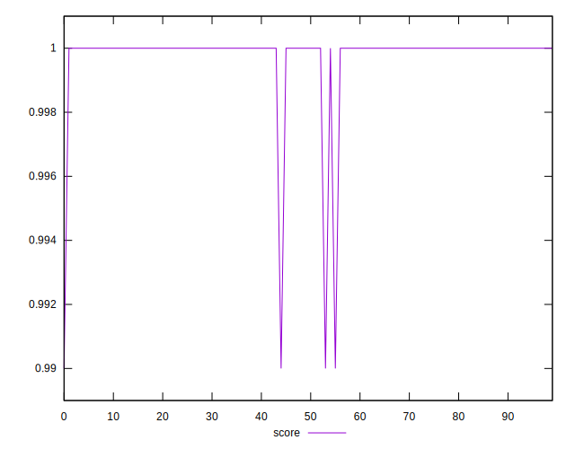
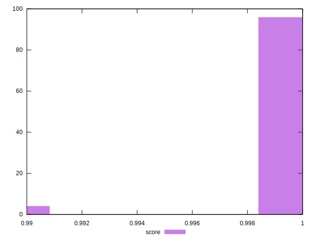
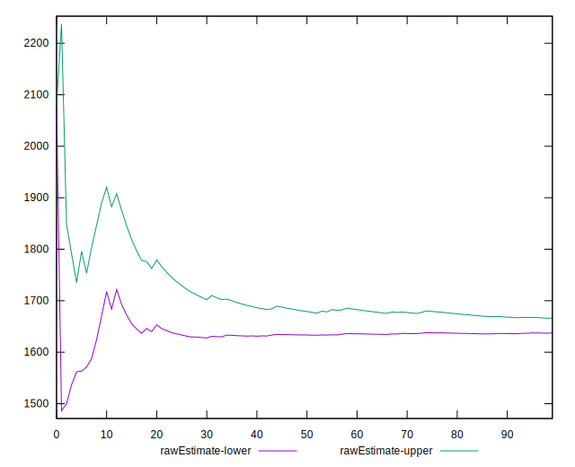
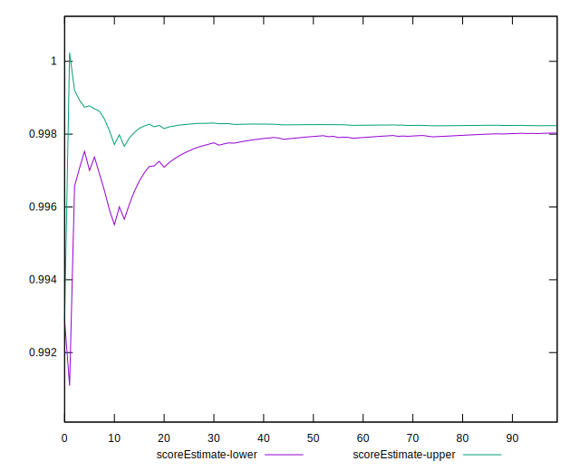
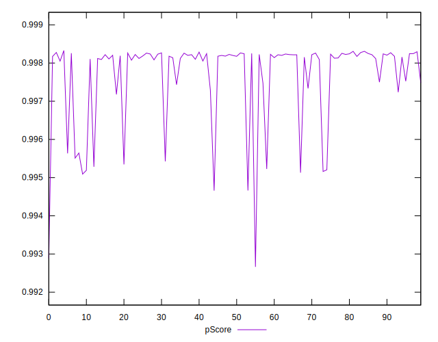
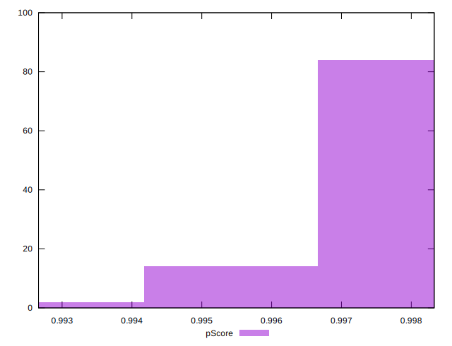
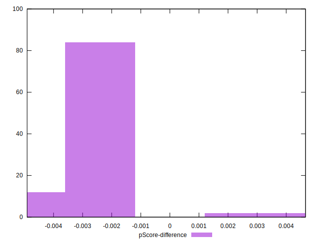

# //interactive/samples/pages+cached+noadtech+nomedia+nocss

[→ Parent](../..)


## Raw


```yaml
p90min: 1627.4473
p90max: 1972.5099999999998
p90range: 345.0626999999997
p90mean: 1691.8233010638307
median: 1644.6595
p90stdev: 100.74446413214308
mad: 10.49834999999996
stdevBySn: 15.514593030000206
lfitCenter: 1678.5190946668336
lfitStdev: 73.8863885380597
mfitCenter: 1652.0404783000195
mfitConfidence: 7.38863885380597
p90skewness: 1.7832844822533493
p90eccentricity: 0.9999999999999999
p90discretization: 1
outlandishness: 1.01024184631878

```


## Score


```yaml
p90min: 0.99
p90max: 1
p90range: 0.010000000000000009
p90mean: 0.9998936170212767
median: 1
p90stdev: 0.0010259202937226556
mad: 0
stdevBySn: 0
lfitCenter: 0.9998062523965826
lfitStdev: 0.00047624380658392557
mfitCenter: 0.9999987252031077
mfitConfidence: 0.00004762438065839256
p90skewness: -9.539955591519758
p90eccentricity: 1.000000000000003
p90discretization: 47
outlandishness: 0.9994127897083943

```


## Raw Estimate


## Score Estimate


## P Score


```yaml
p90min: 0.9946626525519175
p90max: 0.9982961673159426
p90range: 0.00363351476402507
p90mean: 0.9977141598906869
median: 0.9981802312538824
p90stdev: 0.0010138778701813955
mad: 0.00007245069961470119
stdevBySn: 0.00010569845325425675
lfitCenter: 0.9978378798180396
lfitStdev: 0.0007358701647684999
mfitCenter: 0.998102921563536
mfitConfidence: 0.00007358701647684998
p90skewness: -1.9173751258485487
p90eccentricity: 1.0000000000000007
p90discretization: 1
outlandishness: 0.9997767425527804

```


## Score Difference


```yaml
p90min: 0
p90max: 0
p90range: 0
p90mean: 0
median: 0
p90stdev: 0
mad: 0
stdevBySn: 0
lfitCenter: 0
lfitStdev: 0
mfitCenter: 0
mfitConfidence: 0
p90skewness: .nan
p90eccentricity: .nan
p90discretization: 94
outlandishness: .nan

```


## P Score Difference


```yaml
p90min: -0.004809044880128011
p90max: 0.0026625711387691098
p90range: 0.00747161601889712
p90mean: -0.0020990260982298335
median: -0.0018009551831384973
p90stdev: 0.0009758837371776704
mad: 0.00006449762416316229
stdevBySn: 0.00010569845325425675
lfitCenter: -0.0019371192277080182
lfitStdev: 0.000554618692816271
mfitCenter: -0.0018557530891560585
mfitConfidence: 0.000055461869281627105
p90skewness: -0.4170110806138608
p90eccentricity: 1.0000000000000002
p90discretization: 1
outlandishness: 0.905349123991654

```

