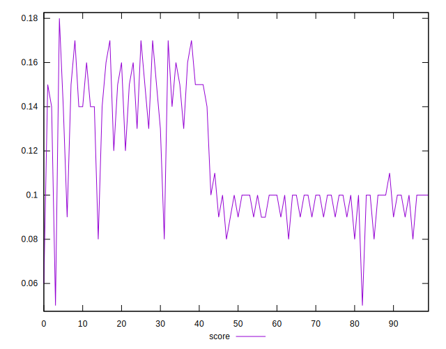

# //interactive/samples/pages

[→ Parent](../..)


## Raw


```yaml
p90min: 11965.204
p90max: 14889.639000000001
p90range: 2924.4350000000013
p90mean: 13605.675388297874
median: 14022.007000000001
p90stdev: 907.7735729650802
mad: 641.0064999999977
stdevBySn: 890.7436973499988
lfitCenter: 13702.767131320556
lfitStdev: 888.1604089580352
mfitCenter: 13855.138589565688
mfitConfidence: 88.81604089580352
p90skewness: -0.46088136390199497
p90eccentricity: 0.9999999999999999
p90discretization: 1
outlandishness: 1.0059580437767228

```


## Score


```yaml
p90min: 0.08
p90max: 0.17
p90range: 0.09000000000000001
p90mean: 0.11478723404255305
median: 0.1
p90stdev: 0.027082565774778876
mad: 0.010000000000000009
stdevBySn: 0.01788900000000001
lfitCenter: 0.11175064653872767
lfitStdev: 0.02601352168812277
mfitCenter: 0.10602973873682824
mfitConfidence: 0.002601352168812277
p90skewness: 0.6354387574854976
p90eccentricity: 0.9999999999999976
p90discretization: 9.4
outlandishness: 0.9984806516863782

```


## Raw Estimate


## Score Estimate


## P Score


```yaml
p90min: 0.08215193640339402
p90max: 0.1674968487009274
p90range: 0.08534491229753338
p90mean: 0.11512260594539767
median: 0.10140246878789719
p90stdev: 0.026556624199115274
mad: 0.014616573906138436
stdevBySn: 0.021099136609803868
lfitCenter: 0.11216660338340624
lfitStdev: 0.025848026306326623
mfitCenter: 0.10635901086931944
mfitConfidence: 0.002584802630632662
p90skewness: 0.6212995713751315
p90eccentricity: 0.9999999999999996
p90discretization: 1
outlandishness: 0.9973376633268988

```


## Score Difference


```yaml
p90min: 0
p90max: 0
p90range: 0
p90mean: 0
median: 0
p90stdev: 0
mad: 0
stdevBySn: 0
lfitCenter: 0
lfitStdev: 0
mfitCenter: 0
mfitConfidence: 0
p90skewness: .nan
p90eccentricity: .nan
p90discretization: 94
outlandishness: .nan

```


## P Score Difference


```yaml
p90min: -0.00454144609160792
p90max: 0.004740746244362576
p90range: 0.009282192335970496
p90mean: 0.000278715212541572
median: -0.00011284182129626952
p90stdev: 0.0025225482715507414
mad: 0.002133845466224818
stdevBySn: 0.0028234162888747393
lfitCenter: 0.0002337348736603736
lfitStdev: 0.002128777212441683
mfitCenter: 0.00013165076310344342
mfitConfidence: 0.00021287772124416827
p90skewness: 0.06440941382134859
p90eccentricity: 0.9999999999999999
p90discretization: 1
outlandishness: 0.9332762503932389

```

