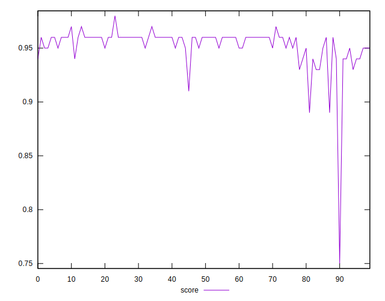
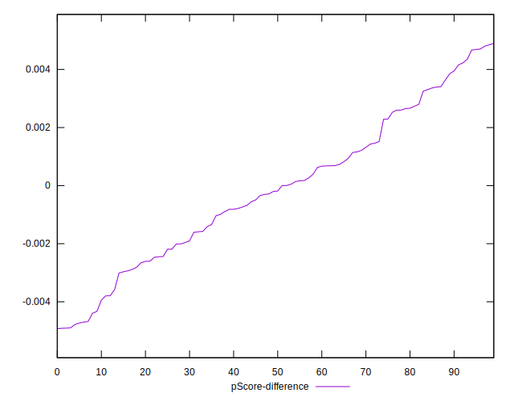

# //mainthread-work-breakdown/samples/pages+cached+noadtech+nomedia

[→ Parent](../..)


## Raw


```yaml
p90min: 1512.8920000000005
p90max: 1932.3960000000009
p90range: 419.50400000000036
p90mean: 1619.7686382978727
median: 1597.9800000000005
p90stdev: 76.81255946130712
mad: 40.348000000000184
stdevBySn: 68.66513760000024
lfitCenter: 1620.021701185175
lfitStdev: 70.56914761913563
mfitCenter: 1601.3938586490542
mfitConfidence: 7.056914761913563
p90skewness: 1.369130510165432
p90eccentricity: 0.9999999999999999
p90discretization: 1
outlandishness: 1.0186405712338689

```


## Score


```yaml
p90min: 0.91
p90max: 0.97
p90range: 0.05999999999999994
p90mean: 0.9543617021276599
median: 0.96
p90stdev: 0.009736803468470156
mad: 0
stdevBySn: 0
lfitCenter: 0.9545845437072754
lfitStdev: 0.010261099993444869
mfitCenter: 0.9573115941084246
mfitConfidence: 0.0010261099993444868
p90skewness: -1.7910328509085554
p90eccentricity: 0.999999999999998
p90discretization: 15.666666666666666
outlandishness: 0.9942208362767051

```


## Raw Estimate


## Score Estimate


## P Score


```yaml
p90min: 0.9133626263273161
p90max: 0.9656086048528042
p90range: 0.05224597852548807
p90mean: 0.9542560231367143
median: 0.9570493823132062
p90stdev: 0.009056912450304778
mad: 0.004294015600623369
stdevBySn: 0.007225577226363527
lfitCenter: 0.9538565414716987
lfitStdev: 0.008850783497310204
mfitCenter: 0.95654496660505
mfitConfidence: 0.0008850783497310205
p90skewness: -1.719225337436164
p90eccentricity: 1.0000000000000002
p90discretization: 1
outlandishness: 0.9941874006463496

```


## Score Difference


```yaml
p90min: 0
p90max: 1.1102230246251565e-16
p90range: 1.1102230246251565e-16
p90mean: 3.0708296425802203e-17
median: 0
p90stdev: 4.9661920064764514e-17
mad: 0
stdevBySn: 0
lfitCenter: 2.2708655306731685e-17
lfitStdev: 4.5279220695042594e-17
mfitCenter: 2.2708655306731685e-17
mfitConfidence: 0
p90skewness: 0.9988681377244392
p90eccentricity: 1.000000000000001
p90discretization: 47
outlandishness: 1.0992715976331358

```


## P Score Difference


```yaml
p90min: -0.004897572733617683
p90max: 0.004709323647776875
p90range: 0.009606896381394558
p90mean: -0.000127128997749415
median: -0.00019218113681246374
p90stdev: 0.0025849192129435896
mad: 0.002253358341843592
stdevBySn: 0.002930137093641663
lfitCenter: -0.0001436756070445077
lfitStdev: 0.00213462704732527
mfitCenter: -0.00020176600009751722
mfitConfidence: 0.000213462704732527
p90skewness: 0.05511954375711843
p90eccentricity: 1.0000000000000002
p90discretization: 1
outlandishness: 0.9114916674390997

```

