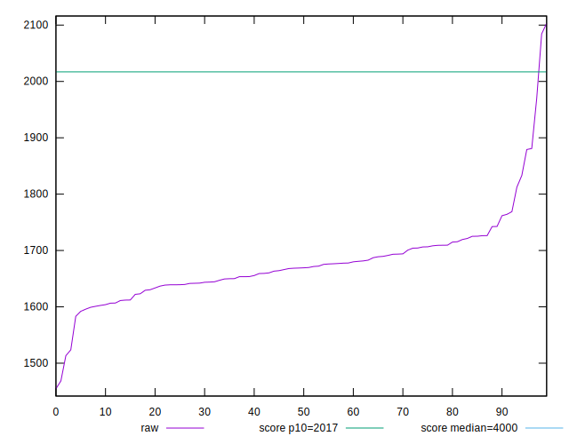

# //mainthread-work-breakdown/samples/pages+cached+noadtech

[→ Parent](../..)


## Raw


```yaml
p90min: 1523.7200000000012
p90max: 1881.0000000000016
p90range: 357.2800000000004
p90mean: 1674.3836170212776
median: 1669.054000000001
p90stdev: 57.28816991560179
mad: 31.966000000000236
stdevBySn: 49.310432199999845
lfitCenter: 1674.5665138555357
lfitStdev: 46.776509109950354
mfitCenter: 1667.5725247919684
mfitConfidence: 4.677650910995036
p90skewness: 1.0697940541714166
p90eccentricity: 1.0000000000000007
p90discretization: 1
outlandishness: 1.0065477551462447

```


## Score


```yaml
p90min: 0.92
p90max: 0.96
p90range: 0.039999999999999925
p90mean: 0.9480851063829794
median: 0.95
p90stdev: 0.007756479205769434
mad: 0
stdevBySn: 0
lfitCenter: 0.9481894512857123
lfitStdev: 0.006321554975669653
mfitCenter: 0.9494346955238423
mfitConfidence: 0.0006321554975669653
p90skewness: -1.0224916361136804
p90eccentricity: 1.0000000000000004
p90discretization: 18.8
outlandishness: 0.998133726136103

```


## Raw Estimate


## Score Estimate


## P Score


```yaml
p90min: 0.9210564289615837
p90max: 0.9645794836495081
p90range: 0.04352305468792439
p90mean: 0.9482151223520181
median: 0.9490775239560377
p90stdev: 0.007023557930260497
mad: 0.00374969392511304
stdevBySn: 0.005750322120703833
lfitCenter: 0.9481123272939287
lfitStdev: 0.005751933615978258
mfitCenter: 0.9492704252136455
mfitConfidence: 0.0005751933615978258
p90skewness: -1.4273988127259074
p90eccentricity: 1.0000000000000002
p90discretization: 1
outlandishness: 0.9978644220313184

```


## Score Difference


```yaml
p90min: 0
p90max: 1.1102230246251565e-16
p90range: 1.1102230246251565e-16
p90mean: 8.740053598112935e-17
median: 1.1102230246251565e-16
p90stdev: 4.5437375048458033e-17
mad: 0
stdevBySn: 0
lfitCenter: 9.466973820862253e-17
lfitStdev: 3.49523793474723e-17
mfitCenter: 9.466973820862253e-17
mfitConfidence: 0
p90skewness: -1.403663161257103
p90eccentricity: 1.0000000000000027
p90discretization: 47
outlandishness: 0.9566954711468225

```


## P Score Difference


```yaml
p90min: -0.004439876380969543
p90max: 0.0045817966124227505
p90range: 0.009021672993392293
p90mean: -0.000005011496252854804
median: 0.00006892349234377537
p90stdev: 0.0026356804791304554
mad: 0.002388713286307631
stdevBySn: 0.0030592768924085976
lfitCenter: -0.000010496394595832323
lfitStdev: 0.0024147989877459893
mfitCenter: -0.000034147186353414223
mfitConfidence: 0.00024147989877459892
p90skewness: 0.046149826168962994
p90eccentricity: 0.9999999999999999
p90discretization: 1
outlandishness: 0.17351524083169725

```

