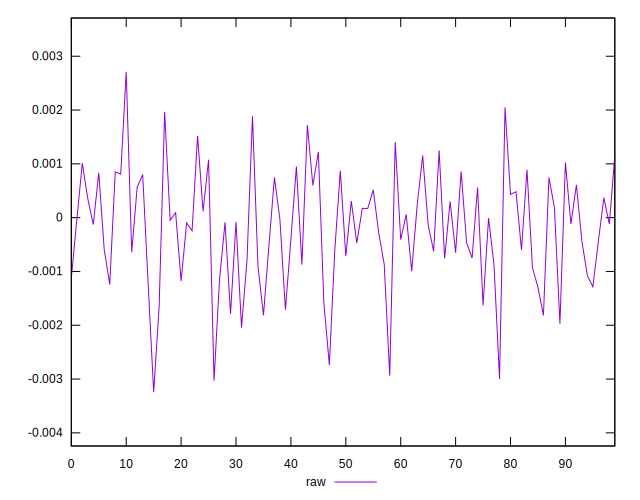
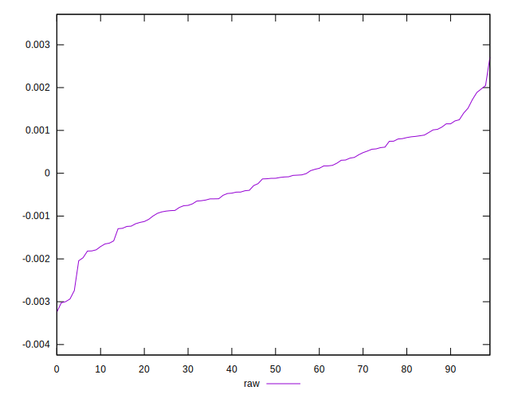
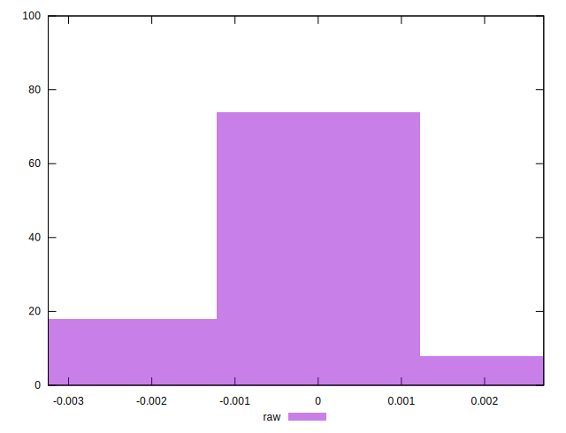

# //meta/pScore-difference/samples/pages+cached+noadtech+nomedia

[→ Parent](../..)


## Raw


```yaml
p90min: -0.00293668834590566
p90max: 0.001885360099280354
p90range: 0.004822048445186014
p90mean: -0.0002035068512947921
median: -0.00011837755049411131
p90stdev: 0.000995318833372229
mad: 0.0007602237656373544
stdevBySn: 0.0011445258833302529
lfitCenter: -0.00019364150393484935
lfitStdev: 0.0008450218632011435
mfitCenter: -0.0001524418850155934
mfitConfidence: 0.00008450218632011435
p90skewness: -0.28834267661772167
p90eccentricity: 1.0000000000000007
p90discretization: 1
outlandishness: 1.134379136260978

```

