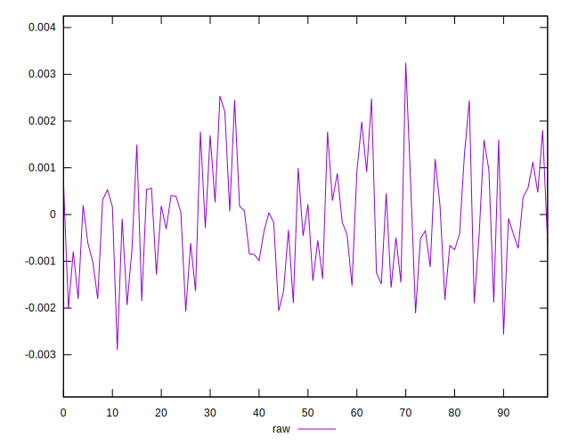
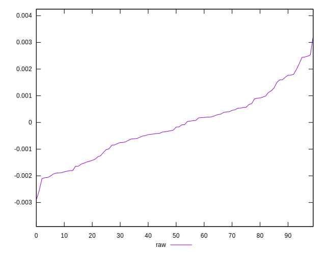
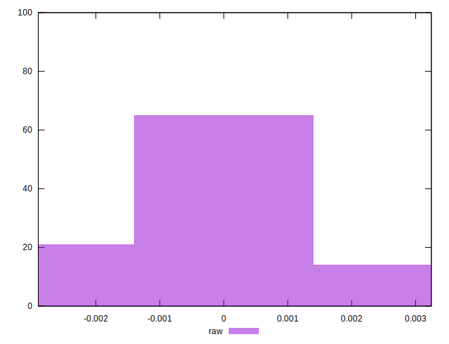

# //meta/pScore-difference/samples/pages+cached+noadtech

[→ Parent](../..)


## Raw


```yaml
p90min: -0.0020713510261061944
p90max: 0.002451125762965103
p90range: 0.004522476789071297
p90mean: -0.00015823325714382544
median: -0.00022974430977737073
p90stdev: 0.0011444445033320253
mad: 0.0007954533541522312
stdevBySn: 0.00127202118372061
lfitCenter: -0.0001659169378714084
lfitStdev: 0.0009528342020745327
mfitCenter: -0.00020473379660161827
mfitConfidence: 0.00009528342020745327
p90skewness: 0.2343406935301525
p90eccentricity: 1
p90discretization: 1
outlandishness: 0.8042674912785925

```

