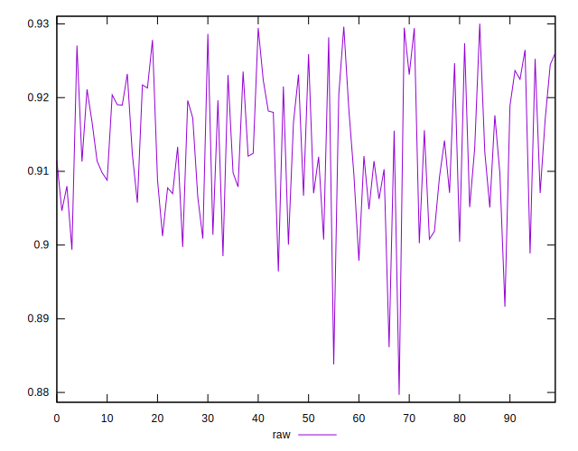
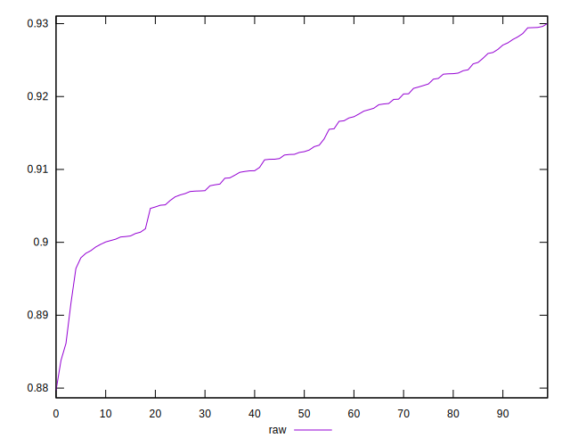

# //meta/pScore/samples/pages+cached+noadtech+nomedia+nocss

[→ Parent](../..)


## Raw


```yaml
p90min: 0.8916332412460267
p90max: 0.9294534716348771
p90range: 0.03782023038885041
p90mean: 0.9133120690776038
median: 0.9123848788862944
p90stdev: 0.009217671224893238
mad: 0.007632213767317875
stdevBySn: 0.010633976371071463
lfitCenter: 0.9131331652136052
lfitStdev: 0.008330667395295142
mfitCenter: 0.9134344299069522
mfitConfidence: 0.0008330667395295142
p90skewness: -0.09246093630265056
p90eccentricity: 1
p90discretization: 1
outlandishness: 0.9990996775981523

```

