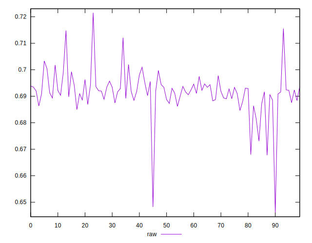
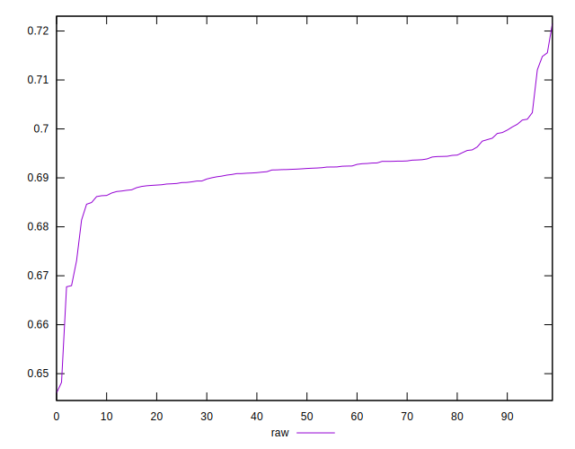
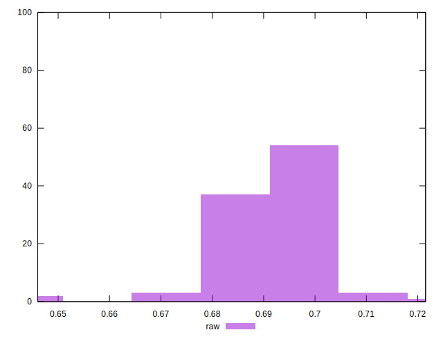

# //meta/pScore/samples/pages+cached+noadtech+nomedia

[→ Parent](../..)


## Raw


```yaml
p90min: 0.6679815884102018
p90max: 0.7120979149687799
p90range: 0.04411632655857811
p90mean: 0.6918505431132382
median: 0.691885457027037
p90stdev: 0.005454306688422226
mad: 0.00252981033619909
stdevBySn: 0.0040659305093872075
lfitCenter: 0.6916640284230138
lfitStdev: 0.004101337454217874
mfitCenter: 0.6918025317187244
mfitConfidence: 0.0004101337454217874
p90skewness: -0.5248345212770349
p90eccentricity: 1.0000000000000007
p90discretization: 1
outlandishness: 0.998924066845699

```

