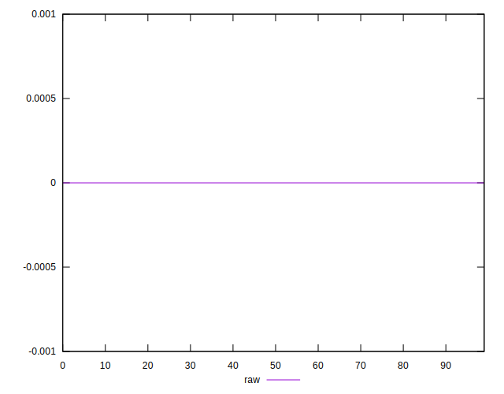

# //meta/score-difference/samples/pages+cached+noadtech+nomedia+nocss

[→ Parent](../..)


## Raw


```yaml
p90min: 0
p90max: 3.3306690738754695e-17
p90range: 3.3306690738754695e-17
p90mean: 5.787332787939642e-18
median: 0
p90stdev: 9.33508182821267e-18
mad: 0
stdevBySn: 0
lfitCenter: 4.728719024846047e-18
lfitStdev: 6.346679123852123e-18
mfitCenter: 4.728719024846047e-18
mfitConfidence: 0
p90skewness: 1.8120662083903114
p90eccentricity: 1.0000000000000002
p90discretization: 23.5
outlandishness: 1.2379968346522283

```

