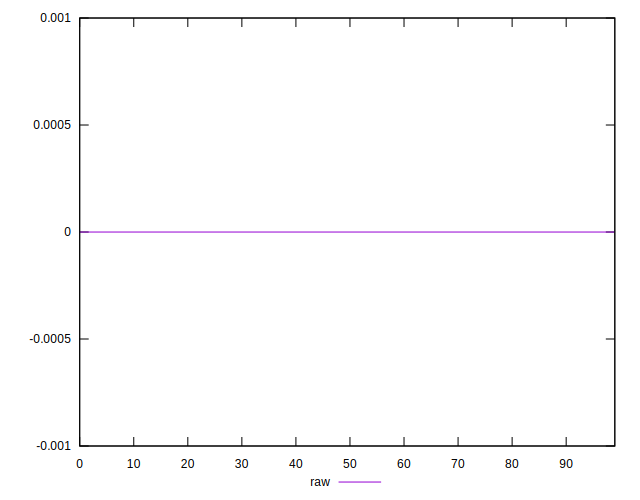

# //meta/score-difference/samples/pages+cached

[→ Parent](../..)


## Raw


```yaml
p90min: 0
p90max: 1.6653345369377347e-17
p90range: 1.6653345369377347e-17
p90mean: 2.8936663939698225e-18
median: 0
p90stdev: 5.767110488404171e-18
mad: 0
stdevBySn: 0
lfitCenter: 2.0075351013694677e-18
lfitStdev: 4.334262257326967e-18
mfitCenter: 2.0075351013694677e-18
mfitConfidence: 0
p90skewness: 1.5086837552672134
p90eccentricity: 1.0000000000000007
p90discretization: 31.333333333333332
outlandishness: 1.2379968346522283

```

