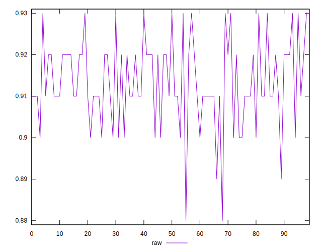
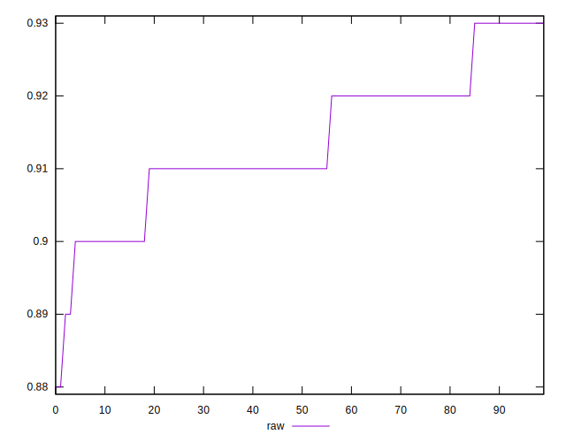
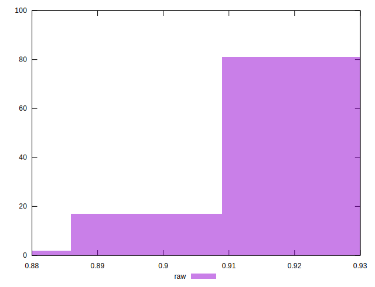

# //meta/score/samples/pages+cached+noadtech+nomedia+nocss

[→ Parent](../..)


## Raw


```yaml
p90min: 0.89
p90max: 0.93
p90range: 0.040000000000000036
p90mean: 0.9138297872340426
median: 0.91
p90stdev: 0.009352025947164227
mad: 0.010000000000000009
stdevBySn: 0.011926000000000011
lfitCenter: 0.9134034921715479
lfitStdev: 0.008718982249443884
mfitCenter: 0.9133638105303898
mfitConfidence: 0.0008718982249443884
p90skewness: 0.029427649384914576
p90eccentricity: 1
p90discretization: 18.8
outlandishness: 0.9990595925576081

```

