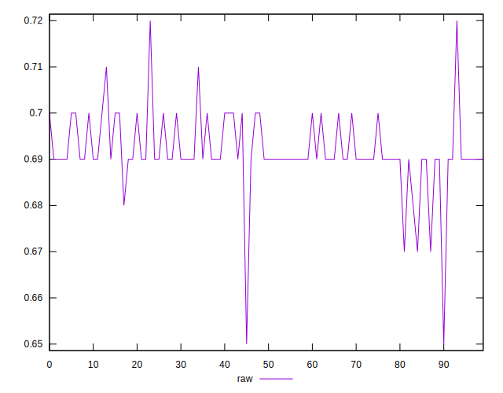
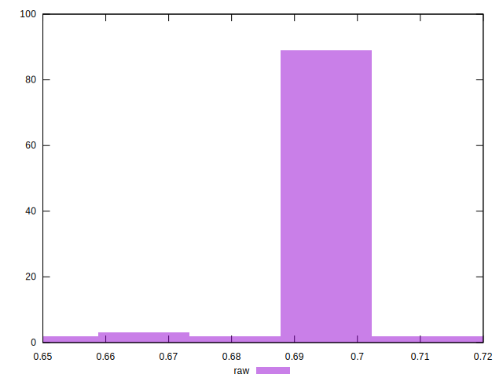

# //meta/score/samples/pages+cached+noadtech+nomedia

[→ Parent](../..)


## Raw


```yaml
p90min: 0.67
p90max: 0.71
p90range: 0.039999999999999925
p90mean: 0.6919148936170206
median: 0.69
p90stdev: 0.005884815611038004
mad: 0
stdevBySn: 0
lfitCenter: 0.6912473027492333
lfitStdev: 0.004554196419050239
mfitCenter: 0.6906665874693523
mfitConfidence: 0.0004554196419050239
p90skewness: -0.3842363011036528
p90eccentricity: 0.9999999999999987
p90discretization: 18.8
outlandishness: 0.9990899980180616

```

