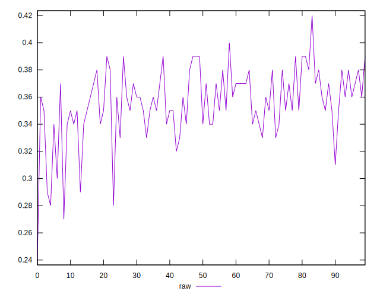
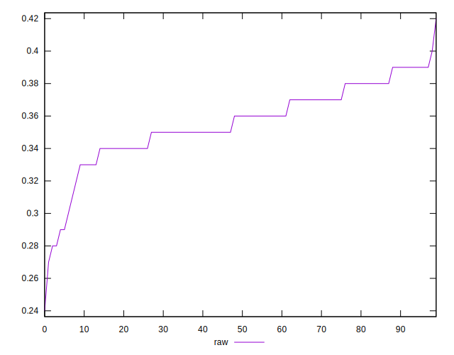
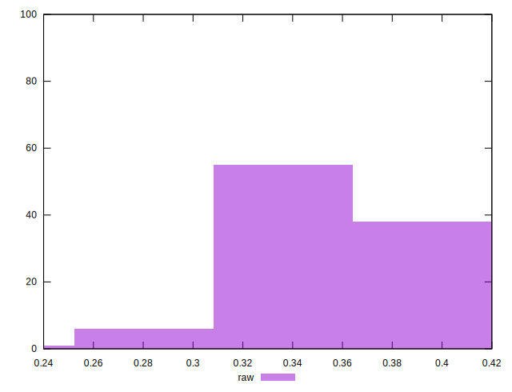

# //meta/score/samples/pages+cached

[→ Parent](../..)


## Raw


```yaml
p90min: 0.28
p90max: 0.39
p90range: 0.10999999999999999
p90mean: 0.35638297872340435
median: 0.36
p90stdev: 0.022777885123550758
mad: 0.019999999999999962
stdevBySn: 0.023852000000000022
lfitCenter: 0.3562852626838148
lfitStdev: 0.0188014254733063
mfitCenter: 0.3582042734439007
mfitConfidence: 0.00188014254733063
p90skewness: -0.8788898142704469
p90eccentricity: 0.9999999999999999
p90discretization: 7.833333333333333
outlandishness: 0.9922538650033417

```

