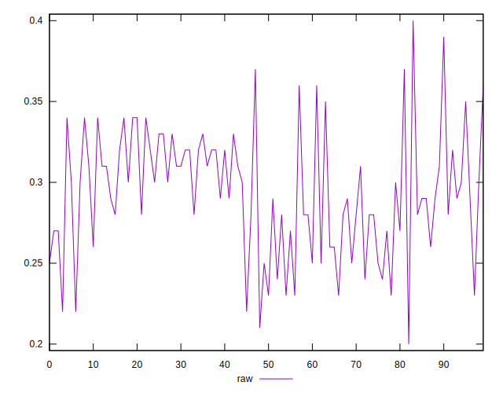
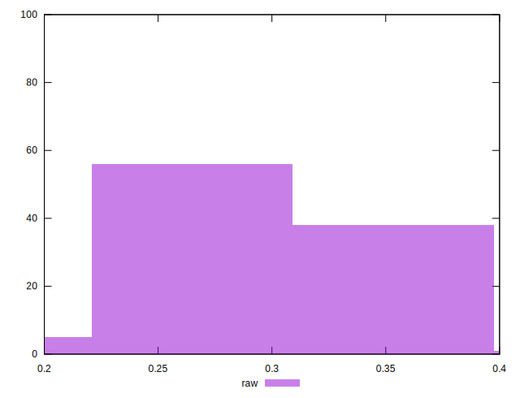

# //meta/score/samples/pages

[→ Parent](../..)


## Raw


```yaml
p90min: 0.22
p90max: 0.37
p90range: 0.15
p90mean: 0.2927659574468086
median: 0.29
p90stdev: 0.03589002870232216
mad: 0.03
stdevBySn: 0.03875950000000002
lfitCenter: 0.2932543808927245
lfitStdev: 0.030093398182299478
mfitCenter: 0.29380551277242095
mfitConfidence: 0.003009339818229948
p90skewness: -0.09589079499096055
p90eccentricity: 1
p90discretization: 5.875
outlandishness: 1.0022832785986513

```

