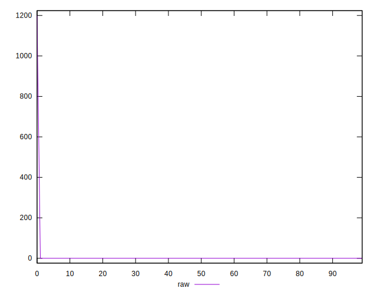
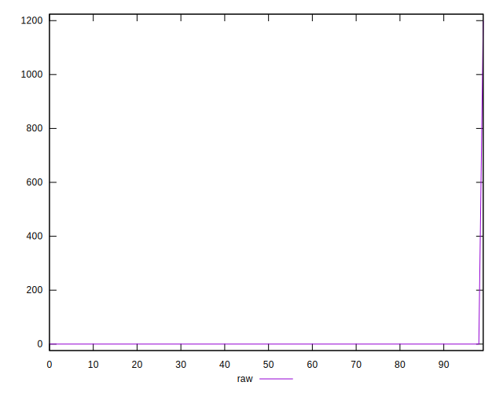
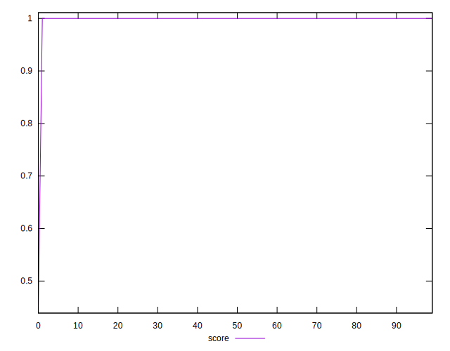
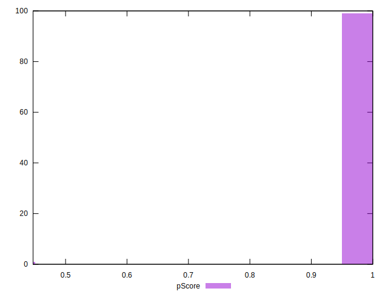

# //offscreen-images/samples/pages+cached

[→ Parent](../..)


## Raw


```yaml
p90min: 0
p90max: 0
p90range: 0
p90mean: 0
median: 0
p90stdev: 0
mad: 0
stdevBySn: 0
lfitCenter: 5.584321623058299
lfitStdev: 13.932678222022917
mfitCenter: 0.002210045408889086
mfitConfidence: 1.3932678222022916
p90skewness: .nan
p90eccentricity: .nan
p90discretization: 94
outlandishness: .inf

```


## Score


```yaml
p90min: 1
p90max: 1
p90range: 0
p90mean: 1
median: 1
p90stdev: 0
mad: 0
stdevBySn: 0
lfitCenter: 0.9974405192560983
lfitStdev: 0.006385810851760437
mfitCenter: 0.9999989870625211
mfitConfidence: 0.0006385810851760437
p90skewness: .nan
p90eccentricity: .nan
p90discretization: 94
outlandishness: 0.9890302500000001

```


## Raw Estimate


## Score Estimate


## P Score


```yaml
p90min: 1
p90max: 1
p90range: 0
p90mean: 1
median: 1
p90stdev: 0
mad: 0
stdevBySn: 0
lfitCenter: 0.9974268321932968
lfitStdev: 0.006419959572892805
mfitCenter: 0.999998981645743
mfitConfidence: 0.0006419959572892804
p90skewness: .nan
p90eccentricity: .nan
p90discretization: 94
outlandishness: 0.9889717508650516

```


## Score Difference


```yaml
p90min: 0
p90max: 0
p90range: 0
p90mean: 0
median: 0
p90stdev: 0
mad: 0
stdevBySn: 0
lfitCenter: 0
lfitStdev: 0
mfitCenter: 0
mfitConfidence: 0
p90skewness: .nan
p90eccentricity: .nan
p90discretization: 94
outlandishness: .nan

```


## P Score Difference


```yaml
p90min: 0
p90max: 0
p90range: 0
p90mean: 0
median: 0
p90stdev: 0
mad: 0
stdevBySn: 0
lfitCenter: -0.00001368706280161343
lfitStdev: 0.00003414872113240899
mfitCenter: -5.4167779629591294e-9
mfitConfidence: 0.0000034148721132408988
p90skewness: .nan
p90eccentricity: .nan
p90discretization: 94
outlandishness: .inf

```

