# //offscreen-images/samples/pages

[→ Parent](../..)


## Raw


```yaml
p90min: 0
p90max: 1360
p90range: 1360
p90mean: 744.468085106383
median: 1200
p90stdev: 601.442622121881
mad: 150
stdevBySn: 178.89000000000001
lfitCenter: 805.4959674944755
lfitStdev: 684.095370977647
mfitCenter: 925.3738351753508
mfitConfidence: 68.4095370977647
p90skewness: -0.4179650259996549
p90eccentricity: 1.0000000000000016
p90discretization: 18.8
outlandishness: 0.9933805249219533

```

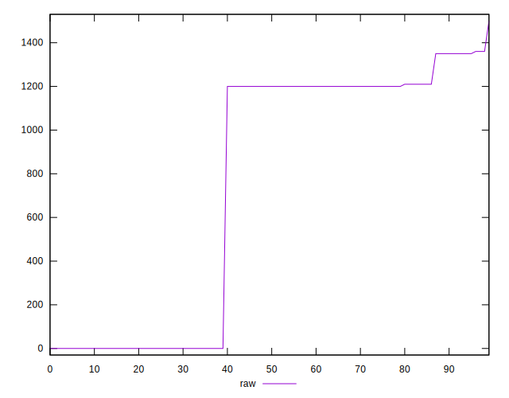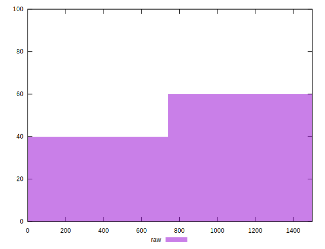
## Score


```yaml
p90min: 0.43
p90max: 1
p90range: 0.5700000000000001
p90mean: 0.6643617021276609
median: 0.45
p90stdev: 0.27048246299638745
mad: 0.020000000000000018
stdevBySn: 0.023852000000000022
lfitCenter: 0.6348258680447993
lfitStdev: 0.3101367894471139
mfitCenter: 0.5838009959326929
mfitConfidence: 0.031013678944711392
p90skewness: 0.43400834419737055
p90eccentricity: 1.0000000000000009
p90discretization: 31.333333333333332
outlandishness: 1.0085626873931486

```

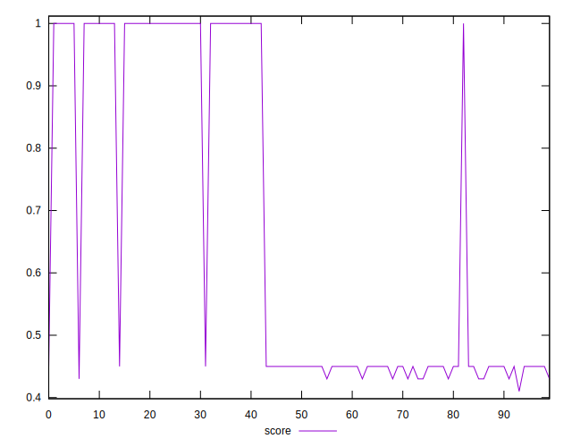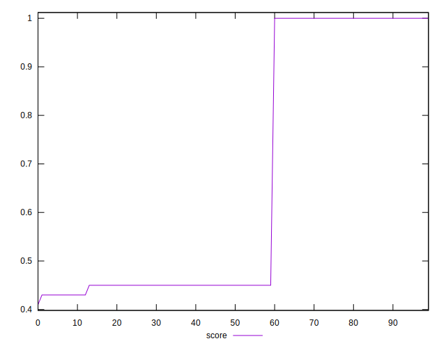
## Raw Estimate

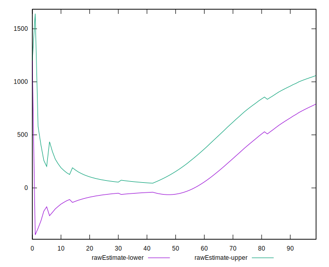
## Score Estimate

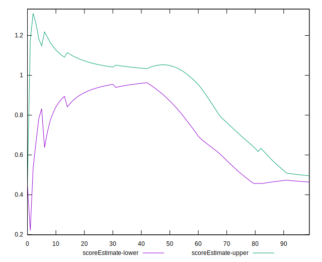
## P Score


```yaml
p90min: 0.42823529411764705
p90max: 1
p90range: 0.571764705882353
p90mean: 0.6627284105131408
median: 0.4470588235294118
p90stdev: 0.2717836256690227
mad: 0.017647058823529405
stdevBySn: 0.02104588235294117
lfitCenter: 0.6329833519219045
lfitStdev: 0.3117016101308786
mfitCenter: 0.5818548473586986
mfitConfidence: 0.03117016101308786
p90skewness: 0.43435604910772513
p90eccentricity: 1.000000000000001
p90discretization: 18.8
outlandishness: 1.0088273721506729

```

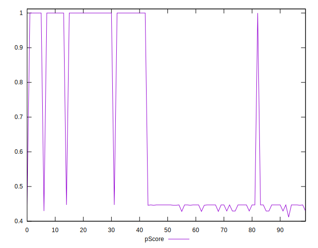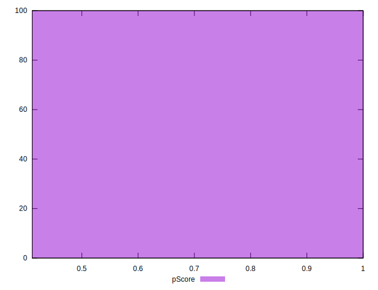
## Score Difference


```yaml
p90min: 0
p90max: 0
p90range: 0
p90mean: 0
median: 0
p90stdev: 0
mad: 0
stdevBySn: 0
lfitCenter: 2.583267684513104e-19
lfitStdev: 6.445158398659724e-19
mfitCenter: 2.583267684513104e-19
mfitConfidence: 0
p90skewness: .nan
p90eccentricity: .nan
p90discretization: 94
outlandishness: .inf

```


## P Score Difference


```yaml
p90min: -0.004117647058823559
p90max: 0
p90range: 0.004117647058823559
p90mean: -0.0015394242803504316
median: -0.0011764705882352788
p90stdev: 0.0014714800374258452
mad: 0.0011764705882352788
stdevBySn: 0.0021045882352941237
lfitCenter: -0.0015284857319049002
lfitStdev: 0.0017197485255025368
mfitCenter: -0.0014849076398756077
mfitConfidence: 0.00017197485255025368
p90skewness: -0.10812598827542388
p90eccentricity: 0.9999999999999962
p90discretization: 18.8
outlandishness: 1.0176380725758496

```

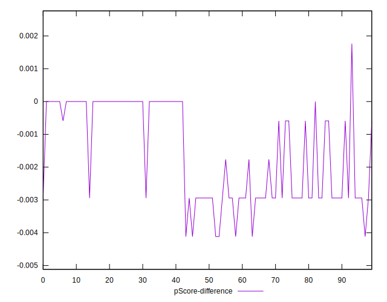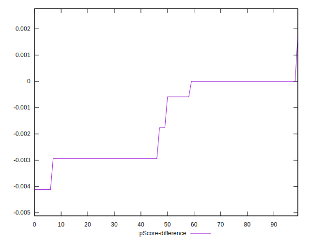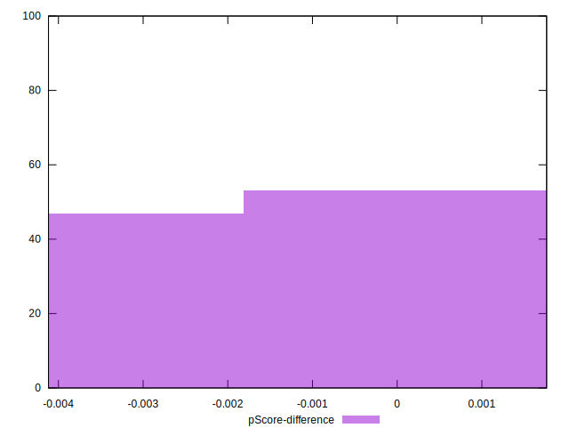