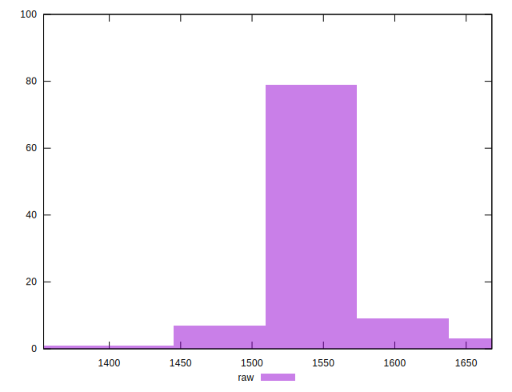

# //render-blocking-resources/samples/pages+cached

[→ Parent](../..)


## Raw


```yaml
p90min: 1495
p90max: 1628
p90range: 133
p90mean: 1543.0106382978724
median: 1542
p90stdev: 26.10025461718597
mad: 21.5
stdevBySn: 30.11315
lfitCenter: 1542.420263832214
lfitStdev: 23.530087285410517
mfitCenter: 1541.0820552256962
mfitConfidence: 2.3530087285410515
p90skewness: 0.5890384357227223
p90eccentricity: 0.9999999999999997
p90discretization: 1.540983606557377
outlandishness: 1.0002195331549126

```


## Score


```yaml
p90min: 0.4
p90max: 0.41
p90range: 0.009999999999999953
p90mean: 0.40702127659574405
median: 0.41
p90stdev: 0.004573230906426503
mad: 0
stdevBySn: 0
lfitCenter: 0.407737973567001
lfitStdev: 0.004741956551669174
mfitCenter: 0.40891434066700616
mfitConfidence: 0.0004741956551669174
p90skewness: -0.8839599998782534
p90eccentricity: 1.0000000000000027
p90discretization: 47
outlandishness: 0.9994041661463406

```


## Raw Estimate


## Score Estimate


## P Score


```yaml
p90min: 0.3967058823529412
p90max: 0.4123529411764706
p90range: 0.015647058823529403
p90mean: 0.4067046307884856
median: 0.4068235294117647
p90stdev: 0.0030706181902571713
mad: 0.002529411764705891
stdevBySn: 0.0035427235294117933
lfitCenter: 0.40677408660797515
lfitStdev: 0.0027682455629894596
mfitCenter: 0.4069315229146237
mfitConfidence: 0.000276824556298946
p90skewness: -0.5890384357229129
p90eccentricity: 0.9999999999999992
p90discretization: 1.540983606557377
outlandishness: 0.9999020202055606

```


## Score Difference


```yaml
p90min: 0
p90max: 5.551115123125783e-17
p90range: 5.551115123125783e-17
p90mean: 3.7794826370218094e-17
median: 5.551115123125783e-17
p90stdev: 2.5876348699949434e-17
mad: 0
stdevBySn: 0
lfitCenter: 4.170960331438333e-17
lfitStdev: 2.599402650759846e-17
mfitCenter: 4.170960331438333e-17
mfitConfidence: 0
p90skewness: -0.7759402897989873
p90eccentricity: 1.0000000000000007
p90discretization: 47
outlandishness: 0.9683790039062501

```


## P Score Difference


```yaml
p90min: -0.0043529411764705594
p90max: 0.004705882352941171
p90range: 0.00905882352941173
p90mean: -0.00023654568210262138
median: -0.00029411764705880583
p90stdev: 0.00266947784366992
mad: 0.0025294117647058634
stdevBySn: 0.0031568823529411856
lfitCenter: -0.00029163768369767695
lfitStdev: 0.002293097028229672
mfitCenter: -0.00046089386151571183
mfitConfidence: 0.00022930970282296722
p90skewness: 0.2221668283249478
p90eccentricity: 0.9999999999999996
p90discretization: 1.540983606557377
outlandishness: 0.8283889140841512

```

