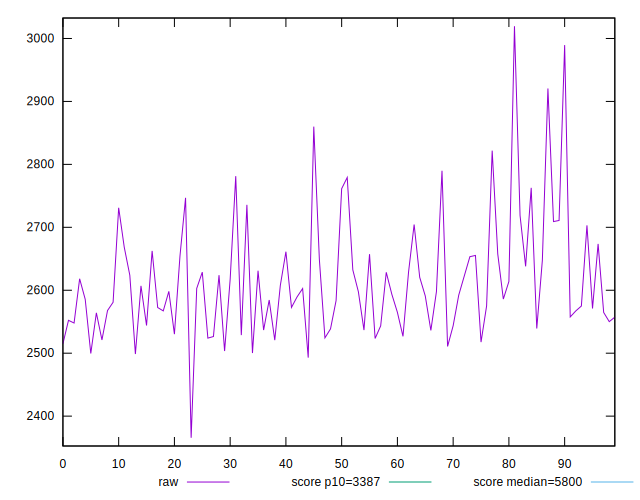
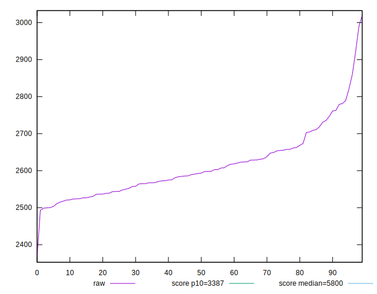
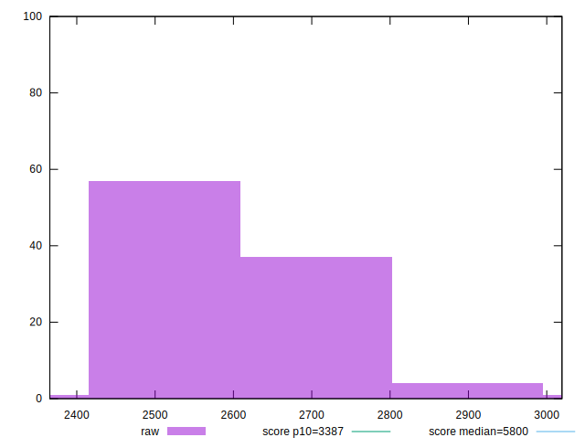
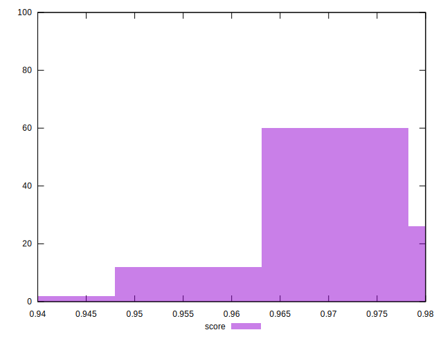
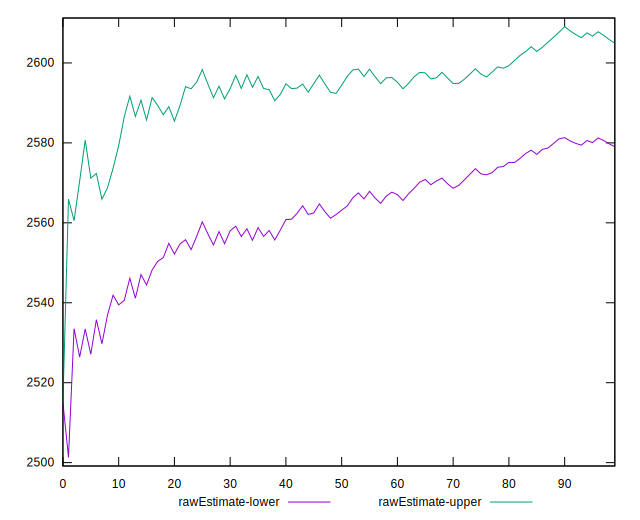
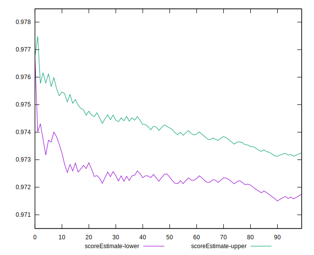
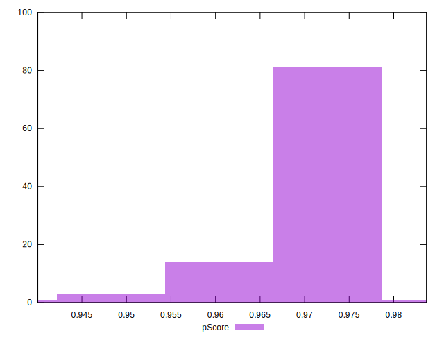
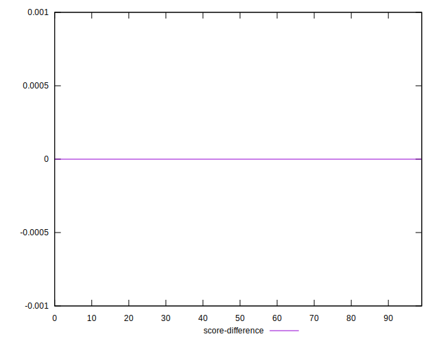
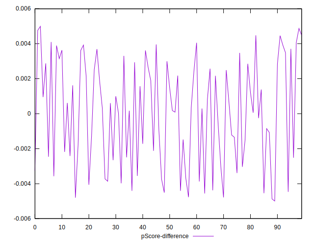
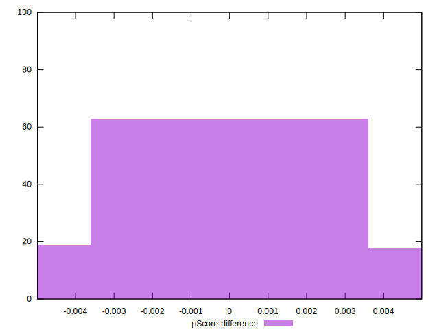

# //speed-index/samples/pages+cached+noadtech+nomedia

[→ Parent](../..)


## Raw


```yaml
p90min: 2499.5483620307155
p90max: 2860.0198375178975
p90range: 360.47147548718203
p90mean: 2609.6101441579417
median: 2592.8909047442644
p90stdev: 78.53891252642033
mad: 54.43528068068008
stdevBySn: 77.46769280106453
lfitCenter: 2606.8301737889933
lfitStdev: 66.00355046770663
mfitCenter: 2591.9726692152135
mfitConfidence: 6.600355046770663
p90skewness: 0.9780062876339828
p90eccentricity: 0.9999999999999992
p90discretization: 1
outlandishness: 1.0048272584888112

```


## Score


```yaml
p90min: 0.95
p90max: 0.98
p90range: 0.030000000000000027
p90mean: 0.9711702127659566
median: 0.97
p90stdev: 0.006163789760370639
mad: 0
stdevBySn: 0
lfitCenter: 0.9706774047793154
lfitStdev: 0.0040816559474280275
mfitCenter: 0.9704485183951699
mfitConfidence: 0.00040816559474280274
p90skewness: -0.34925882537914826
p90eccentricity: 0.9999999999999966
p90discretization: 23.5
outlandishness: 0.9988260649654701

```


## Raw Estimate


## Score Estimate


## P Score


```yaml
p90min: 0.9539538150772511
p90max: 0.9775410961177027
p90range: 0.023587281040451602
p90mean: 0.9712136127841173
median: 0.9724491968895113
p90stdev: 0.004940609535859254
mad: 0.0030946332847987534
stdevBySn: 0.004482305030407003
lfitCenter: 0.9713783930679794
lfitStdev: 0.004132085549441034
mfitCenter: 0.9724831385769036
mfitConfidence: 0.0004132085549441034
p90skewness: -1.2232578912552965
p90eccentricity: 1.0000000000000002
p90discretization: 1
outlandishness: 0.9988404454113434

```


## Score Difference


```yaml
p90min: 0
p90max: 1.1102230246251565e-16
p90range: 1.1102230246251565e-16
p90mean: 1.1810883240693154e-18
median: 0
p90stdev: 1.139000331521095e-17
mad: 0
stdevBySn: 0
lfitCenter: 2.1510305028010703e-18
lfitStdev: 5.2873683940481196e-18
mfitCenter: 2.1510305028010703e-18
mfitConfidence: 0
p90skewness: 9.539955591519906
p90eccentricity: 0.9999999999999999
p90discretization: 47
outlandishness: 14.137600000000003

```


## P Score Difference


```yaml
p90min: -0.004779063034976994
p90max: 0.004474685956919688
p90range: 0.009253748991896682
p90mean: 0.00005405293773977537
median: 0.0003020346770483684
p90stdev: 0.002928265300956073
mad: 0.002779165688988283
stdevBySn: 0.003513094204032228
lfitCenter: 0.0001179540833660229
lfitStdev: 0.0026616353528681586
mfitCenter: 0.00029774361140675107
mfitConfidence: 0.0002661635352868159
p90skewness: -0.14730019263049832
p90eccentricity: 0.9999999999999999
p90discretization: 1
outlandishness: 0.8680901931428409

```

