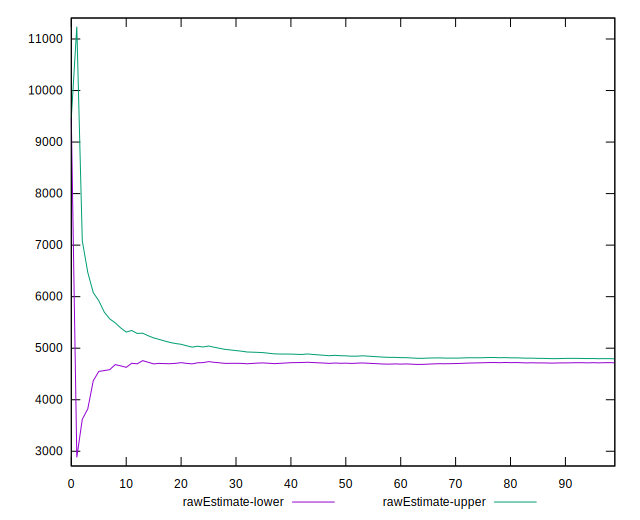
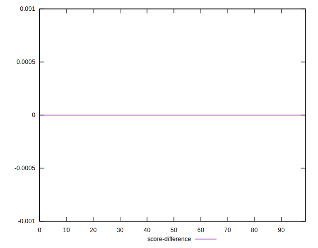

# //speed-index/samples/pages+cached

[→ Parent](../..)


## Raw


```yaml
p90min: 4495.7046578799345
p90max: 5516.88865321843
p90range: 1021.1839953384952
p90mean: 4800.45277673133
median: 4790.659914175295
p90stdev: 243.86793352178645
mad: 139.85150841956647
stdevBySn: 250.39821299616165
lfitCenter: 4811.679294878301
lfitStdev: 198.1595192526407
mfitCenter: 4755.550056049917
mfitConfidence: 19.81595192526407
p90skewness: 1.2104301290528903
p90eccentricity: 0.9999999999999997
p90discretization: 1
outlandishness: 1.0229065102881396

```


## Score


```yaml
p90min: 0.55
p90max: 0.73
p90range: 0.17999999999999994
p90mean: 0.673510638297872
median: 0.68
p90stdev: 0.042818455128514094
mad: 0.024999999999999967
stdevBySn: 0.04770399999999991
lfitCenter: 0.6728783710887135
lfitStdev: 0.03373546123733382
mfitCenter: 0.6813804426064416
mfitConfidence: 0.003373546123733382
p90skewness: -1.1827733084471184
p90eccentricity: 0.9999999999999997
p90discretization: 5.875
outlandishness: 0.9798779623478239

```


## Raw Estimate


## Score Estimate


## P Score


```yaml
p90min: 0.547452285674795
p90max: 0.7280396018350344
p90range: 0.18058731616023938
p90mean: 0.673906339220512
median: 0.6756251875618313
p90stdev: 0.043315345796218464
mad: 0.02499188537407887
stdevBySn: 0.044673176039984976
lfitCenter: 0.6732140412507286
lfitStdev: 0.03319369879931476
mfitCenter: 0.6818089886618989
mfitConfidence: 0.003319369879931476
p90skewness: -1.1996693231981932
p90eccentricity: 0.9999999999999999
p90discretization: 1
outlandishness: 0.9796318503577672

```


## Score Difference


```yaml
p90min: 0
p90max: 1.1102230246251565e-16
p90range: 1.1102230246251565e-16
p90mean: 3.543264972207946e-18
median: 0
p90stdev: 1.9514781802162963e-17
mad: 0
stdevBySn: 0
lfitCenter: 3.3158666172059827e-18
lfitStdev: 8.063403855810743e-18
mfitCenter: 3.3158666172059827e-18
mfitConfidence: 0
p90skewness: 5.326002287485494
p90eccentricity: 1.0000000000000044
p90discretization: 47
outlandishness: 3.5344000000000007

```


## P Score Difference


```yaml
p90min: -0.004666980141081134
p90max: 0.004705046368033261
p90range: 0.009372026509114395
p90mean: 0.0003254380470152605
median: 0.0005375465235881727
p90stdev: 0.0026638775946158477
mad: 0.002106431955250787
stdevBySn: 0.003259593870394361
lfitCenter: 0.0003959822617031162
lfitStdev: 0.0022734523931927726
mfitCenter: 0.0005926591673922119
mfitConfidence: 0.00022734523931927726
p90skewness: -0.2640454778554835
p90eccentricity: 1
p90discretization: 1
outlandishness: 0.895232988236563

```

