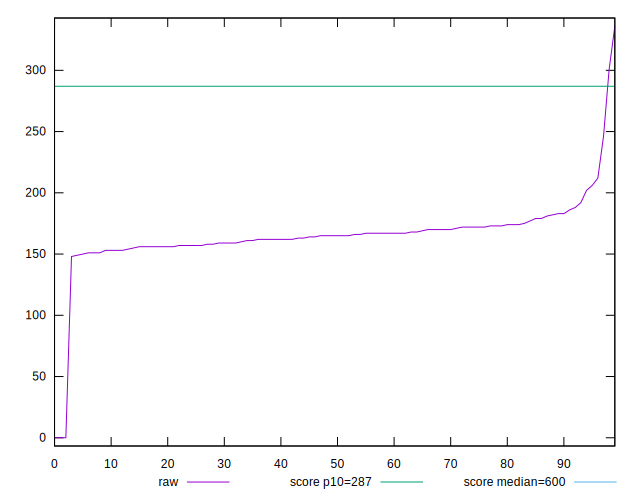
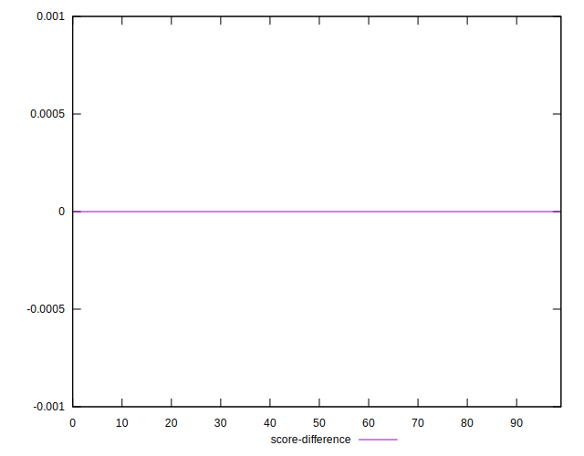

# //total-blocking-time/samples/pages+cached+noadtech

[→ Parent](../..)


## Raw


```yaml
p90min: 148
p90max: 211.99999999999977
p90range: 63.99999999999977
p90mean: 166.2765957446808
median: 165
p90stdev: 11.740459463370499
mad: 7.5
stdevBySn: 11.03154999999973
lfitCenter: 165.0363467026894
lfitStdev: 12.809801296234523
mfitCenter: 164.71109155137813
mfitConfidence: 1.2809801296234524
p90skewness: 1.3838558995404917
p90eccentricity: 0.9999999999999996
p90discretization: 1.540983606557377
outlandishness: 0.986256124119463

```


## Score


```yaml
p90min: 0.96
p90max: 0.99
p90range: 0.030000000000000027
p90mean: 0.9874468085106372
median: 0.99
p90stdev: 0.005445312294497758
mad: 0
stdevBySn: 0
lfitCenter: 0.9871393016491331
lfitStdev: 0.006473895380995709
mfitCenter: 0.9892216811261773
mfitConfidence: 0.0006473895380995709
p90skewness: -2.443538596523933
p90eccentricity: 1.0000000000000009
p90discretization: 23.5
outlandishness: 0.9946462712524389

```


## Raw Estimate


## Score Estimate


## P Score


```yaml
p90min: 0.9646913915580886
p90max: 0.9925016364489319
p90range: 0.027810244890843272
p90mean: 0.9867095148059447
median: 0.9875677218786949
p90stdev: 0.004734727966402687
mad: 0.0025239361884777933
stdevBySn: 0.00356182782657992
lfitCenter: 0.9859112094630329
lfitStdev: 0.0053201410714211915
mfitCenter: 0.9876738398151262
mfitConfidence: 0.0005320141071421191
p90skewness: -2.2174921635313543
p90eccentricity: 0.9999999999999994
p90discretization: 1.7407407407407407
outlandishness: 0.9948780147912337

```


## Score Difference


```yaml
p90min: 0
p90max: 0
p90range: 0
p90mean: 0
median: 0
p90stdev: 0
mad: 0
stdevBySn: 0
lfitCenter: 5.166535369026208e-19
lfitStdev: 1.2890316797319448e-18
mfitCenter: 5.166535369026208e-19
mfitConfidence: 0
p90skewness: .nan
p90eccentricity: .nan
p90discretization: 94
outlandishness: .inf

```


## P Score Difference


```yaml
p90min: -0.004954404027099013
p90max: 0.004660887594568841
p90range: 0.009615291621667854
p90mean: -0.0006516090487995788
median: -0.0005031467585161487
p90stdev: 0.0023547585104716595
mad: 0.0018956431781404492
stdevBySn: 0.0027802947069557665
lfitCenter: -0.0006630745904403706
lfitStdev: 0.001982772000764966
mfitCenter: -0.0007281958043345632
mfitConfidence: 0.00019827720007649662
p90skewness: 0.27667639295053337
p90eccentricity: 1.0000000000000002
p90discretization: 1.6785714285714286
outlandishness: 0.907336403505086

```

