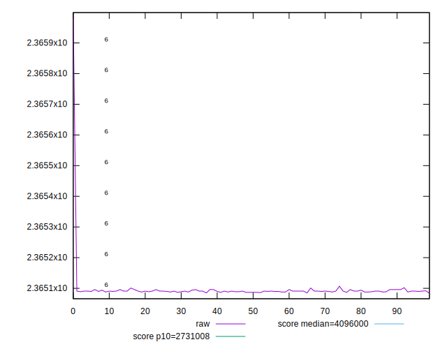
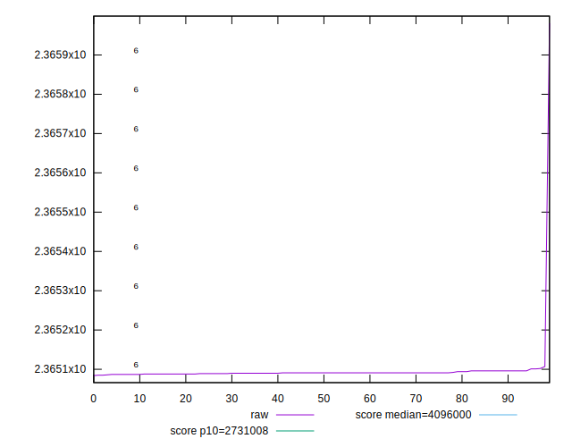
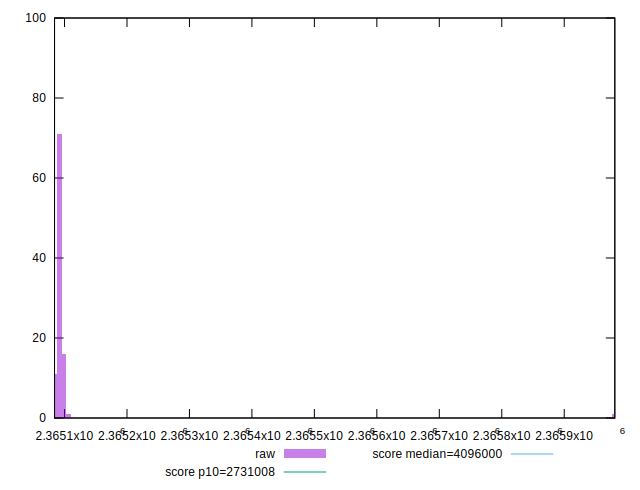
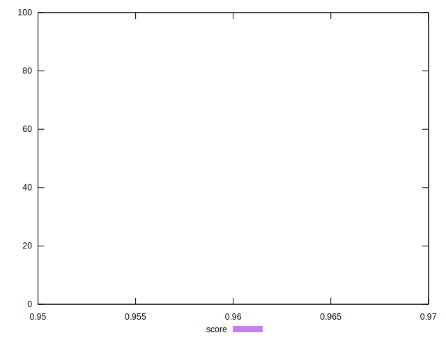
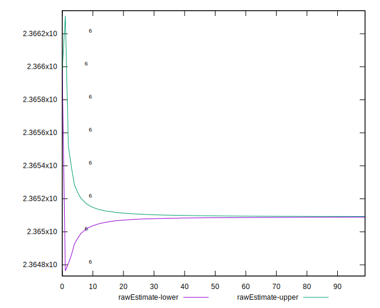
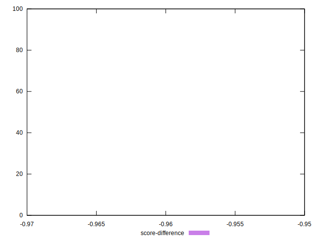

# //total-byte-weight/samples/pages+cached

[→ Parent](../..)


## Raw


```yaml
p90min: 2365086
p90max: 2365101
p90range: 15
p90mean: 2365091.010638298
median: 2365091
p90stdev: 2.9839809224871554
mad: 2
stdevBySn: 2.3852
lfitCenter: 2365095.0514766527
lfitStdev: 10.910489336628066
mfitCenter: 2365090.813442586
mfitConfidence: 1.0910489336628066
p90skewness: 1.0875763333938993
p90eccentricity: 1.0000000000000018
p90discretization: 9.4
outlandishness: 1.0000075932627603

```


## Score


```yaml
p90min: 0.96
p90max: 0.96
p90range: 0
p90mean: 0.9599999999999987
median: 0.96
p90stdev: 1.2212453270876722e-15
mad: 0
stdevBySn: 0
lfitCenter: 0.9599999999999984
lfitStdev: 0
mfitCenter: 0.9599999999999984
mfitConfidence: 0
p90skewness: 1
p90eccentricity: 1
p90discretization: 94
outlandishness: 0.9999999999999993

```


## Raw Estimate


## Score Estimate


## P Score


```yaml
p90min: 0
p90max: 0
p90range: 0
p90mean: 0
median: 0
p90stdev: 0
mad: 0
stdevBySn: 0
lfitCenter: 0
lfitStdev: 0
mfitCenter: 0
mfitConfidence: 0
p90skewness: .nan
p90eccentricity: .nan
p90discretization: 94
outlandishness: .nan

```


## Score Difference


```yaml
p90min: -0.96
p90max: -0.96
p90range: 0
p90mean: -0.9599999999999987
median: -0.96
p90stdev: 1.2212453270876722e-15
mad: 0
stdevBySn: 0
lfitCenter: -0.9599999999999984
lfitStdev: 0
mfitCenter: -0.9599999999999984
mfitConfidence: 0
p90skewness: -1
p90eccentricity: 1
p90discretization: 94
outlandishness: 0.9999999999999993

```


## P Score Difference


```yaml
p90min: -0.96
p90max: -0.96
p90range: 0
p90mean: -0.9599999999999987
median: -0.96
p90stdev: 1.2212453270876722e-15
mad: 0
stdevBySn: 0
lfitCenter: -0.9599999999999984
lfitStdev: 0
mfitCenter: -0.9599999999999984
mfitConfidence: 0
p90skewness: -1
p90eccentricity: 1
p90discretization: 94
outlandishness: 0.9999999999999993

```

