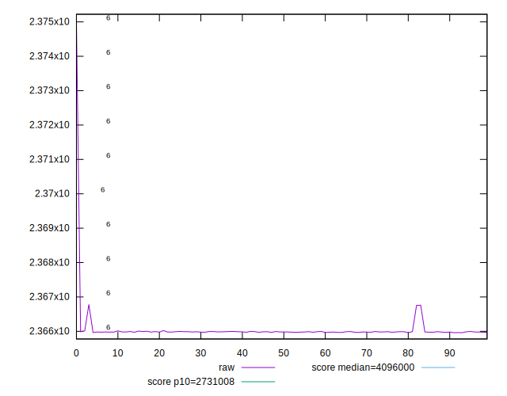
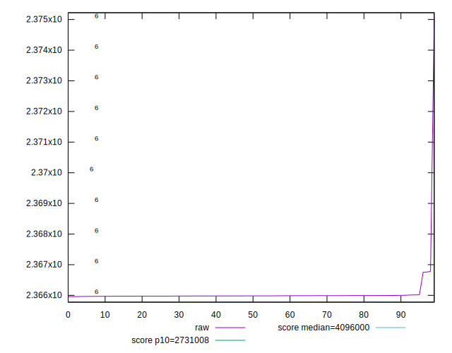
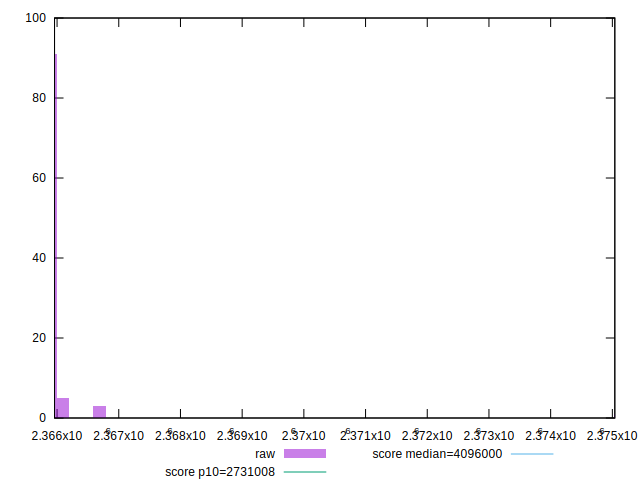
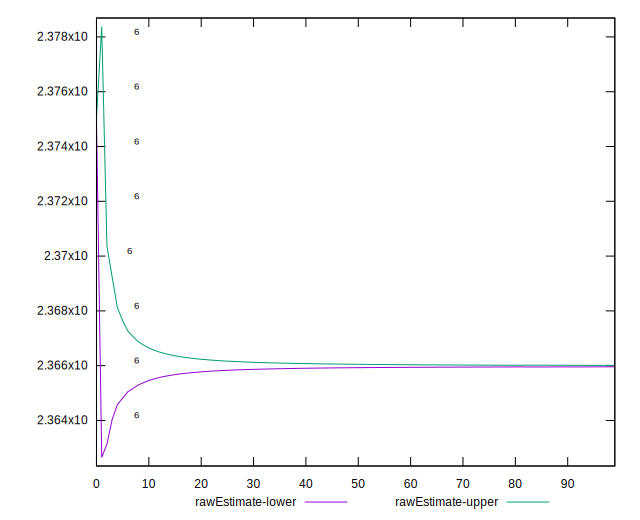
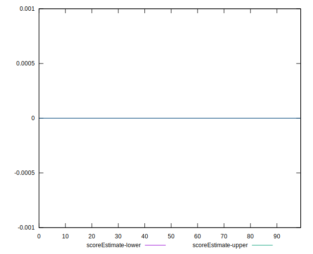
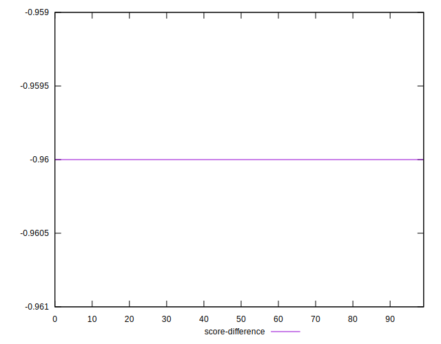
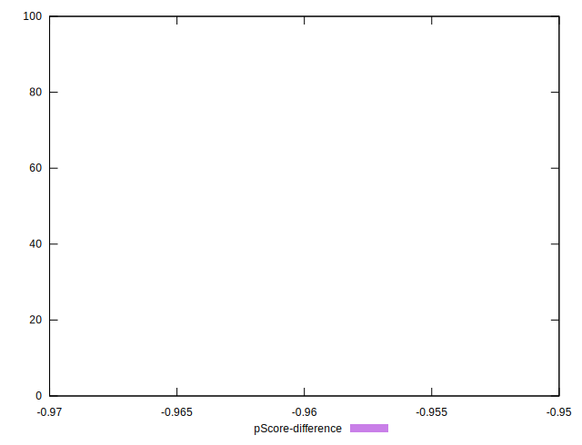

# //total-byte-weight/samples/pages

[→ Parent](../..)


## Raw


```yaml
p90min: 2365962
p90max: 2366754
p90range: 792
p90mean: 2365991.9680851065
median: 2365982
p90stdev: 79.77287601307205
mad: 8
stdevBySn: 11.926000000000002
lfitCenter: 2366036.725956171
lfitStdev: 131.9106466067406
mfitCenter: 2365983.9305473333
mfitConfidence: 13.191064660674062
p90skewness: 9.268312116697823
p90eccentricity: 1.0000000000000069
p90discretization: 2.611111111111111
outlandishness: 1.0000888458208865

```


## Score


```yaml
p90min: 0.96
p90max: 0.96
p90range: 0
p90mean: 0.9599999999999987
median: 0.96
p90stdev: 1.2212453270876722e-15
mad: 0
stdevBySn: 0
lfitCenter: 0.9599999999999984
lfitStdev: 0
mfitCenter: 0.9599999999999984
mfitConfidence: 0
p90skewness: 1
p90eccentricity: 1
p90discretization: 94
outlandishness: 0.9999999999999993

```


## Raw Estimate


## Score Estimate


## P Score


```yaml
p90min: 0
p90max: 0
p90range: 0
p90mean: 0
median: 0
p90stdev: 0
mad: 0
stdevBySn: 0
lfitCenter: 0
lfitStdev: 0
mfitCenter: 0
mfitConfidence: 0
p90skewness: .nan
p90eccentricity: .nan
p90discretization: 94
outlandishness: .nan

```


## Score Difference


```yaml
p90min: -0.96
p90max: -0.96
p90range: 0
p90mean: -0.9599999999999987
median: -0.96
p90stdev: 1.2212453270876722e-15
mad: 0
stdevBySn: 0
lfitCenter: -0.9599999999999984
lfitStdev: 0
mfitCenter: -0.9599999999999984
mfitConfidence: 0
p90skewness: -1
p90eccentricity: 1
p90discretization: 94
outlandishness: 0.9999999999999993

```


## P Score Difference


```yaml
p90min: -0.96
p90max: -0.96
p90range: 0
p90mean: -0.9599999999999987
median: -0.96
p90stdev: 1.2212453270876722e-15
mad: 0
stdevBySn: 0
lfitCenter: -0.9599999999999984
lfitStdev: 0
mfitCenter: -0.9599999999999984
mfitConfidence: 0
p90skewness: -1
p90eccentricity: 1
p90discretization: 94
outlandishness: 0.9999999999999993

```

