# //unminified-css/samples/pages

[→ Parent](../..)


## Raw


```yaml
p90min: 0
p90max: 450
p90range: 450
p90mean: 101.38297872340425
median: 150
p90stdev: 97.2012724703263
mad: 95
stdevBySn: 116.27850000000001
lfitCenter: 106.56852861002913
lfitStdev: 92.51012514778596
mfitCenter: 103.7591965785835
mfitConfidence: 9.251012514778596
p90skewness: 0.9676296356044831
p90eccentricity: 0.9999999999999994
p90discretization: 10.444444444444445
outlandishness: 1.1516690523877215

```

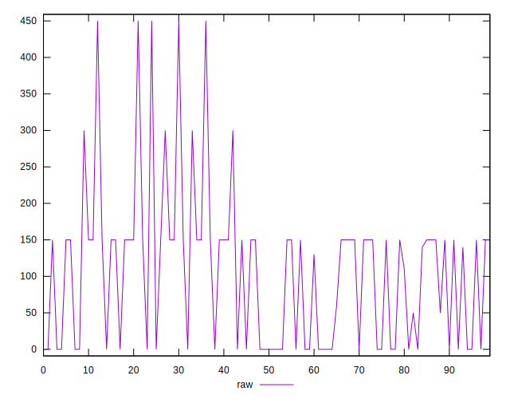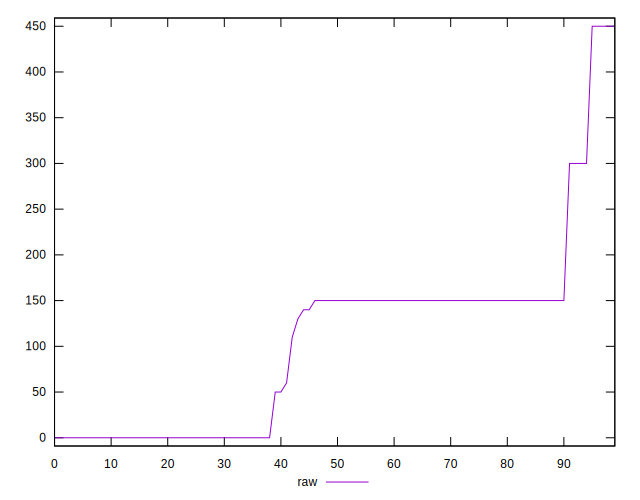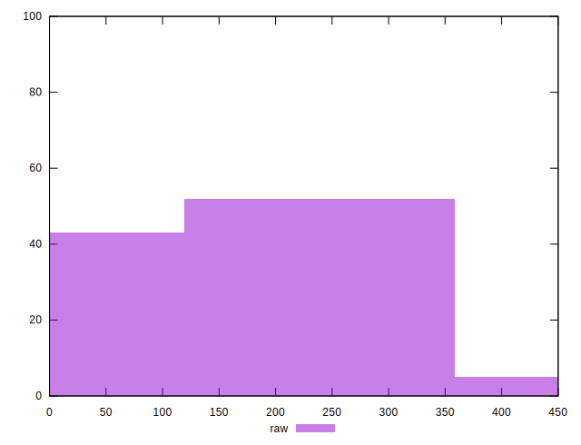
## Score


```yaml
p90min: 0.67
p90max: 1
p90range: 0.32999999999999996
p90mean: 0.9188297872340422
median: 0.88
p90stdev: 0.0765736522513042
mad: 0.07499999999999996
stdevBySn: 0.09242649999999995
lfitCenter: 0.9148495344162381
lfitStdev: 0.07383801618938664
mfitCenter: 0.9161091753804274
mfitConfidence: 0.007383801618938664
p90skewness: -0.7917481310998665
p90eccentricity: 0.9999999999999992
p90discretization: 11.75
outlandishness: 0.9890817201034522

```

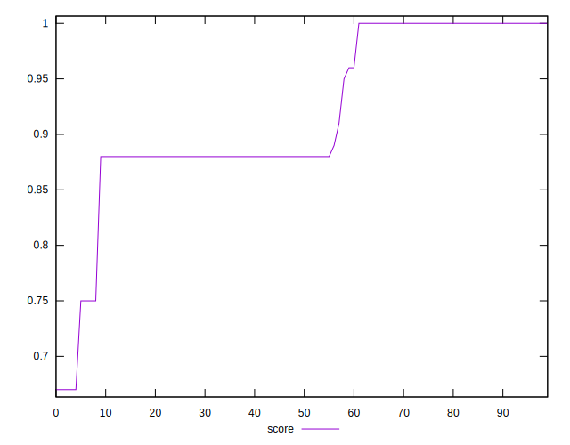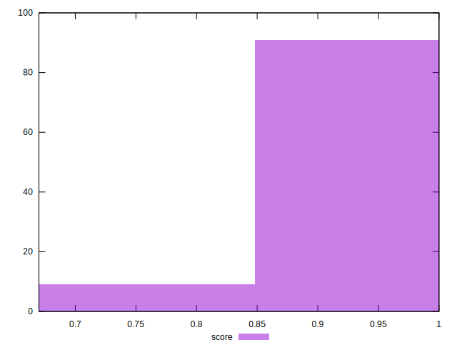
## Raw Estimate

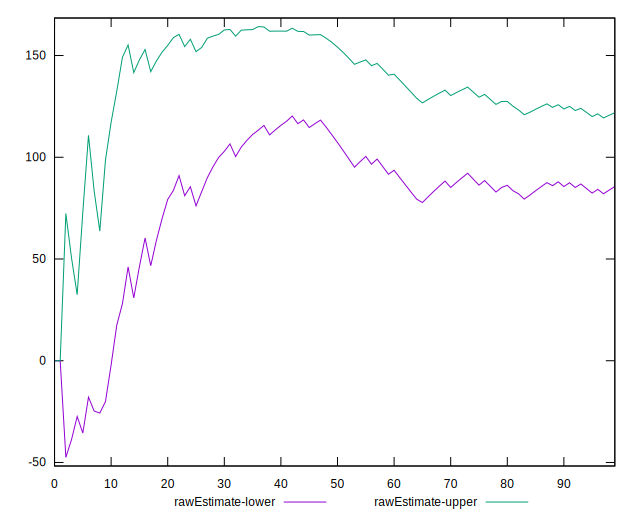
## Score Estimate

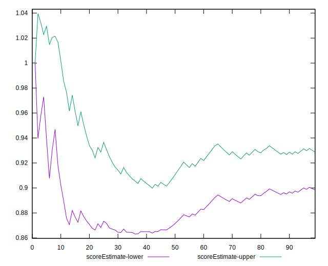
## P Score


```yaml
p90min: 0.6666666666666666
p90max: 1
p90range: 0.33333333333333337
p90mean: 0.9164007092198582
median: 0.875
p90stdev: 0.07798864225648508
mad: 0.07916666666666666
stdevBySn: 0.09689875000000003
lfitCenter: 0.9122158036879402
lfitStdev: 0.07614847058298473
mfitCenter: 0.9127372378433898
mfitConfidence: 0.007614847058298473
p90skewness: -0.7096640886949196
p90eccentricity: 1
p90discretization: 10.444444444444445
outlandishness: 0.9891521490349098

```

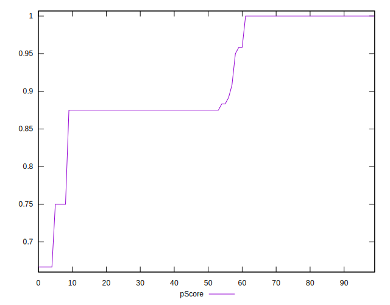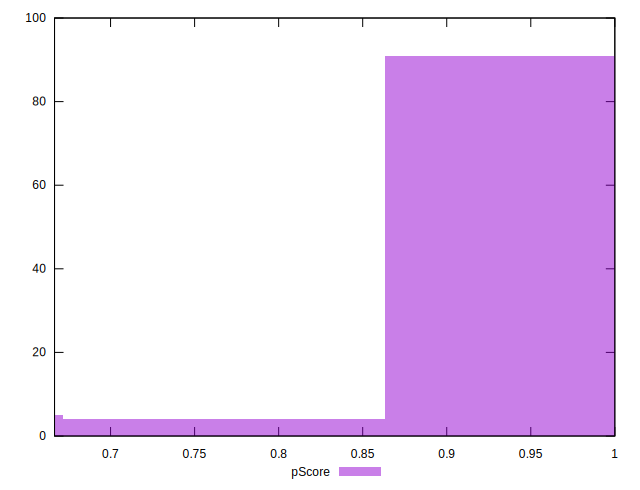
## Score Difference


```yaml
p90min: 0
p90max: 0
p90range: 0
p90mean: 0
median: 0
p90stdev: 0
mad: 0
stdevBySn: 0
lfitCenter: 5.166535369026208e-19
lfitStdev: 1.2890316797319448e-18
mfitCenter: 5.166535369026208e-19
mfitConfidence: 0
p90skewness: .nan
p90eccentricity: .nan
p90discretization: 94
outlandishness: .inf

```


## P Score Difference


```yaml
p90min: -0.0050000000000000044
p90max: 0
p90range: 0.0050000000000000044
p90mean: -0.0024645390070922035
median: -0.0025000000000000577
p90stdev: 0.0024033163086059485
mad: 0.0024999999999999467
stdevBySn: 0.002981499999999937
lfitCenter: -0.002405362718269803
lfitStdev: 0.0028944091452598963
mfitCenter: -0.0024341065928976803
mfitConfidence: 0.0002894409145259896
p90skewness: -0.021206182863262334
p90eccentricity: 1.0000000000000007
p90discretization: 18.8
outlandishness: 0.9351863982195551

```

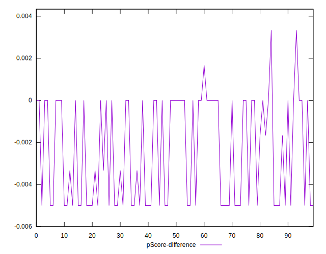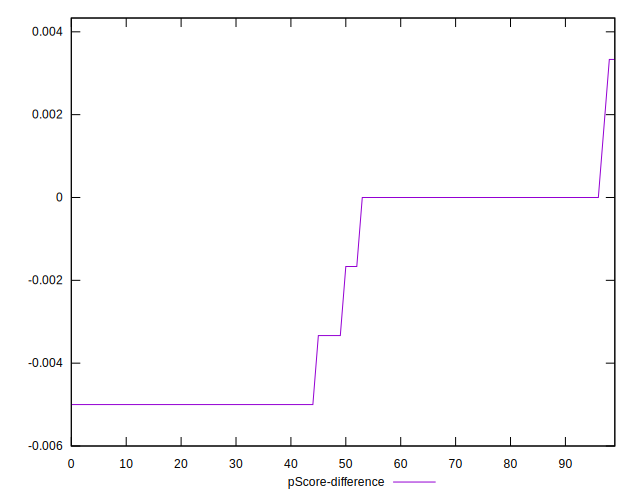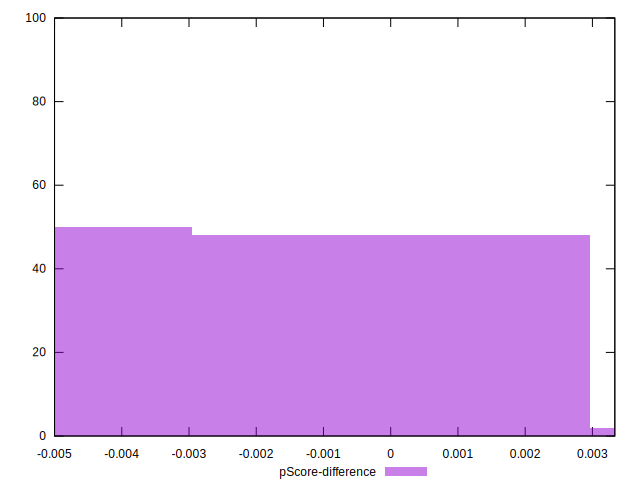